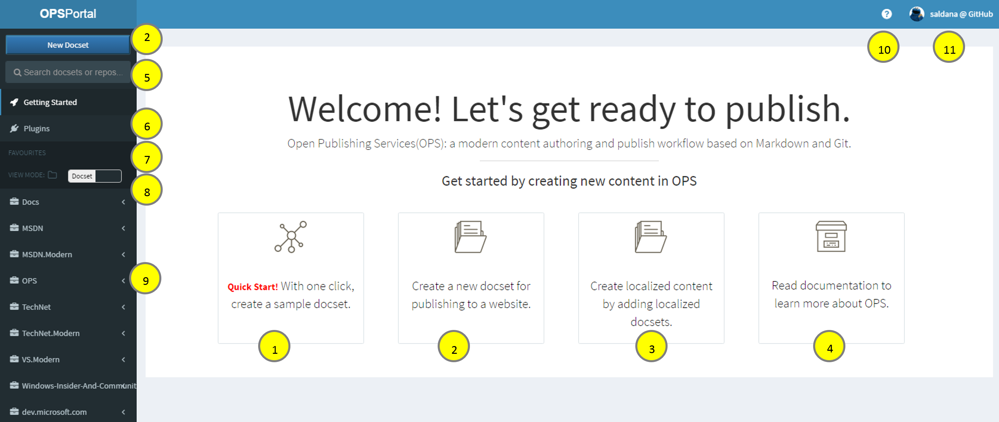

# OPS self-service portal
* URL from Corpnet: `https://OPS`
* URL from outside corpnet: `https://ops.microsoft.com/`

## Browsers
> [!TIP]
> Do not use Internet Explorer with the portal. Use instead Edge or Chrome.

## Going live
See [Go live](partnerdocs/golive.md)

## Supported scenarios

1. Create a docset with one click for testing purposes.

2. [Add and connect an English docset to OPS](partnerdocs\repo-creation-config.md#ConnectENDocset).

3. [Add and connect localized docsets to OPS based on English settings](partnerdocs/localization/provision_localized_repo.md).

4. Go to OPS documentation.

5. Find a docset by docset name, base URL, or repo.

6. Plug in to do some actions quicker:
    * [Branch merger](partnerdocs/golive.md#MergeMasterToLive) - `Merge multiple locale repositories from branch master to live.`
    
7. Pin and see your favorite docsets.

8. Have a view by docset or repo.

9. List of end points. Expanding opens all the docsets you have access to.

10. Link to OPS resources: [MSDNHelp site](http://msdnhelp.corp.microsoft.com/), [OPS docs](https://opsdocs.azurewebsites.net/en-us/opsdocs/?branch=master), [DocFx doc](https://github.com/dotnet/docfx), [Yammer](https://www.yammer.com/microsoft.com/#/threads/inGroup?type=in_group&feedId=7133984), etc. So `https://OPS` is the only URL you have to remember.

11. User log in information. You can log off from here and switch to VSTS or GitHub. You can also see whether you are logged with GitHub or VSTS (`S110, week 1`). 

### Other scenarios
* Portal is accessible from outside corpnet and VPN via 2FA.
* Support for GitHub and VSTS repos by login with either your GitHub or VSTS account.
* [Force publishing via manual publishing](partnerdocs/publish.md#ManualPublish).
* Go to repo from portal.
* [See published URLs](partnerdocs/publish.md#PubHistory).
* [See publishing history and reports](partnerdocs/publish.md).
* Tutorials and quick help for first time users thorugh the portal to ensure you are never lost.
* [Disconnect a docset from OPS](partnerdocs/edit-docset-properties.md). 
* [Disconnect an English repo from OPS](partnerdocs/edit-repo-properties.md). 
* [Disconnect a localized repo from OPS](partnerdocs/localization/provision_localized_repo.md#RemovingLocRepos).
* [Edit repo properties, including renaming repo](partnerdocs/edit-repo-properties.md).
* [Edit docset properties](partnerdocs/edit-docset-properties.md).
* [See Pull Requests](partnerdocs/publish.md#PullRquest)
* [Download IntelliSense](partnerdocs/publish.md#service-built-intellisense)
* Google analytics to monitor and analyse user behavior.

Scheduled for FY17Q3
[Open Localization hookup](partnerdocs/localization/Provision_Localized_Repo.md)
* Sync between private and public repos
* See publishing and system health

Not going to be supported (documentation provided)
* [Move a repo from GitHub to VSTS and vice-versa](partnerdocs/vstsgit-github.md#GitHub_to_VSTS)