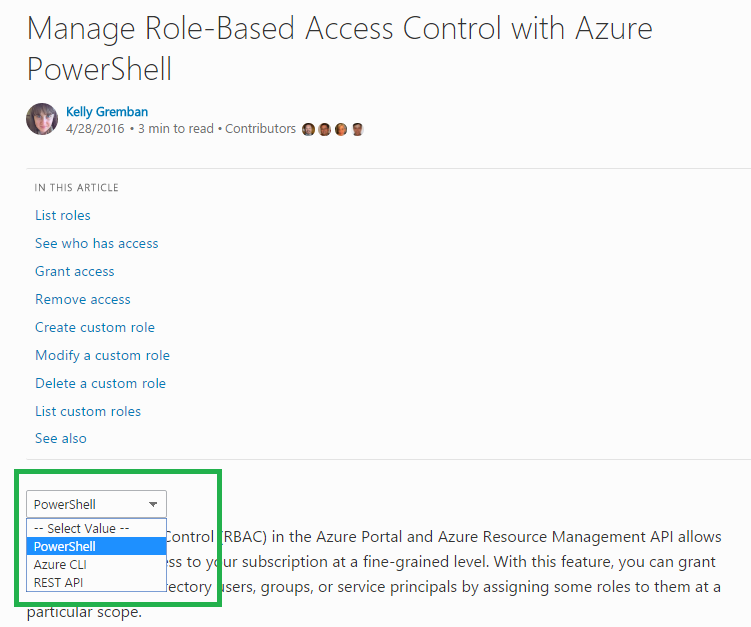

# Azure Content Transformer
Currently, docs site also publish some azure content.
However, you may know that Azure's markdown syntax is differnt with both official markdown syntax or OPS markdown syntax as azure has its own markdown extension.
How can docs publishes azure articles successfully now?
That's because we have a tool to transform azure content to OPS online, namely AzureTransformer.

## Overview to the azure markdown extension handled in AzureTransformer
Markdown has [common syntax](http://daringfireball.net/projects/markdown/syntax), besides those, all the other extensions are customer defined.
Azure also has lots of extensions (we call it [Azure Extensions](https://github.com/Azure/azure-content/blob/master/contributor-guide/custom-markdown-extensions.md)) and which is not officially supported by OPS.
AzureTransormer is created for transforming azure extensions to OPS one's. So that after transform the content can be handled by OPS service.

### What's azure extension is handled in AzureTransformer
Here's a table of azure's extensions that has been handled by AzureTransformer with simple usage explanation.

| Azure Extension | Usage | Corresponding OPS extension |
| --------------- | ----- | --------------------------- |
| <ul><li>> [AZURE.NOTE]</li><li>> [AZURE.WARNING]</li><li>> [AZURE.TIP]</li><li>> [AZURE.IMPORTANT]</li></ul> | Indicate that the following content part will be part of the extension and will be rendered with a special style | <ul><li>&gt; [!NOTE]</li><li>&gt; [!WARNING]</li><li>&gt; [!TIP]</li><li>&gt; [!IMPORTANT]</li></ul> |
| `> [AZURE.INCLUDE [<title>](<filepath>)]` | To include some common content, such as token | `> [!INCLUDE [<title>](<filepath>)]` |
| `> [AZURE.VIDEO video-id-string]` | To embed vide in to the page | `<iframe width="640" height="360" src="<video link>" frameborder="0" allowfullscreen="true"></iframe>` |
| `> [AZURE.SELECTOR]` | Let user choose different options to show the page content | > [!div class="op_single_selector"] |
| `[AZURE.SELECTOR-LIST (Dropdown1 | Dropdown2 )]` | Let user choose different option combanations to show the page content | > [!div class="op_multi_selector" title1="&lt;title1&gt;" title2="&lt;title2&gt;"] |
| Azure Metadata with html syntax at the beginning of markdown | Indicate some properties of the content | Yaml metadata header |

## Details of the transformation to different syntax
In this part, we will tell you how AzureTransformer transforms different azure extensions in details.

### Transform Azure NOTE/WARNING/TIP/IMPORTANT
Azure Note syntax is implemented by add special symbol at the beginning of a blockquotes.
It support two styles, one is single line note and the other is Multiple lines note.  
*Azure single line example:*
```
> [AZURE.NOTE] This is single line text
```

*Azure multiple lines example:*
```
> [AZURE.NOTE]
> First line of text
> Second line of text
```

However, OPS official support NOTE syntax has only one style, that's similar with Azure multiple lines note.
If you write the single line Note syntax, OPS can support it but will give you the warning that ask you to make the content part as a separate line with the Note syntax.  
So in AzureTransformer, the above two cases will both transform to one style such as following shows.  
*OPS single line example:*
```
> [!NOTE]
> This is single line text
```

*OPS multiple lines example:*
```
> [!NOTE]
> First line of text
> Second line of text
```

### Transform Azure Include
Azure and OPS both have the function that allow you to include a markdown content as a token in different file.
So that one day you want to change the common content in the token, it will take effective in all the other markdown files.

The include markdown in Azure and OPS are similar.  
*Azure*: `> [AZURE.INCLUDE [<title>](<filepath>)]`  
*OPS*: `> [!INCLUDE [<title>](<filepath>)]`

> [!IMPORTANT]
> The difference of include syntax between Azure and OPS is not in syntax but in **file reference.**

> [!NOTE]
> Azure document has a rule: File name is unique in the repository

Because that azure's file name is unique, so user can write any &lt;filepath&gt; in the file reference as long as file name is correct.
Then azure's build process can find the correct file and include the corresponding content.  
However, OPS doesn't have this rule. So it is required that AzureTransformer should transform the &lt;filepath&gt; to a correct relative path.

Here's an example to show what's the difference between them.  
  
In Azure system, if FileA.md want to ref the token under DirB, writer can writer as `> [AZURE.INCLUDE [content from token b](Token.md)]`  
In OPS system, writer must write Token.md's relative path to FileA.md, so in File.md the include correct syntax is `> [!INCLUDE [content from token b](../DirB/Token.md)`  

**AzureTransformer** will try to transform the include file reference path to correct relative path by some methods.

### Transform Azure Video
Azure allow user to embed video in the page by Azure Video syntax `> [AZURE.VIDEO video-id-string]`. The video-id-string is a string that can only be recognize by azure build process.  
We heard that Azure has a database to store the id and video link mapping relationship. So once Azure give us the access to the database, then we can transform the video syntax to OPS one,
namely: `<iframe width="640" height="360" src="<video link>" frameborder="0" allowfullscreen="true"></iframe>`  

Before that, we can only work with a workaround. That's ask user to pass the Azure id and link mapping file to AzureTransformer.
However, by this way we can only transform partial of the video as it depends on how many relationship user given in that file. 

### Transform Azure Single Selector
Azure single selector allow user to choose some options in the page to read different content of topic. The syntax is
```
> [AZURE.SELECTOR]
- [Link #1 Label](link #1 url)
- [Link #2 Label](link #2 url)
```

In OPS, we don't have this specific syntax, so we leverage section syntax and work together with rendering team to carry out this function.
So AzureTransformert just transform the syntax to a section syntax that supported by OPS but with specific attributes. The syntax is
```
> [!div class="op_single_selector"]
> - [Link #1 Label](link #1 url)
> - [Link #2 Label](link #2 url)
```
The markdown content will be built as the following html content
```
<div class="op_single_selector">
  <ul>
    <li><a href="link #1 url">Link #1 Label</a></li>
    <li><a href="link #2 url">Link #2 Label</a></li>
  </ul>
 </div>
```
With the class value **op_single_selector** in the attribute, rendering will give a selector view to those html part.
Here's rendering result contrast between Azure and OPS.  
**Azure**  
  
**OPS**


### Transform Azure Selector List
Azure selector list allow user to choose some options combination in the page to read different content of topic. The syntax is
```
> [AZURE.SELECTOR-LIST (Dropdown1 | Dropdown2 )]
- [(Dropdown1Text1 | Dropdown2Text1 )](../articles/dropdown1-text1-dropdown2-text1.md)
- [(Dropdown1Text1 | Dropdown2Text2 )](../articles/dropdown1-text1-dropdown2-text1.md)
- [(Dropdown1Text2 | Dropdown2Text3 )](../articles/dropdown1-text1-dropdown2-text1.md)
- [(Dropdown1Text3 | Dropdown2Text4 )](../articles/dropdown1-text1-dropdown2-text1.md)
```

OPS also use section syntax to carry out the selecotr list, the syntax is like
```
> [!div class="op_multi_selector" title1="Dropdown1" title2="Dropdown2"]
> - [(Dropdown1Text1 | Dropdown2Text1 )](../articles/dropdown1-text1-dropdown2-text1.md)
> - [(Dropdown1Text1 | Dropdown2Text2 )](../articles/dropdown1-text1-dropdown2-text1.md)
> - [(Dropdown1Text2 | Dropdown2Text3 )](../articles/dropdown1-text1-dropdown2-text1.md)
> - [(Dropdown1Text3 | Dropdown2Text4 )](../articles/dropdown1-text1-dropdown2-text1.md)
```

The markdown content will be built as following html content
```
<div class="op_multi_selector" title1="Dropdown1" title2="Dropdown2">
  <ul>
    <li><a href="../articles/dropdown1-text1-dropdown2-text1.md">(Dropdown1Text1 | Dropdown2Text1 )</a></li>
    <li><a href="../articles/dropdown1-text1-dropdown2-text1.md">(Dropdown1Text1 | Dropdown2Text2 )</a></li>
    <li><a href="../articles/dropdown1-text1-dropdown2-text1.md">(Dropdown1Text2 | Dropdown2Text3 )</a></li>
    <li><a href="../articles/dropdown1-text1-dropdown2-text1.md">(Dropdown1Text3 | Dropdown2Text4 )</a></li>
  </ul>
</div>
```
OPS Rendering will also give a corresponding format to the **op_multi_selector** attribute div part.

### Transform Azure Metadata
In Azure content, the metadata is written with html syntax at the beginning of every markdown file. AzureTransfomer will transform them to yaml header.  
For example in azure the properties is:
```
<properties
   pageTitle=""Azure Container Service Introduction | Microsoft Azure""
   description=""Azure Container Service (ACS) provides a way to simplify the creation, configuration, and management of a cluster of virtual machines that are preconfigured to run containerized applications.""
   services=""virtual-machines""
   documentationCenter=""""
   authors=""rgardler; liza""
   manager=""nepeters""
   editor=""""
   tags=""acs, azure-container-service""
   keywords=""Docker, Containers, Micro-services, Mesos, Azure""/>

<tags
   ms.service=""virtual-machines""
   ms.devlang=""na""
   ms.topic=""home-page""
   ms.tgt_pltfrm=""na""
   ms.workload=""na""
   ms.date=""12/02/2015""
   ms.author=""rogardle""/>
```

Transform to OPS one it will be:
```
---
title: Azure Container Service Introduction | Microsoft Azure
description: Azure Container Service (ACS) provides a way to simplify the creation, configuration, and management of a cluster of virtual machines that are preconfigured to run containerized applications.
services: virtual-machines
documentationcenter: 
author: rgardler
manager: nepeters
editor: 
tags: acs, azure-container-service
keywords: Docker, Containers, Micro-services, Mesos, Azure

ms.service: virtual-machines
ms.devlang: na
ms.topic: home-page
ms.tgt_pltfrm: na
ms.workload: na
ms.date: 12/02/2015
ms.author: rogardle
---
```

You can see some properties is changed.
- pageTitle in azure transform to title in yaml header.
- authors in azure transform to author in yaml header. Besides if authors has multiple values split by either ',' or ';' will only keep the first one in author.

### Other additional steps done by AzureTransformer
Besides the extension fixed, there's also some other work AzureTransformer will do to make the content build with correct content.

#### Fix broken link as possible as we can
As it is said in Azure Include extension part. Azure writer can reference a file with only name but don't care about if the relative path is correct.
However, OPS doesn't. So besides to fix the relative path reference in Azure Include extension, the tool will also try to fix the incorrect relative path in markdown.

The fix include two parts
1. Fix the incorrect relative path reference
2. Append the ".md" extension if the relative path doesn't, but should keep the anchor as original
