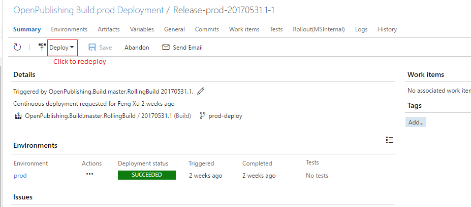

# Process for Rollback 
Due to the high rate of LSI happening after each deployment, operation team wants to know if there's a way that they can quickly work around the issue due to this time's deployment, so they can unblock partner immediately and leave the investigation to OPS team later.

# Options of Rollback
## Rollback packages
You can follow the steps below to rollback packages.
1. Go to https://www.myget.org/ and sign in.
2. Click the feed "docascode/op" in the right side.
3. Delete the packages (in most cases, they are "opbuild" and "opbuild.templates.common") with issues.

## Rollback services (Including scripts in Azure blob)
You can follow the steps below to rollback services.
1. Go to [**Deployment Page**](https://mseng.visualstudio.com/VSChina/Open%20Publishing%20Build/_release?definitionId=7&releaseId=2926&_a=releases).
2. Choose the release that you want to rollback to and double click to open it      

3. Click "Deploy" button to redeploy the services   
   

## Rollback features with feature flag
When adding some new features with risk, OPS may add feature flag to turn on/off those features. Sometimes the flags are on repositories while sometimes they are global configured.  
If you find the error is obviously related to new feature, you can try to turn that feature flags off either on modifying publish configuration file or change the [global configuration](https://capservice.visualstudio.com/CAPS/_git/Configuration?path=%2Fopenpublishingbuild%2Fop-build-prod.json&version=GBmaster&_a=contents)

> [!IMPORTANT]
> Change the global configuration will result in all the worker role restart. The messages that are already in processing will be picked up and processed again after that.
