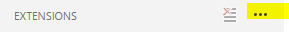
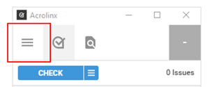
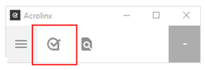
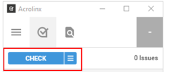
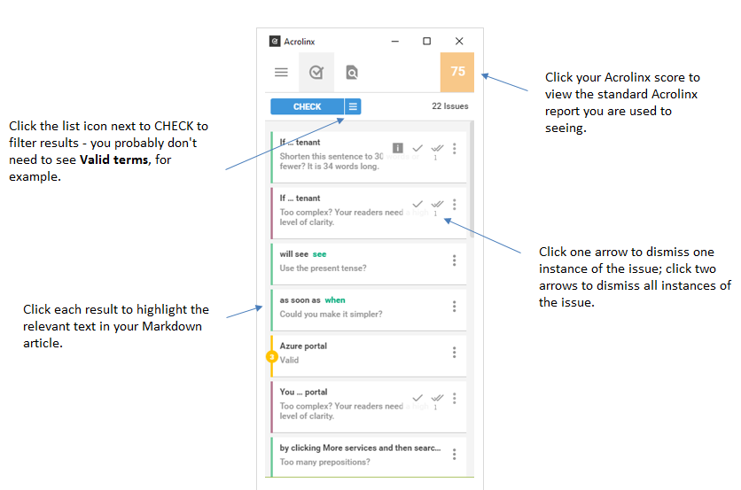

# Acrolinx for APEX technical content

Acrolinx is software that provides content authors with automated feedback on grammar, spelling, punctuation, writing style, terminology, and voice. Acrolinx is available both upstream and locally - upstream, users get automatic results from the Acrolinx integration for GitHub, which writes Acrolinx results to each pull request. The tool is seamlessly integrated into the pull request workflow.

Locally, the Acrolinx extension for Visual Studio Code is now available so you can obtain the Acrolinx feedback *before* you push content to the upstream repository.

Currently, Acrolinx is available for use only with content in the following GitHub repositories:

- Microsoft/azure-content-pr
- Azure/azure-docs-cli-python
- Azure/azure-docs-rest-apis
- MicrosoftDocs/sql-docs-pr

There is a cost associated with extending Acrolinx coverage to other APEX-owned content repositories. Expansion is planned for FY18, but is dependent on budget and prioritization. Any expansion to other content sets will occur at the beginning of FY18. Contact [tysonn](mailto:tysonn@microsoft.com) if you have questions about using Acrolinx with your content set.

## To install the Acrolinx extension for VSCode

1. Open VS Code.
2. Update to the latest version if prompted.
3. Select the square icon in the left-hand bar to open the **Extensions** pane.
        
    

5. Click the three dots for "More" and select "Install from VSIX..."
    
    

6. Paste the path `\\dpspub\Acrolinx\acrolinx.vsix` into the **File** name box and click **Open**. 
    > [!NOTE]
    > The extension is large and can take about a minute to install. There is no indication of activity during this time.
8. When installation is complete, VS Code will prompt you to restart. You will now see the Acrolinx icon on the menu bar, top right, when a .md or .txt file is open:
        
    
 
8. When you click the icon, a separate Acrolinx sidebar window will appear. The first time you run Acrolinx, you’ll need to configure it: 
    - **Server address:** https://microsoft-ce-csi.acrolinx.cloud:443
    - **User name:** vscode-user
    - **Password:** bigbird$
9. Click **Open the slide out menu** > **Options**:

    

10. Turn off the New Term settings; leave all other settings enabled:

    

11. Click **Check the document**:

        

12. Click the CHECK button:

    

## To review the results

## To submit feedback

File a bug or suggestion using this link:
[https://aka.ms/acrolinxbug](https://aka.ms/acrolinxbug)

