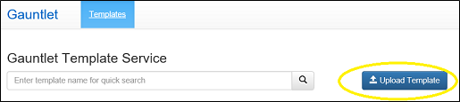
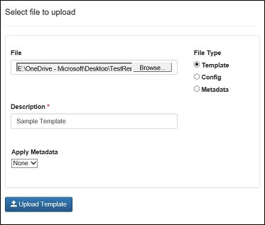

# Gauntlet Template Service

The Gauntlet Template Service allows writers in VS Code to pull a template from a centralized store and apply it to a file. Templates can help ensure that required metadata is included in topics, that content standards are followed, etc. Templates are managed by authorized content team representatives via a web-based front end. For more information about existing templates or if you have an idea for a new one, contact your content business rep. If you are a business rep, the rest of this topic describes how to provide templates to help contributors author better content.

## File types

The template service supports three file types:

- Article templates.
- Metadata files.
- Configuration files.

Article templates provide guidance to contributors for how to author a topic. They can be very lightweight - for example, just listing required and optional metadata - or very detailed, describing the full structure and guidelines for a particular type of article, such as Getting Started or Tutorial.

A single metadata file can be embedded into multiple article template files. When creating a new article template and uploading it to the Gauntlet template store, a business rep can choose to embed an existing metadata file into that template. This means that a single set of metadata only needs to be updated once and all of the templates that it is associated with will get this update too. 

Configuration files, such as docfx.json, can be uploaded to the template store with standard values - for example, to help teams onboard to OPS.

## How to create a new template and upload it to the template store

1. To create and upload templates, you must be on the admin whitelist. Email gauntletsupport@microsoft.com to request admin perms.
2. Create your template as a Markdown (.md) file.
3. Go to [http://aka.ms/Gauntlet](http://aka.ms/Gauntlet).
4. Select the **Templates** tab.
5. Click the **Upload Template** button. 

    
6. Navigate to your template file.
7. Select the Template radio button.
8. Include a description.
9. Choose to add existing metadata to this template if you wish.

    

To cancel without saving at any time, click outside the dialog box.

## Metadata files

As outlined above, an existing metadata file can be optionally associated with a newly updated template. Additionally, a new metadata file can be created and updated at any time by admin users, and associated with new templates after that.

The template service enables you to auto-generate certain values:

- Date: Use the dynamic field `{ms.date}` to autogenerate today's date in the correct format for OPS (MM/DD/YYYY), generally for `ms.date`.
- Author: Use `{author}` to auto-generate the `author` value with the user's GitHub ID.
- Ms.author: Use `{ms.author}` to auto-generate the `ms.author` value with the user's Microsoft alias.

## How to edit an existing template in the Gauntlet template store

The Gauntlet UI is not a Markdown editor. To edit an existing template, you must download the file via the UI. Make the required changes in VS Code and then re-upload the template with the same file name to overwrite the previous version. Once a template is re-uploaded, Gauntlet will clear its local cache, meaning all users will be able to pull the new version of the template into Visual Studio Code almost immediately. 

In future releases, template versioning is planned, as well as template properties such as owner, edited by, last updated date, creation date, checkin comments.

## How to create a new instance of a template in VS Code 

1. In VS Code, ensure that you have the Gauntlet extension installed.
2. Click the **Create File** button or use the `Ctrl+Shift+Alt+N` hotkey.
3. Click the **Apply Template** button or use the `Ctrl+Shift+Alt+M` hotkey.
4. From the list of available templates, choose the one you want.
5. Save the file with an appropriate name in your docs folder (as a .md file).

>[!NOTE]
>If you attempt to insert a template into a document that is not empty, the template will be inserted into the document at the position selected, overwriting any selected content.

