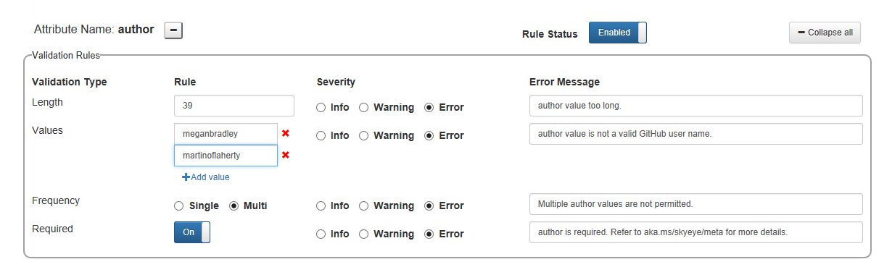

# Gauntlet Validation Service

The Gauntlet Validation service provides the ability for content team admins to configure validation rules via the Gauntlet web UI, and for docs.microsoft.com contributors to check their Markdown files for issues using the Gauntlet VS Code toolbar. The first Validation service release provides metadata validation. Markdown and HTML content validation is coming next, as well as integration of rulesets as custom validations in the OPS build.

Most users will only use the VS Code frontend of the validation service and the build integration when available. Only admins will use the Gauntlet site to configure validations.

## To validate your Markdown files in VS Code

1. Install the dogfood Gauntlet extension, as described [here](/gauntlet-dogfood.md#gauntlet-vs-code-extension-and-services-dogfood).
2. Author docs topics in Markdown as usual. Use a [template](/gauntlet-templates.md#how-to-create-a-new-instance-of-a-template-in-vs-code-) with standard docs metadata to make your life easier!
3. Click the checkmark toolbar icon or use the shortcut `Ctrl+Shift+Alt+V`.
4. Validation will run on the file. When complete, a new pane will open showing errors and warnings, if any.

> [!NOTE]
> `Error` indicates a serious issue that will block the build when rulesets are integrated as custom validations. `Warning` will not block the build, but may prevent automatic merging if PR Merger is enabled on your repo. **None of this is broadly implemented yet** - and there will be coordinated rollout including pre-rollout issue scrubbing - but you are strongly encouraged to clean up all errors and warnings in your topics, the sooner the better!

If you get inaccurate validation results, please file a bug using the megaphone icon on the Gauntlet toolbar, or via http://aka.ms/GauntletBug. The issue may be a code bug or it may be that the metadata admins have configured the rule in a way you didn't expect or that doesn't work for your content. The Gauntlet team will triage issues appropriately.

## To administer validation rules via Gauntlet

Validation rules are coded by the Gauntlet engineering team, and configurable in the Gauntlet UI. 

To administer rules, you must have admin perms. Current administrators are limited to the APEX BI and SEO teams. If you think you should be an admin, email GauntletPM@microsoft.com. New admins must be approved by CarolZ.

1. Go to [http://aka.ms/GauntletStage](http://aka.ms/GauntletStage).
2. Click the **Metadata validation** tab.
3. You will see the Global ruleset and any custom rulesets. The Global ruleset is applied to all content by default. If you create a custom ruleset and associate it with a repo, contributors working in a clone of that repo in VS Code will get the custom ruleset.

> [!IMPORTANT]
> Custom rulesets should be rare. The goal of validation is to help ensure consistent quality across repos; customization means inconsistency.

To create a custom ruleset:

1. Click **Global Validation Settings** to open the global ruleset.
2. Click the red **Edit Rule** button.
3. At the bottom of the page, click **Save As Custom**.
4. At the top to the page, add a name for the ruleset in **Custom Ruleset Name**.
5. Click **+New repo** and paste at least one repo to associate with the ruleset.
6. Customize the ruleset by editing the following options as appropriate for each rule.

|Validation Type  |Options  |Notes  |
|---------|---------|---------|
|Length     |Add the maximum number of characters.|         |
|Values     |By default, all values are valid that do not break other checks. To limit valid values, click **+Add value** and type in the box for each allowed value.  |For some attributes, Gauntlet will pull valid values from SkyEye or GitHub.    |
|Frequency |Choose Single if only one value is allowed; Multi if attribute can be multi-valued.  |         |
|Required  |On if attribute is required.         |         |
|Range     |Specifies a numeric range of valid values.  |Ranges will automatically be appended to the error message.  |
|Format     |The allowed format, such as MM/DD/YYYY for dates or comma separated for multiple string values.          |         |
|Severity|Info = no action Warning = should fix Error = must fix |OPS build integration is not yet enabled, but Error maps to issues that will eventually break the build.    |
|Error Message |The text the user will see in the VS Code result pane.   |Some information, such as valid range, is appended to the error message automatically. This information should not be included in the manually configured message.  |
|Rule Status|Enabled/Disabled|Rules are Enabled by default. Switch to Disabled to exclude a rule from the ruleset.|

## To audit a repo for validation issues

Currently most active repos have many errors and warnings. In VS Code validation, these are not blocking, but when validation is integrated into the OPS build Errors will cause build failures and Warnngs will block auto-merging via PRMerger. Therefore teams will need to audit their repos and fix validation issues before build integration is enabled. This will be driven by the Gauntlet team (Megan). A console app is available to run Gauntlet validation on the full contents of a locally cloned repo and provide results in a CSV file.

[instructions to be added after deployment]