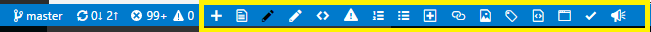

# Gauntlet Authoring Services and VS Code Extension

The Gauntlet VS Code extension for OPS authoring provides Markdown authoring assistance to writers working in OPS and publishing to docs.microsoft.com. It includes several functions, including applying templates to new Markdown files, applying common formatting to strings, and inserting links, images, tokens, snippets, tables, and lists, as well as previewing content using your site's CSS.

## Installation option 1: Download the installer

This option is available for Windows on any browser.    

1. Ensure that you are connected to corpnet.
2. If you haven't already, install [VS Code](https://code.visualstudio.com/Download).
3. Go to http://aka.ms/Gauntlet.
4. Click **Download and Run the Installer**.
5. Save and run GauntletExtensionInstaller.exe.
6. You may see a security warning. If so, select **More info**:

    

    ...then select **Run anyway**:

    

6. A command line will pop up, providing status as the extension installs.
8. When complete, you will see the Gauntlet toolbar at the bottom of your VS Code window:

    

## Installation option 2: Run the installer from a share

This option is only available for Windows on Edge or Internet Explorer.

1. Ensure that you are connected to corpnet.
2. If you haven't already, install [VS Code](https://code.visualstudio.com/Download).
3. Go to http://aka.ms/Gauntlet on Edge or Internet Explorer.
4. Click **Open the Installer Location**.
5. A share opens. Double-click GauntletExtensionInstaller.exe.
6. A command line will pop up, providing status as the extension installs.
8. When complete, you will see the Gauntlet toolbar in VS Code.

## Installation option 3: Install from VSIX

This option is available for Mac and Windows, including all browsers.

1. If you haven't already, install [VS Code](https://code.visualstudio.com/Download).
2. Open VS Code. 
3. If you have a previously installed version of Gauntlet, uninstall it first.
4. Click the square icon on the left panel to open the **Extensions** menu.

    

5. Click the three dots for **More** and select **Install from VSIX...**.

    

6. Paste the path `\\dpspub\Gauntlet-Extension-Production\gauntlet-2.0.0.vsix` into the **File name** box and click **Open**.
7. VS Code will install the extension and prompt you to restart.

## What's New

Gauntlet 2.0 introduces the following features:

- **Metadata and content validation in VS Code.** At author time in VS Code, you can check validate your files for issues such as missing or incorrect metadata, bad Markdown syntax, and SEO issues. Note that these validations are not yet integrated into the OPS build - we will need to update some rules first based on user feedback, and then scrub repos for common issues to avoid severely impacting build performance. See [Gauntlet Validation Service](gauntlet-validation.md) for more information.
- **OPS build preview.** This new preview service uses OPS build logic for more accurate preview.
- **Gauntlet PR Merger.** For auto-merging PRs (available for azure-docs-pr and sql-docs-pr).
- **Auto-population of author and ms.author fields in templates.** See [Gauntlet Template Service](gauntlet-templates.md) for more information.

## Prerequisites and assumptions

To effectively use the authoring extension, you must clone your entire repo to your local machine and keep it in sync. Functions such as link and asset insertion are not reliable if the repo is out of sync.

## Known issues

- The new preview creates a local environment that can leave a process, DfMHttpService, running in the background, preventing full uninstallation. If you need to uninstall Gauntlet and get strange errors, this is likely the cause. Just close and reopen VS Code and uninstallation should succeed.
- The new preview renders some items, such as alerts, includes, code, and images, inconsistently. Sometimes this is because the environment is still building in the background, sometimes if you edit the text the items stop previewing correctly. Closing and reopening the preview may fix the issue. These bugs are under investigation and will be fixed before the new preview releases to production - let us know if you find other issues!
- Hotkeys may conflict with other applications. We have chosen an unusual convention, `Ctrl+Shift+Alt`, to minimize conflicts - but we cannot predict what hotkeys may be assigned by other applications installed on your machine. If a hotkey does not work as documented, it probably means you have a conflict. To assign a different hotkey, see [Customizing Shortcuts](https://code.visualstudio.com/docs/customization/keybindings#_customizing-shortcuts) in the VS Code docs. You can also do this if you just find our convention too clumsy!

## Toolbar quick reference

|Tool Bar Icon |Description  |
|---------|---------|
|| **Create New File** - Use to create a new unsaved document tab, that you can author directly or copy a template into.  Hotkey: `Ctrl+Shift+Alt+N`.  |
||**Apply Template** - Use to apply a template, such as the QuickStart template.  If your document already has content, the template will be inserted in place. Hotkey: `Ctrl+Shif+Alt+M`. For more information, see [Gauntlet Template Service](gauntlet-templates.md). | 
||**Bold Text** - Use to bold a string or block of text. Hotkey `Ctrl+Shift+Alt+B`. | 
||**Italic Text** - Use to style a string or block of text as italic. Hotkey: `Ctrl+Shift+Alt+I`. | 
| |**Code** - Use to style a string or block of text as code. If you select a line or less of text, then click the button or use the `Ctrl+Shift+Alt+C` hotkey, the Gauntlet extension will style the string as code inline. If you select more than one line, it will be styled as fenced code. |
||**Insert Alert** - Use to insert a note, warning, important, or tip. After clicking the button, choose the alert type from the quick pick menu. If you need to add additional paragraphs to your alert, be sure to add a `>` after each line break, including the blank line between paragraphs. Hotkey: `Ctrl+Shift+Alt+1`.|
||**Insert Numbered List** - Use to insert an ordered (numbered) list. Hotkey: `Ctrl+Shift+Alt+O`.| 
| |**Insert Bulleted List** - Use to insert an unordered (bulleted) list. Hotkey: `Ctrl+Shift+Alt+U`.|
||**Insert Table** - Use to insert a table. The number of rows and columns are entered in `C:R` format, for example `3:5` indicates a table with three columns and five rows. Per content guidelines, tables inserted via Gauntlet are limited to a maximum of four columns and fewer than one hundred rows, although you can add more manually. Hotkey: `Ctrl+Shift+Alt+T`.| 
||**Insert Link** - In your Markdown file, type the link text and select it, or put your cursor where you want to add a link. Click the button or use the `Ctrl+Shift+Alt+L` hotkey to open the quick pick menu, then select **External**, **Internal**, **Bookmark in this file**, or **Bookmark in another file**.   For internal relative links, choose the link target from the quick pick menu that appears. You can either scroll through the list or start typing in the text box to filter search results.   For bookmarks in the same topic, choose from a the list of headings in the topic.   For bookmarks in another topic, first find the topic you want to link to, just like inserting an internal relative link, then choose the heading in that topic.   For external links, type or paste the full URI, including `http://` or `https://`. |
||**Insert Media** - Type alt text and select it or put your cursor where you want to insert an image or video. Press the button or use the `Ctrl+Shift+Alt+ A` hotkey, then choose the media type (Image or Video). For image, select the target file from the quick pick menu that appears. You can either scroll through the list or start typing in the text box to filter search results. For Video, paste the Channel 9 or YouTube embedded URL. Only Channel 9 and YouTube are supported, and to render videos correctly you must use the embedded syntax, as follows: Channel 9 URLs must start with `https` and end with `player`, such as `https://channel9.msdn.com/Series/Youve-Got-Key-Values-A-Redis-Jump-Start/03/player`. YouTube URLs must include `/embed`, such as `https://www.youtube.com/embed/XGSy3_Czz8k`.  |
||**Insert Include** - Use to insert included files (tokens). Hotkey: `Ctrl+Shift+Alt+E`. | 
||**Insert Snippet** - Use to insert a code snippet. Hotkey: `Ctrl+Shifft+Alt+S`. | 
| |**Preview Content** - Provides more accurate Markdown preview using the CSS of your target site (by default, docs.microsoft.com). Hotkey: `Ctrl+Shift+Alt+P`. | 
||**Validate** - Validates the current file against the ruleset associated with your repo. Hotkey: `Ctrl+Shift+Alt+V`.|
||**File Bug or Feature** - You can submit feedback directly from the Gauntlet toolbar! Click to submit your feedback through VSTS. The Gauntlet team will triage your bug, DCR, or feature request for possible implementation in a future release. Hotkey: `Ctrl+Shift+Alt+F`.|

## Gauntlet Services

The Gauntlet VS Code extension is the front-end to services that help manage and validate content. In general only content admins will need to interact with Gauntlet outside of VS Code; for more information about using and administering these services, see:

- [Gauntlet Template Service](gauntlet-templates.md)
- [Gauntlet Validation Service](gauntlet-validation.md)
- [Gauntlet PRMerger](prmerger-overview.md)

## Coming soon!

- More validations, including metadata, Markdown, and HTML.
- Full repo local validation.
- Build-time validation.
- Xref link insertion.
- Installation and update via VS Code Marketplace.
- .NET Undocumented API reporting.

