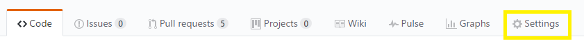
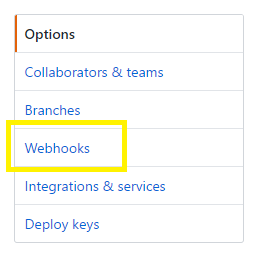
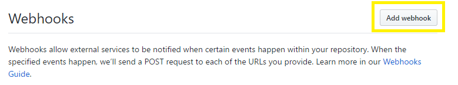
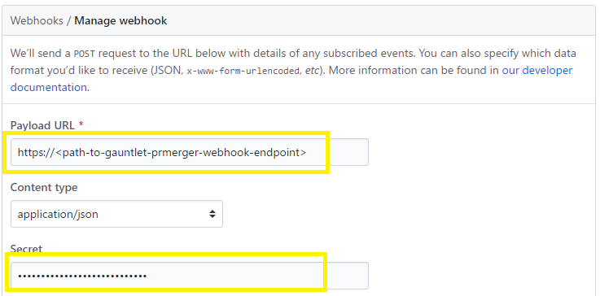
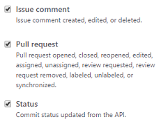
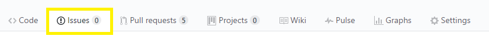
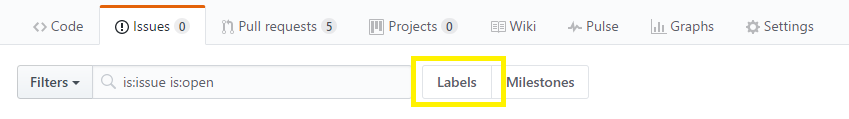
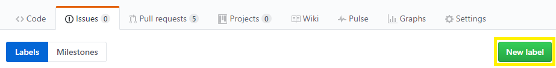

# Onboarding to Gauntlet PRMerger
There are a few simple configurations that need to be made to the repositories settings in GitHub in order for PRMerger to see and start merging pull requests. It is necessary for someone that has administrator access to the repositories to make these changes. Once the setting changes outlined below are in place, PRMerger will immediately start monitoring this repository and merging pull requests.

## Github Setting Changes

### Step 1: Add the PRMerger webhook end-point
> [!IMPORTANT]
> The following steps needs to be completed by the Gauntlet Engineering Team (contact **martinof** for additional support).

- Open your repo in [http://www.github.com](http://www.github.com).
- Click on **Settings**. 

   

- From the **Options** menu, click **Webhooks**. 

   

- From the Webhooks page click on **Add webhook** (you may be asked to enter your Github password to continue).

   

- The Gauntlet webhook and secret need to get added to the **Payload URL** and **Secret** fields and then the Webhook is added.

   

----
### Step 2: Subscribe to the correct webhook events
Once the webhook is added the next step is to subscribe to the correct events so PRMerger knows what to listen to in this repo. 

- Within the Webhooks setting page from the previous step, the following events need to be subscribed to `Issue Comment`, `Pull Request` & `Status`

  

----
### Step 3: Create the required labels
- From your Repo in [http://www.github.com](http://www.github.com) click on the **Issues** tab.
  
- Click on the **Labels** button.
  
- Then click on **New label**.
  
- If they do not already exist then the following labels need to be created (exact spelling and case required). Also, the label colors must be consistent across all repositories as these are visual markers in a shared PR queue where vendor PR review is provided. 
    - `do-not-merge` (bright red)
    - `qualifies-for-auto-merge` (bright green)
    - `needs-human-review` (bright yellow)
    - `ready-to-merge` (bright green)
    - `merged-by-prmerger` (bright green)
  
