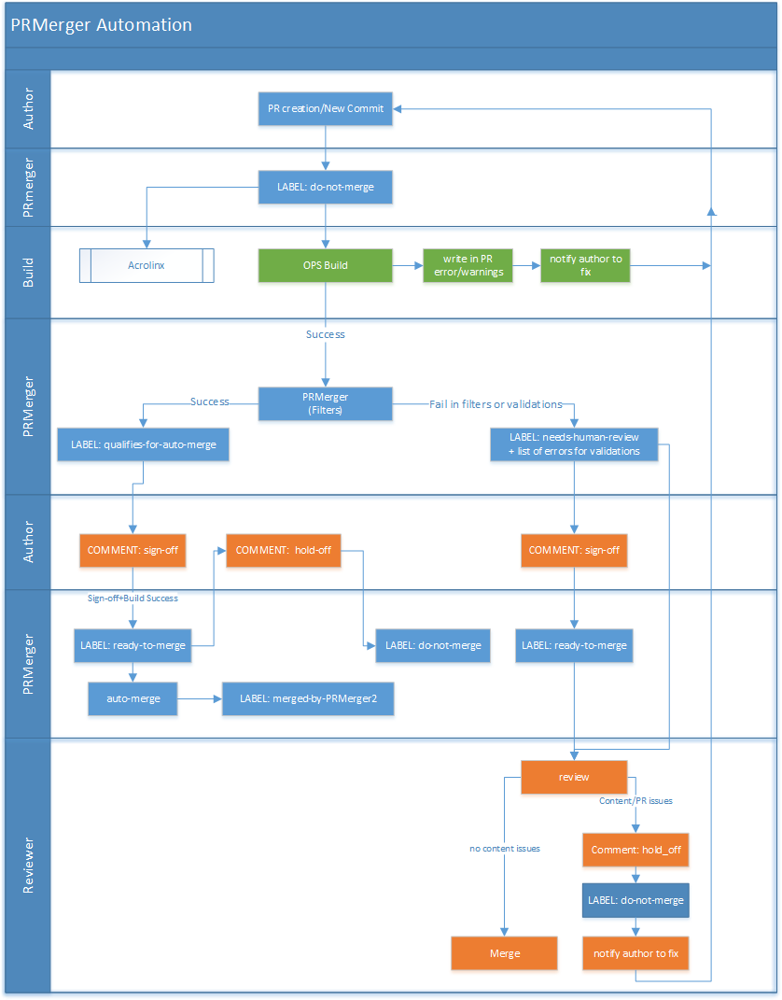

# Overview of PRMerger
PRMerger is a part of the Gauntlet framework used to merge pull requests in a repository based on set of predefined filters/validation checks. Currently in most repositories, the pull request merge process is a manual task. As the number of PRs is increasing this manual process is not scalable. A need was identified to automate pull request workflow management and align the basic workflow of all repositories to the existing known and proven workflow in **azure-content-pr**. 

## How does Gauntlet PRMerger work?
Once a repository on GitHub has been [configured](prmerger-onboarding.md), Gauntlet PRMerger will begin monitoring that repo for incoming Pull Requests. Once a Pull Request is submitted, the following steps are taken (full [PRMerger Flow](#prmerger-full-workflow) is also outlined below):

**Basic Flow**
1. PRMerger first adds a label called `do-not-merge` to all new Pull Requests. Based on the business requirements, a Pull Request can only be merged if **the following 3 conditions** are met:
     - Build is successful.
     - All PRMerger validation filters pass.
     - A comment **#sign-off** is added to the PR, which assigns the `ready-to-merge` label.
2. The Pull Request will trigger the OPS build. If the build is successful the PRMeger automation kicks in, otherwise the author is notified of the failed build.
3. After the successful build, the [PRMerger business filters](#gauntlet-prmerger-business-rules-and-validation-filter) are run: 
    1. If all of the *filters are successful*, PRMerger adds a label `qualifies-for-auto-merge` 
        - The author reviews and adds a Comment **#sign-off**. Once PRMerger sees the sign-off comment it adds the `ready-to-merge` label, confirms the filters were successful and the build has passed. PRMerger will then proceed to auto-merge this Pull Request and add a label `merged-by-prmerger`.  
    2. If the *filters are not successful*, PRMerger adds a label `needs-human-review`. 
        - When this label is assigned, the designated pull request reviewers for the repository have to review the pull request to decide whether it can be merged or not. If there are no content issues they merge the Pull Request manually. If there are, they add a comment **#hold-off** and notify the author to fix. This reassigns the `do-not-merge` label so that PRMerger will not proceed with merging the PR.

## Gauntlet PRMerger business rule and validation criteria
Pull Requests need to meet the follow criteria, defined by the business in order to qualifiy for auto-merge. If a Pull Request fails one of these criteria, then it will be labeled for human review.

### PRMerger criteria
For a pull request to qualify for automatic merge, the pull request needs to meet these criteria:

- Affects no more than 10 files.
- Contains no more than 15 commits.
- Contains no more than 20% change.
- Contains no new files or deleted files.
- Does not change, add or remove any images.
- Contains no index pages, hub pages, home pages, landing pages, config files, breadcrumb files, or TOC files
- The PR is filed against the master branch.
- PR title does not contain the words "edit pass".

### PRMerger validation items
If a pull request includes any of the following items, a warning will be written to the pull request so the author can fix the issues before signing off:

- Contains only one H1 heading.
- Unsupported file extensions.
- MD file deletions by someone who is not listed in those files as the author. You must list yourself as the author prior to deleting articles.
- Files being submitted into the root folder of the repo.

## PRMerger Full Workflow

