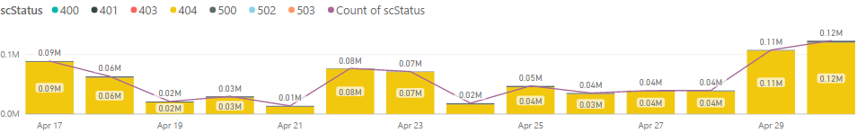

# APEX Weekly Live Site Update 04/24-04/30

 
This is weekly live site update for content sites and online services in C+E APEX team. The update covers the availability and performance for major content sites, and high severity live site incidents occurred during the week. Besides the site reliability analysis, performance trends for Open Publishing Service(OPS) are provided as well. While you receive this update in the email, you can always find the [online version](https://opsdocs.azurewebsites.net/en-us/OPSDocs/livesiteupdates/week0424?branch=master) as well as archived updates there.

Overall https://docs.microsoft.com had **good availability and performance** for the week, and the availability for other sites went down by certain degree, especially MSDN site(98.58%, below the goal) due to the load balancer issue in one of 3 data centers(live site incident [984069](https://mseng.visualstudio.com/VSChina/_workitems/edit/984069)) on 4/27. 

|Site Name  |Availability(actual/goal)*  |Performance*  |#LSIs(Live Site Incidents)  |#CRI(Customer Reported Incidents) |
|---------|---------|---------|---------|---------|
|https://docs.microsoft.com/| 99.97%/99.9% | 0.81 second | 3 | 3 |
|https://developer.microsoft.com/| 99.84%/99.9% | 1.64 seconds |  |  |
|Blogs sites([MSDN](https://blogs.msdn.microsoft.com) & [Technet](https://blogs.technet.microsoft.com/)) | 99.96%/99.9% | 1.80 seconds |2 |2 |
|https://msdn.microsoft.com | 98.58%/99.5% | 1.95 seconds |  |  |
|https://technet.microsoft.com | 99.43%/99.5% | 1.91 seconds | | |
|Forums sites([MSDN](https://social.msdn.microsoft.com/Forums/en-US/home), [Technet](https://social.technet.microsoft.com/Forums/en-US/home) & [MSFT](https://social.microsoft.com/Forums/en-US/home)) | 99.60%/99.5% | 1.95 seconds | | |
*Keynote is data source of Availability and Performance (aka Main Content Seen). More check out [here](http://capsinsight.azurewebsites.net/keynote/keynotereportdashboard.aspx)

There were 9 LSIs for the week and this is the 3rd week with the big number of LSIs after the new reporting tool.  Some of severity 2 LSIs could convert to bugs, and as long as we are tracking those issues, either way is fine for now and any feedback is welcome for improvement. For those who still not aware of how to report issues, please always remember [http://aka.ms/sitehelp](http://aka.ms/sitehelp).

|ID |Severity | Title |Service impacted|
|---------|---------|---------|---------|
|[977838](https://mseng.visualstudio.com/VSChina/_workitems/edit/977838) |2|[LSI]OPS builds doesn't support adding code snippet references to config files|OPS|
|[980696](https://mseng.visualstudio.com/VSChina/_workitems/edit/980696) |2|Social Forums intermittently not sorting|MSDN|
|[982159](https://mseng.visualstudio.com/VSChina/_workitems/edit/982159) |2|[LSI]Headers not populated from Swagger|Docs.MSFT|
|[983171](https://mseng.visualstudio.com/VSChina/_workitems/edit/983171) |1|AppVeyor Service Issue|OPS|
|[984069](https://mseng.visualstudio.com/VSChina/_workitems/edit/984069) |1|Intermittent issue with MSDN site|MSDN|
|[984070](https://mseng.visualstudio.com/VSChina/_workitems/edit/984070) |2|[LSI]Overload pages are missing APIscan metadata for the individual overloads|Docs.MSFT|
|[984189](https://mseng.visualstudio.com/VSChina/_workitems/edit/984189) |2|[LSI]Docs: 404 image reference is not made relative|Docs.MSFT|
|[984232](https://mseng.visualstudio.com/VSChina/_workitems/edit/984232) |1|OPSDocs is down|OPS|
|[985483](https://mseng.visualstudio.com/VSChina/_workitems/edit/985483) |2|[LSI]Add new product family version value to CAPS porfolio|OPS|

We have done root cause analysis for a set of LSIs(refer to below table) and details have been added into each individual LSI. Please forward to folks who you think will find useful and good lesson learning. 

|ID |Severity | Title |Service impacted| RCA Summary|
|---------|---------|---------|---------|---------|
|[941427](https://mseng.visualstudio.com/VSChina/_workitems/edit/941427) | 2 | OpS build failure with system exception: An item with the same key has already been added	|OPS-Build|Code Regression|
|[951756](https://mseng.visualstudio.com/VSChina/_workitems/edit/951756) | 2 | Intermittent issues with docsmsft-eus azure website(docs site)	|Rendering|Code Bug|
|[952437](https://mseng.visualstudio.com/VSChina/_workitems/edit/952437) | 2 | Issue in downloading the PDF files in Docs pages	|	OPS-Build	|Code Regression/Communication|
|[960341](https://mseng.visualstudio.com/VSChina/_workitems/edit/960341) | 2 | Pull request validation not working for Azure-docs-pr	|OPS-Build|Code Regression|
|[961379](https://mseng.visualstudio.com/VSChina/_workitems/edit/961379) | 2 | Investigating issue with rating pop-up in Docs Pages	|Rendering	|Code Regression|

[Docs site error rate](https://msit.powerbi.com/groups/e610335a-39ac-4ca2-b4dc-58ef168c2b48/dashboards/262443dd-d5f9-4081-bd40-bfc086deac3e) for the week is around 366K, decrease of 45k from last week, though there was a spike over the weekend(tracking via #[962895](https://mseng.visualstudio.com/VSChina/_workitems?id=962895&fullScreen=false&_a=edit)).

 

[OPS build daily performance trend](https://msit.powerbi.com/groups/e610335a-39ac-4ca2-b4dc-58ef168c2b48/reports/ac5b4829-3599-4ad6-9750-1a90739ffa4e/ReportSection) shows there were spikes for both Azure and .NET repos on April 28th due to the high volume of commits and pull requests, and other days are in normal mode.
 

 
