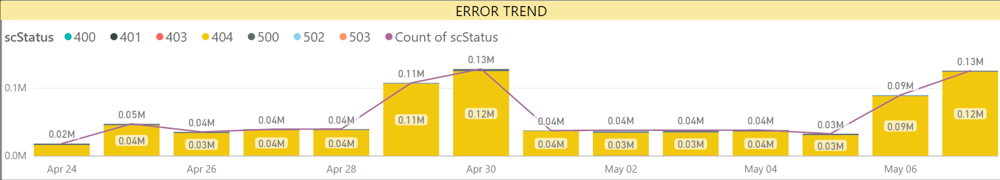
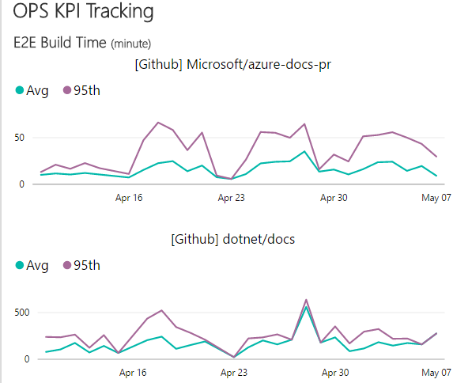

# APEX Weekly Live Site Update 05/01-05/07

 
This is weekly live site update for content sites and online services in C+E APEX team. The update covers the availability and performance for major content sites, and high severity live site incidents occurred during the week. Besides the site reliability analysis, performance trends for Open Publishing Service(OPS) are provided as well. While you receive this update in the email, you can always find the [online version](https://opsdocs.azurewebsites.net/en-us/OPSDocs/livesiteupdates/week0501?branch=master) as well as archived updates there.

Overall https://docs.microsoft.com *didn't* achieve 99.9 last week due to one of the EUS instances going down randomly for which we are getting an RCA from Azure webapp team. On a separate note, there wasn't any major customer impact observed during these intermittent failures, thanks to our automated failover mechanism on rendering side.

Forums, MSDN, Technet & other sites were impacted last week due to LSIs ([986083](https://mseng.visualstudio.com/VSChina/_workitems?id=986083) and [987473](https://mseng.visualstudio.com/VSChina/_workitems?id=987473)) (on 05/01 & 05/02) based on the unexpected traffic from Sogou user-agent and /vstudio URL path requests.

[DevMSFT](https://devmsftprod.azurewebsites.net/) availability decrease is due to the DNS Look up failure from single Keynote agent on 05/05, for which we filed a case with Dynatrace team and they confirmed an issue on that day with this agent. Apart from that, overall this website was all fine in both perf and availability metrics.
 

|Site Name  |Availability(actual/goal)*  |Performance*  |#LSIs(Live Site Incidents)  |#CRI(Customer Reported Incidents) |
|---------|---------|---------|---------|---------|
|https://docs.microsoft.com/| 99.61%/99.9% | 0.76 second | 1 ||
|https://developer.microsoft.com/| 99.22%/99.9% | 1.71 seconds |  |  |
|Blogs sites([MSDN](https://blogs.msdn.microsoft.com) & [Technet](https://blogs.technet.microsoft.com/)) | 99.90%/99.9% | 1.67 seconds |||
|https://msdn.microsoft.com | 99.05%/99.5% | 2.25 seconds | 2 | 1 |
|https://technet.microsoft.com | 99.35%/99.5% | 2.15 seconds | 1 | |
|Forums sites([MSDN](https://social.msdn.microsoft.com/Forums/en-US/home), [Technet](https://social.technet.microsoft.com/Forums/en-US/home) & [MSFT](https://social.microsoft.com/Forums/en-US/home)) | 98.09%/99.5% | 2.9 seconds | 1 |  |
*Keynote is data source of Availability and Performance (aka Main Content Seen). More check out [here](http://capsinsight.azurewebsites.net/keynote/keynotereportdashboard.aspx)

There were 5 LSIs ([TFS Query](https://mseng.visualstudio.com/vschina/_workitems?id=ec1a8231-15a0-4d3e-a9f5-a25f9317e29d&_a=query)) for this week with a great decrease compared to last week. Some were initially filed as an LSI, but as part of our process we converted to the ideal work item type (Bug, Feature, Task). On a separate note, the best way to report LSIs is through [sitehelp](http://aka.ms/sitehelp).

|ID |Severity | Title |Service impacted|Customer Impact|
|---------|---------|---------|---------|---------|
|[986083](https://mseng.visualstudio.com/VSChina/_workitems?id=986083) |1|[LSI]Intermittent performance issue with MSDN/TechNet website|MSDN Rendering|Yes|
|[987473](https://mseng.visualstudio.com/VSChina/_workitems?id=987473) |1|Intermittent issue with Forums Sites|Forums Search|Yes|
|[989089](https://mseng.visualstudio.com/VSChina/_workitems?id=989089) |2|[LSI]Akamai Alert: EUS Azure Datacenter Down|Docs.MSFT Rendering|No|
|[989538](https://mseng.visualstudio.com/VSChina/_workitems?id=989538) |1|Msdnstage Down|MSDN Stage Rendering|Yes|
|[989839](https://mseng.visualstudio.com/VSChina/_workitems?id=989839) |1|Access issues with multiple internal tools (sms/stage sites)|Internal Tool Rendering|Yes|

Below are the LSIs for which detailed RCA was performed from last 2 weeks.

|ID |Severity | Title |Service impacted| RCA Summary|
|---------|---------|---------|---------|---------|
|[975617](https://mseng.visualstudio.com/VSChina/_workitems?id=975617) | 2 |[LSI]API Browser results link to null (no content)|Rendering|Code Bug|
|[976267](https://mseng.visualstudio.com/VSChina/_workitems?id=976267) | 2 | [LSI]PDF creation is not occurring in prod	|Rendering|Code Bug|
|[987473](https://mseng.visualstudio.com/VSChina/_workitems?id=987473) | 2 | Intermittent issue with Forums Sites	|Forums||

[Docs site error rate](https://msit.powerbi.com/groups/e610335a-39ac-4ca2-b4dc-58ef168c2b48/dashboards/262443dd-d5f9-4081-bd40-bfc086deac3e) for the week is around 400K, decrease of 16K from last week, though there was a spike over the weekend(tracking via #[993046](https://mseng.visualstudio.com/VSChina/_workitems?id=993046&fullScreen=false&_a=edit)).

 

[OPS build daily performance trend](https://msit.powerbi.com/groups/e610335a-39ac-4ca2-b4dc-58ef168c2b48/dashboards/e1858dc8-09bc-4a09-ac15-0a97042a4f1c/reports/ac5b4829-3599-4ad6-9750-1a90739ffa4e/ReportSection) shows all normal during last week. 
 

 
