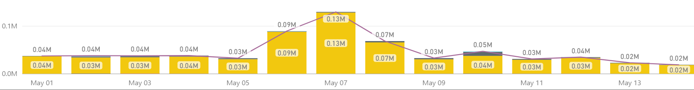
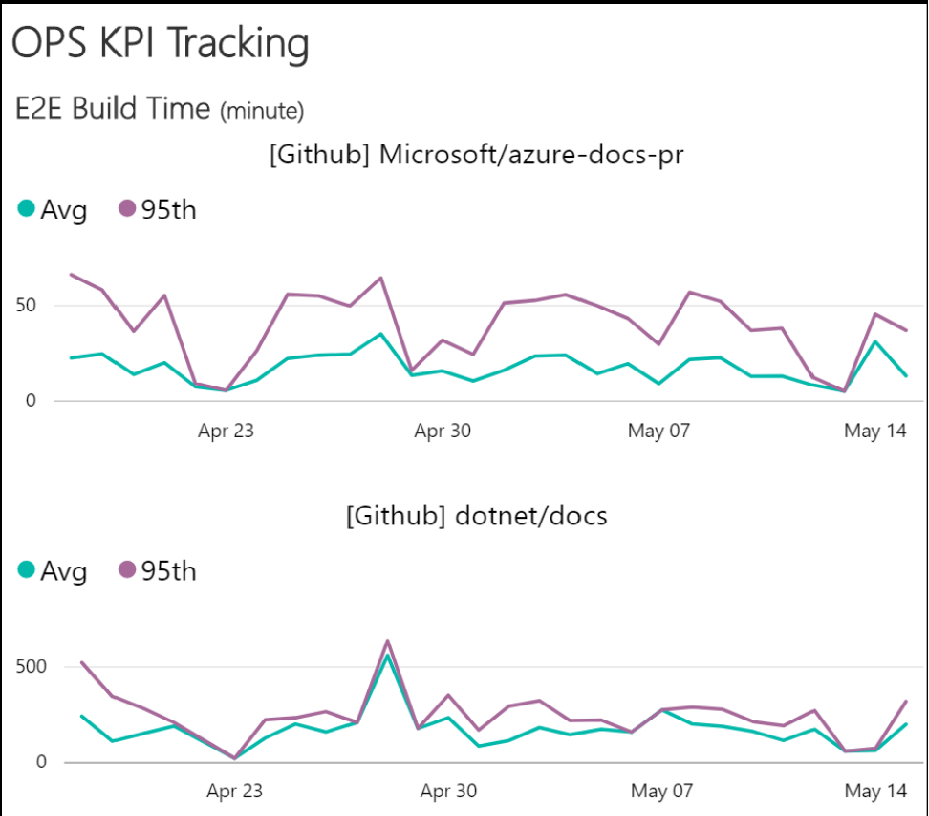

# APEX Weekly Live Site Update 05/08-05/14

 
This is weekly live site update for content sites and online services in C+E APEX team. The update covers the availability and performance for major content sites, and high severity live site incidents occurred during the week. Besides the site reliability analysis, performance trends for Open Publishing Service(OPS) are provided as well. While you receive this update in the email, you can always find the [online version](https://opsdocs.azurewebsites.net/en-us/OPSDocs/livesiteupdates/week0508?branch=master) as well as archived updates there.

Overall https://docs.microsoft.com had **Good availability and Performance** for the week including all other sites as well. All the sites recorded at least 99.8% this week except technet which had the availability of 99.64%. Based on overall availability and performance metrics, this is the best week so far. 
 

|Site Name  |Availability(actual/goal)*  |Performance*  |#LSIs(Live Site Incidents)  |#CRI(Customer Reported Incidents) |
|---------|---------|---------|---------|---------|
|https://docs.microsoft.com/| 99.94%/99.9% | 0.81 second | 1 ||
|https://developer.microsoft.com/| 99.82%/99.9% | 1.69 seconds |  |  |
|Blogs sites([MSDN](https://blogs.msdn.microsoft.com) & [Technet](https://blogs.technet.microsoft.com/)) | 99.87%/99.9% | 1.67 seconds |||
|https://msdn.microsoft.com | 99.91%/99.5% | 1.73 seconds | | |
|https://technet.microsoft.com | 99.64%/99.5% | 1.78 seconds | | |
|Forums sites([MSDN](https://social.msdn.microsoft.com/Forums/en-US/home), [Technet](https://social.technet.microsoft.com/Forums/en-US/home) & [MSFT](https://social.microsoft.com/Forums/en-US/home)) | 99.93%/99.5% | 2.24 seconds | | |
*Keynote is data source of Availability and Performance (aka Main Content Seen). More check out [here](http://capsinsight.azurewebsites.net/keynote/keynotereportdashboard.aspx)

There were 7 LSIs ([TFS Query](https://mseng.visualstudio.com/vschina/_workitems?id=ec1a8231-15a0-4d3e-a9f5-a25f9317e29d&_a=query)) for this week. The below list excludes all the LSIs which were either related to existing bugs or content issues. On a separate note, the best way to report LSIs is through [sitehelp](http://aka.ms/sitehelp).

|ID |Severity | Title |Service impacted|Customer Impact|
|---------|---------|---------|---------|---------|
|[994773](https://mseng.visualstudio.com/VSChina/_workitems?id=994773) |1|[LSI]Intermittent issue with Docs WUS Endpoint - due to one failure instance from WUS|Docs Rendering|No|
|[995025](https://mseng.visualstudio.com/VSChina/_workitems?id=995025) |2|[LSI]docs[mref]code tag in triple-slash (///) comments rendered as full Code block|OPS-Build|Yes|
|[995065](https://mseng.visualstudio.com/VSChina/_workitems?id=995065) |2|[LSI]HB Issue: Visual studio release notes (RECON) not being processed|OPS-Loc|No|
|[995985](https://mseng.visualstudio.com/VSChina/_workitems?id=995985) |2|Content.VS builds are not being triggered|OPS-Build|Yes|
|[996738](https://mseng.visualstudio.com/VSChina/_workitems?id=996738) |2|[LSI]HO Issue: vcppdocs_HT_OL#MedHT#20170510T222141|OPS-Build|No|
|[997084](https://mseng.visualstudio.com/VSChina/_workitems?id=997084) |2|[LSI][OPS] [LOC] Azure-psdocs-processing: Localized version of article is not being published live|OPS-Build|No|
|[993994](https://mseng.visualstudio.com/VSChina/_workitems?id=993994) |2|[LSI]HO Issue: vcppdocs_HT_OL#MedHT#20170510T222141|OPS-Build|No|

Below are the LSIs for which detailed RCA was performed from last 2 weeks.

|ID |Severity | Title |Service impacted| RCA Summary|
|---------|---------|---------|---------|---------|
|[989538](https://mseng.visualstudio.com/VSChina/_workitems?id=989538) | 1 |[LSI]msdnstage sites not accessible|Rendering|Networking/Proxy|

[Docs site error rate](https://msit.powerbi.com/groups/e610335a-39ac-4ca2-b4dc-58ef168c2b48/dashboards/262443dd-d5f9-4081-bd40-bfc086deac3e) for the week is around 250K, decrease of ~150K from last week. This is a great improvement from reliability perspective and we didn't notice any anamolies on 404 trend too, hence didn't file any LSIs for content teams.

 

[OPS build daily performance trend](https://msit.powerbi.com/groups/e610335a-39ac-4ca2-b4dc-58ef168c2b48/dashboards/e1858dc8-09bc-4a09-ac15-0a97042a4f1c/reports/ac5b4829-3599-4ad6-9750-1a90739ffa4e/ReportSection) shows all normal during last week. 

 

 
