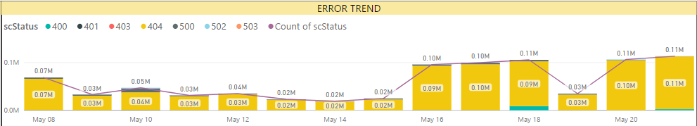
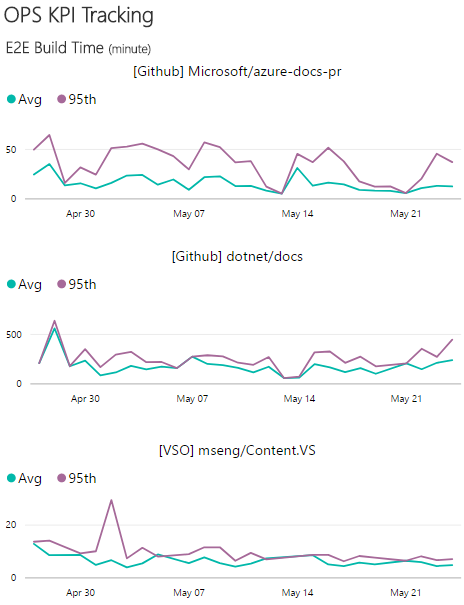

# APEX Weekly Live Site Update 05/15-05/21

 
This is weekly live site update for content sites and online services in C+E APEX team. The update covers the availability and performance for major content sites, and high severity live site incidents occurred during the week. Besides the site reliability analysis, performance trends for Open Publishing Service(OPS) are provided as well. While you receive this update in the email, you can always find the [online version](https://opsdocs.azurewebsites.net/en-us/OPSDocs/livesiteupdates/week0515?branch=master) as well as archived updates there.

Overall https://docs.microsoft.com had **Great availability and Performance** for this week. First time, we recorded 100% availability. All other sites had little less availability due to multiple LSIs last week, especially Forums and Blogs. 
 

|Site Name  |Availability(actual/goal)*  |Performance*  |#LSIs(Live Site Incidents)  |#CRI(Customer Reported Incidents) |
|---------|---------|---------|---------|---------|
|https://docs.microsoft.com/| 100%/99.9% | 0.81 second | 1 ||
|https://developer.microsoft.com/| 99.51%/99.9% | 1.83 seconds |  |  |
|Blogs sites([MSDN](https://blogs.msdn.microsoft.com) & [Technet](https://blogs.technet.microsoft.com/)) | 96.09%/99.9% | 2.32 seconds |2||
|https://msdn.microsoft.com | 99.91%/99.5% | 1.73 seconds | | |
|https://technet.microsoft.com | 99.64%/99.5% | 1.78 seconds | | |
|Forums sites([MSDN](https://social.msdn.microsoft.com/Forums/en-US/home), [Technet](https://social.technet.microsoft.com/Forums/en-US/home) & [MSFT](https://social.microsoft.com/Forums/en-US/home)) | 99.93%/99.5% | 2.24 seconds | 4 | |
*Keynote is data source of Availability and Performance (aka Main Content Seen). More check out [here](http://capsinsight.azurewebsites.net/keynote/keynotereportdashboard.aspx)

There were 10 LSIs ([TFS Query](https://mseng.visualstudio.com/vsChina/_workitems?id=3c2a1290-11e9-41f7-ad20-59780a2f8925&_a=query)) for this week. The below list excludes all the LSIs which were either related to existing bugs or content issues. On a separate note, the best way to report LSIs is through [sitehelp](http://aka.ms/sitehelp).

|ID |Severity | Title |Service impacted|Customer Impact|
|---------|---------|---------|---------|---------|
|[997801](https://mseng.visualstudio.com/VSChina/_workitems?id=997801) |0|[LSI]Issues with MSDN and TechNet Blogs site down|MSDN/TN Blogs|Yes|
|[999534](https://mseng.visualstudio.com/VSChina/_workitems?id=999534) |2|[LSI]Azure CLI CI process caused breaking changes to parameter info|OPS-Build-Docfx|Yes|
|[1000415](https://mseng.visualstudio.com/VSChina/_workitems?id=1000415) |2|[LSI]Example code is cut off and has no Copy button|DocsMSFT - Rendering|No|
|[1000491](https://mseng.visualstudio.com/VSChina/_workitems?id=1000491) |1|Incident Notification: Issue with Forum sites- issue while patching sql servers|MSDN/TN Forums|Yes|
|[1000849](https://mseng.visualstudio.com/VSChina/_workitems?id=1000849) |2|[LSI]Sorting issue with Forums|MSDN/TN Forums|No|
|[1000897](https://mseng.visualstudio.com/VSChina/_workitems?id=1000897) |2|[LSI]Error when try to publish some files in CAPS for SQL14|OPS-Other|No|
|[1001136](https://mseng.visualstudio.com/VSChina/_workitems?id=1001136) |2|[LSI]Handoff transform failed due to Server Error|OPS-Loc|No|
|[1001201](https://mseng.visualstudio.com/VSChina/_workitems?id=1001201) |1|[LSI]Issue with Forum sites- issue while patching SQL servers|MSDN/TN Forums|Yes|
|[1001315](https://mseng.visualstudio.com/VSChina/_workitems?id=1001315) |1|[LSI]Issue with Forum sites|MSDN/TN Forums|Yes|
|[1002547](https://mseng.visualstudio.com/VSChina/_workitems?id=1002547) |1|[LSI]Intermittent Issue with MSDN and TechNet Blogs|MSDN/TN Blogs|Yes|

[Docs site error rate](https://msit.powerbi.com/groups/e610335a-39ac-4ca2-b4dc-58ef168c2b48/dashboards/262443dd-d5f9-4081-bd40-bfc086deac3e) for the week is around 500K, increase of ~250K from last week. Error rate increase drastically for 404s and we are filing bugs with content owners to look more into this based on the trend in error report. Filed [bug](https://mseng.visualstudio.com/VSChina/_workitems?id=962895&fullScreen=false&_a=edit) for content teams to help analyze more on this.

 

[OPS build daily performance trend](https://msit.powerbi.com/groups/e610335a-39ac-4ca2-b4dc-58ef168c2b48/dashboards/e1858dc8-09bc-4a09-ac15-0a97042a4f1c/reports/ac5b4829-3599-4ad6-9750-1a90739ffa4e/ReportSection) shows all normal during last week. 
 

