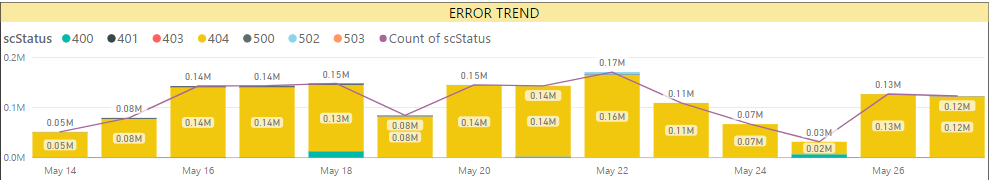
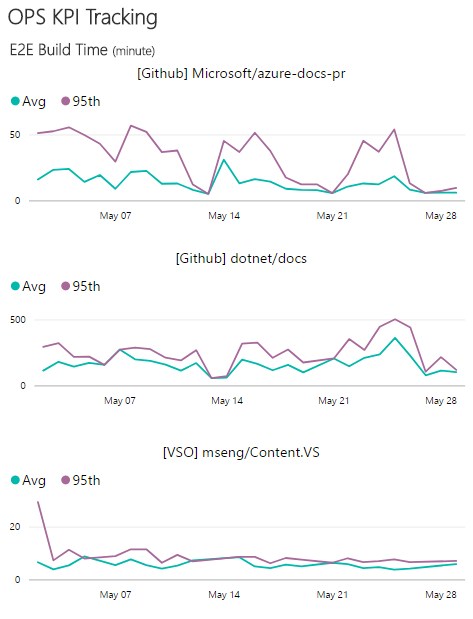

# APEX Weekly Live Site Update 05/22-05/28

 
This is weekly live site update for content sites and online services in C+E APEX team. The update covers the availability and performance for major content sites, and high severity live site incidents occurred during the week. Besides the site reliability analysis, performance trends for Open Publishing Service(OPS) are provided as well. While you receive this update in the email, you can always find the [online version](https://opsdocs.azurewebsites.net/en-us/OPSDocs/livesiteupdates/week0522?branch=master) as well as archived updates there.

Overall https://docs.microsoft.com had **Good availability and Performance** for this week. We haven't achieved 99.9% target for last week, due to some keynote agent failures intermittently which brought down the availability to 99.85%. All other sites also didn't achieve 99.9% this week due to transient issues on multiple areas. 
 

|Site Name  |Availability(actual/goal)*  |Performance*  |#LSIs(Live Site Incidents)  |#CRI(Customer Reported Incidents) |
|---------|---------|---------|---------|---------|
|https://docs.microsoft.com/| 99.85%/99.9% | 0.85 second | 1 ||
|https://developer.microsoft.com/| 99.88%/99.9% | 1.66 seconds |  |  |
|Blogs sites([MSDN](https://blogs.msdn.microsoft.com) & [Technet](https://blogs.technet.microsoft.com/)) | 99.92%/99.9% | 1.95 seconds |||
|https://msdn.microsoft.com | 99.89%/99.5% | 1.75 seconds || |
|https://technet.microsoft.com | 99.66%/99.5% | 1.77 seconds | | |
|Forums sites([MSDN](https://social.msdn.microsoft.com/Forums/en-US/home), [Technet](https://social.technet.microsoft.com/Forums/en-US/home) & [MSFT](https://social.microsoft.com/Forums/en-US/home)) | 99.69%/99.5% | 2.14 seconds |1| |
*Keynote is data source of Availability and Performance (aka Main Content Seen). More check out [here](http://capsinsight.azurewebsites.net/keynote/keynotereportdashboard.aspx)

There were 7 LSIs ([TFS Query](https://mseng.visualstudio.com/vsChina/_workitems?id=3c2a1290-11e9-41f7-ad20-59780a2f8925&_a=query)) for this week. The below list excludes all the LSIs which were either related to existing bugs or content issues. On a separate note, the best way to report LSIs is through [sitehelp](http://aka.ms/sitehelp).

|ID |Severity | Title |Service impacted|Customer Impact|
|---------|---------|---------|---------|---------|
|[1002861](https://mseng.visualstudio.com/VSChina/_workitems?id=1002861) |2|[LSI] Comments Facebook Livefyre commenting is not configured|Docs.MSFT - Rendering|No|
|[1003578](https://mseng.visualstudio.com/VSChina/_workitems?id=1003578) |2|[Forums] 2 bad elastic nodes Intermittent content err on main page|MSDN - Forums|Yes|
|[1006585](https://mseng.visualstudio.com/VSChina/_workitems?id=1006585) |2|[LSI]Getting "Run script failed with no detailed information" error when creating a pull request in GitHub|OPS - Build|No|
|[1007617](https://mseng.visualstudio.com/VSChina/_workitems?id=1007617) |2|[LSI]PDF download button not working|OPS - Build|Yes|
|[1007862](https://mseng.visualstudio.com/VSChina/_workitems?id=1007862) |2|[LSI]OPS Live Partner Center site not updating when I push master to live|OPS - Build|Yes|
|[1008225](https://mseng.visualstudio.com/VSChina/_workitems?id=1008225) |2|[LSI]CAPS service is timing out on bulk checkins|CAPS|Yes|
|[1008438](https://mseng.visualstudio.com/VSChina/_workitems?id=1008438) |2|[LSI]Changes in OPS aren't showing up in staging|OPS-Build|No|

[Docs site error rate](https://msit.powerbi.com/groups/e610335a-39ac-4ca2-b4dc-58ef168c2b48/dashboards/262443dd-d5f9-4081-bd40-bfc086deac3e) for the week is around 550K, increase of ~50K from last week. Error rate increase drastically for 404s and we are filing bugs with content owners to look more into this based on the trend in error report. Most contribution in error rate is on 404s for which we had an [LSI](https://mseng.visualstudio.com/dfe297d9-5f61-4d42-b4bb-03f8b8646944/_workitems?id=1008152) last week.

 

[OPS build daily performance trend](https://msit.powerbi.com/groups/e610335a-39ac-4ca2-b4dc-58ef168c2b48/dashboards/e1858dc8-09bc-4a09-ac15-0a97042a4f1c/reports/ac5b4829-3599-4ad6-9750-1a90739ffa4e/ReportSection) shows all normal during last week. 
 

