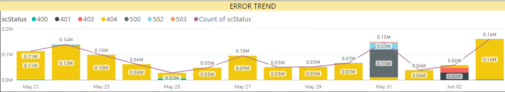
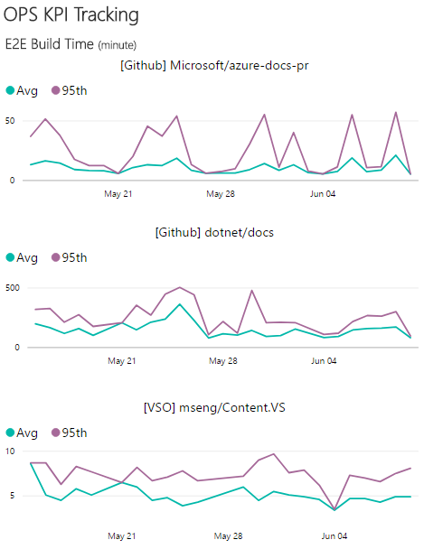

# APEX Weekly Live Site Update 06/05-07/02

 
This is weekly live site update for content sites and online services in C+E APEX team. The update covers the availability and performance for major content sites, and high severity live site incidents occurred during the week. Besides the site reliability analysis, performance trends for Open Publishing Service(OPS) are provided as well. While you receive this update in the email, you can always find the [online version](https://opsdocs.azurewebsites.net/en-us/OPSDocs/livesiteupdates/week0529?branch=master) as well as archived updates there.

Overall https://docs.microsoft.com hadn't reached it's target of 99.9% due to couple of major LSIs last week related to deployments. All other sites also didn't achieve 99.9% this week due to transient issues on multiple areas. 
 

|Site Name  |Availability(actual/goal)*  |Performance*  |#LSIs(Live Site Incidents)  |#CRI(Customer Reported Incidents) |
|---------|---------|---------|---------|---------|
|https://docs.microsoft.com/| 99.61%/99.9% | 1.02 second | 2 ||
|https://developer.microsoft.com/| 99.54%/99.9% | 2.05 seconds |  |  |
|Blogs sites([MSDN](https://blogs.msdn.microsoft.com) & [Technet](https://blogs.technet.microsoft.com/)) | 99.83%/99.9% | 2.07 seconds |||
|https://msdn.microsoft.com | 99.56%/99.5% | 1.95 seconds || |
|https://technet.microsoft.com | 99.58%/99.5% | 1.74 seconds | | |
|Forums sites([MSDN](https://social.msdn.microsoft.com/Forums/en-US/home), [Technet](https://social.technet.microsoft.com/Forums/en-US/home) & [MSFT](https://social.microsoft.com/Forums/en-US/home)) | 99.82%/99.5% | 2.02 seconds |2| |
*Keynote is data source of Availability and Performance (aka Main Content Seen). More check out [here](http://capsinsight.azurewebsites.net/keynote/keynotereportdashboard.aspx)

There were 7 LSIs ([TFS Query](https://mseng.visualstudio.com/vsChina/_workitems?id=3c2a1290-11e9-41f7-ad20-59780a2f8925&_a=query)) for this week. The below list excludes all the LSIs which were either related to existing bugs or content issues. On a separate note, the best way to report LSIs is through [sitehelp](http://aka.ms/sitehelp).

|ID |Severity | Title |Service impacted|Customer Impact|
|---------|---------|---------|---------|---------|
|[1009467](https://mseng.visualstudio.com/VSChina/_workitems?id=1009467) |1|[LSI] Forums - Profile: Activities delayed|MSDN - Forums|Yes|
|[1009753](https://mseng.visualstudio.com/VSChina/_workitems?id=1009753) |1|Docs site timeout due to mooncake template deployment|Docs - Rendering|Yes|
|[1010692](https://mseng.visualstudio.com/VSChina/_workitems?id=1010692) |1|Profile:  Intermittent Gateway timeout|MSDN - Profile|Yes|
|[1011105](https://mseng.visualstudio.com/VSChina/_workitems?id=1011105) |2|[LSI] Ho Issue : No archive package azure-docs-pr_HT_P1#OL#CPubP1#20170531T190913|OPS - Loc|No|
|[1011476](https://mseng.visualstudio.com/VSChina/_workitems?id=1011476) |1|Missing images and forbidden pages under docsmsft site|Docs - Rendering|Yes|
|[1011796](https://mseng.visualstudio.com/VSChina/_workitems?id=1011796) |2|[LSI] HO Issue :  azure-docs-pr_HT_BugFix Failed|OPS - Loc|No|

[Docs site error rate](https://msit.powerbi.com/groups/e610335a-39ac-4ca2-b4dc-58ef168c2b48/dashboards/262443dd-d5f9-4081-bd40-bfc086deac3e) for the week is around 574K, decrease of ~10K from last week. Error rate increase mostly on couple of LSIs on docs due to mooncake deployment and missing images deployment on DHS part. 404s seems okay for last week, hence didn't file any bug to content team.

 

[OPS build daily performance trend](https://msit.powerbi.com/groups/e610335a-39ac-4ca2-b4dc-58ef168c2b48/dashboards/e1858dc8-09bc-4a09-ac15-0a97042a4f1c/reports/ac5b4829-3599-4ad6-9750-1a90739ffa4e/ReportSection) shows couple of spikes, but everything else looks normal per trend. 
 

