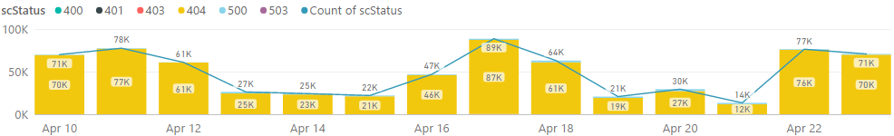
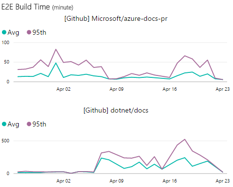

# APEX Weekly Live Site Update

The week:  04/17/2017 - 04/23/2017

<please update this and fill in below table>Overall all sites had **good availability and performance** for the week, comparable with the week before except developer’s performance went up 30% due to a temporary site issue on 4/18. 

|Site Name  |Availability*  |Performance*  |#LSIs(Llve Site Incidents)  |#CRI(Customer Reported Incidents) |
|---------|---------|---------|---------|---------|
|https://docs.microsoft.com/| 99.97% | 0.82 second | 4 | 4 |
|https://developer.microsoft.com/| 99.94% | 1.70(30% up) |  |  |
|Blogs sites([MSDN](https://blogs.msdn.microsoft.com) & [Technet](https://blogs.technet.microsoft.com/)) | 99.96% | 1.17 seconds | | |
|https://msdn.microsoft.com | 99.75% | 1.82 seconds | 1 | 1 |
|https://technet.microsoft.com | 99.61% | 1.80 seconds | | |
|Forums sites([MSDN](https://social.msdn.microsoft.com/Forums/en-US/home), [Technet](https://social.technet.microsoft.com/Forums/en-US/home) & [MSFT](https://social.microsoft.com/Forums/en-US/home)) | 99.85% | 1.81 seconds | | |
*Keynote is data source of Availability and Performance (aka Main Content Seen). More check out [here](http://capsinsight.azurewebsites.net/keynote/keynotereportdashboard.aspx)

<please update this and fill in below table>There were 7 LSIs for the week and this is the 2nd week with the big number of LSIs after the new reporting tool.  Starting with this week, a weekly LSI review happens with Engineering teams.

|ID |Severity | Title |Service impacted|
|---------|---------|---------|---------|
|[973914](https://mseng.visualstudio.com/VSChina/_workitems/edit/973914) | 2 |[LSI]Tertiary menu not accessible (disappears during mouse over) on msdn pages|Docs.MSFT|

<please update this and upload a new screenshot>[Docs site error rate](https://msit.powerbi.com/groups/e610335a-39ac-4ca2-b4dc-58ef168c2b48/dashboards/262443dd-d5f9-4081-bd40-bfc086deac3e) for the week is about 397k, **comparable** with the prior week(300k) except 404 errors over the weekend which is pending investigations.
 

<please update this and upload a new screenshot>[OPS build daily performance trend](https://msit.powerbi.com/groups/e610335a-39ac-4ca2-b4dc-58ef168c2b48/reports/ac5b4829-3599-4ad6-9750-1a90739ffa4e/ReportSection) for Azure repo is **normal** while .Net repo saw a peak of 523 mins 95th E2E build time on 4/19 and back to normal 2 days later.
 

 
