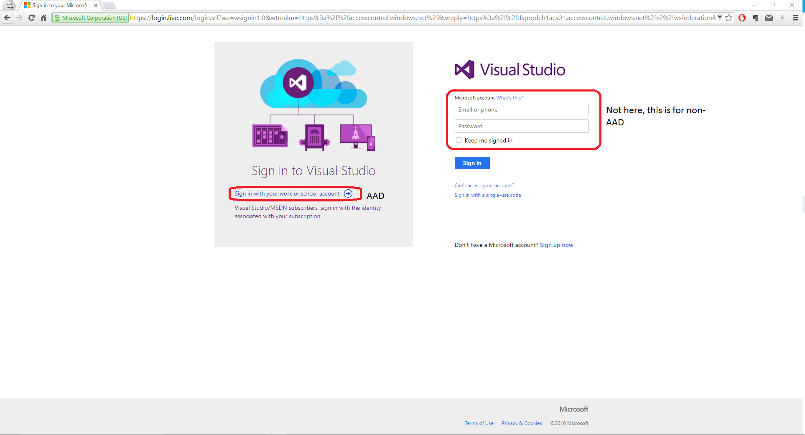
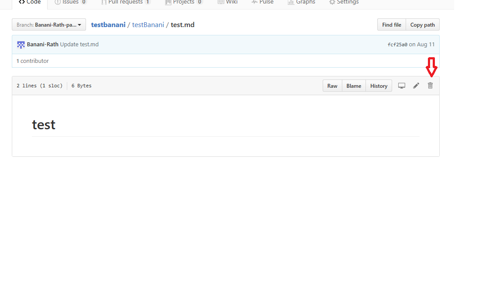

# Frequent Questions and Answers

## Q: Why I can't see any provisoned repositories in OPS portal when I sign in with VSTS?
A: Each corpnet user with their email `xxx@microsoft.com` has two separate accounts in VSTS account system, one is backed up by AAD, while the other is not. Normally, our repositories are located in your AAD account. To solve the problem, you just need to sign out the non-AAD VSTS account, and sign in with your AAD one.
1. Re-open [OPS self-service portal](https://OPS), click log-in with VSTS. (If automatically signed in, sign out the portal first in the upper-right corner)

2. It should display the VSTS sign in page, since you’ve logged off VSTS, if not, please go to [Visual Studio Homepage](https://www.visualstudio.com/) to log off and go back to previous step.
Sign in via the link in the left pane(Sign in with your work or school account) [Not the right panel blanks]

After that, just following the instruction text in log in.

## Q: Why do I receive a 404 page when I want to sign in with VSTS?
A: Try to log in with your AAD VSTS account, not the non-AAD one, just following [Sign in with VSTS AAD](#SignInWithAAD).

## Q: Why is my localized content showing up in English?
A: If your content has been localized and it shows in English when it is published, most likely the docset containing that content has not been provisioned for Open Publishing. You can do this now via the [OPS portal](../opsportal.md). 

## Q: How to delete a duplicate folder from my repo?

A: To delete a duplicate folder, you need to delete the content from folder. For example, if you want to delete a duplicate test folder from your repo and it has content test.md, then 

   Step 1: Locate folder from your [repo](https://github.com/Banani-Rath/testbanani)
     
   Step 2: Click on markdown file or files
     
   Step 3: Click on Delete button on  upper right corner of markdown file as shown in pic.
     
   Step 4: Commit Changes and Folder will be gone.
     

   
## Q: Why do I receive 404 for files with extension .exe.md, e.g., xxx.exe.md?
A: .exe is blocked by our IIS server and treated as unsafe extension. Please rename your files and avoid using unsafe extensions.
     

## Q: Why I cannot sign it to OPS portal with Edge?
The issue is because the portal backend server is in a different zone than the frontend server. Note that both IE and Edge shares the zoning. So to fix the problem, follow these steps:

1. Launch Internet Explorer.
2. Go to **Tools – Internet Options - Security**
3. Click on Local intranet and then on **Sites – Advanced**
4. Add the following two sites to the intranet zone. If you get prompted as either site is in a different zone, please accept the changes
    * https://ops.microsoft.com
    * https://*.op-build-prod.azurewebsites.net
5. Click on **Close – OK – OK**.
6. Close both Internet Explore and Edge.
7. Launch Edge and log in to the portal.
