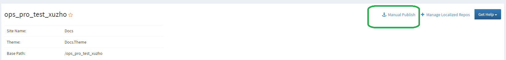
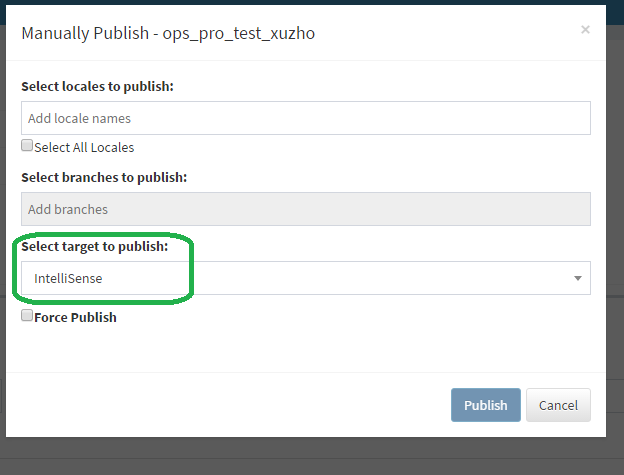
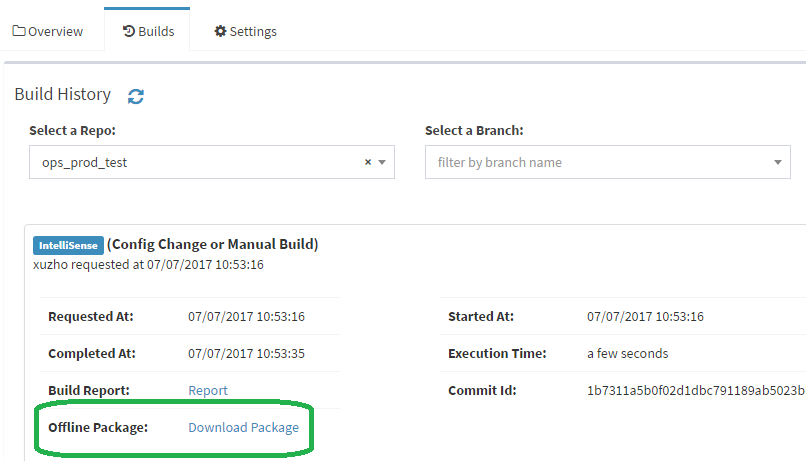

# Intellisense

Intellisense files are XML files generated from **Reference** page's content. It is structured by assembly. Namely, each assembly has an XML file like below:

```XML
<?xml version="1.0" encoding="UTF-8"?>
<doc>
  <assembly>
    <name>Assembly Name</name>
  </assembly>
  <members>
    <member name="CommentId">
      <summary>About tags that are supported in summary, refer to <see cref="https://docs.microsoft.com/en-us/dotnet/csharp/programming-guide/xmldoc/recommended-tags-for-documentation-comments"/></summary>
      <param name="ParameterIdentifier">Parameter description</param>
      <returns>Return value description</returns>
      <exception cref="CommentId">Exception description</exception>
    </member>
    <member name="CommentId">
    ....
    </member>
  </members>
</doc>
```

## Supported tags

Intellisense files support a subset of [recommended tags for documentation comments](https://docs.microsoft.com/en-us/dotnet/csharp/programming-guide/xmldoc/recommended-tags-for-documentation-comments).

* `<summary>`
* `<param>`
* `<paramref>`
* `<typeparam>`
* `<typeparamref>`
* `<returns>`
* `<exception>`
* `<para>`
* `<see>`


## Intellisense generation

There're two ways to publish an Intellisense file. You can manually trigger a publish or set up configuration to auto-trigger a publish once your docset has any change.

### Manually trigger an Intellisense build

Open [OPSPortal](https://ops.microsoft.com), go to the docset view and click `Manual Publish`,



It would pop up a window like below, select `Intellisense` as the target to build:



Click `Publish` button, it would then trigger an Intellisense publish. After the publish completes, you can go to the Builds panel, and download the intellisense packages by clicking `Download Package`.



### Auto-trigger Intellisense build

Go to your Github/VSO repo, and open your `.openpublishing.publish.config.json` in **live** branch, now append below setting to your original file:

```json
  "branch_target_mapping": {
    "[The branch you want to generate intellisense]": [
      "Publish",
      "Intellisense"
    ]
  }
```

Remember to replace the string "[The branch you want to generate intellisense]" with your real branch name, for example `"master"`. You can use [the site](https://jsonlint.com) to validate the config file after the edit.

Now you're done! Once anything in your repo changes, Webhook would trigger OPS to publish an intellisense build. You can download your intellisense packages from OPS portal the same way as manually triggering intellisense.
