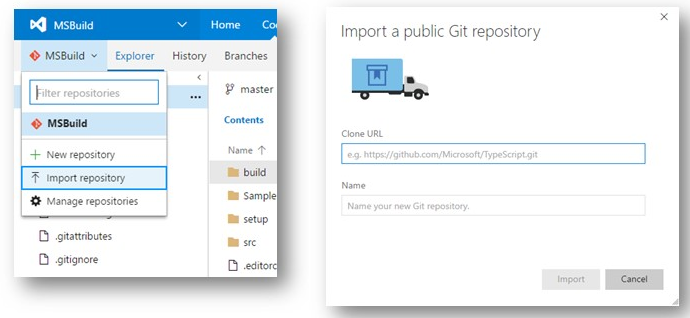
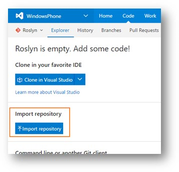

# Choose between VSTS Git or GitHub
Before moving forward with your OPS analysis or onboarding, to need you decide whether you are going to create a Visual Studio Team Services (VSTS) Git repo or GitHub.

If you are not familiar with GitHub, please visit [the GitHub site](https://github.com/) to learn more.

- For GitHub repository setup, follow the [GitHub tutorials](https://help.github.com/articles/set-up-git/).
- For Visual Studio Team Servives see [VSTS documentation](https://www.visualstudio.com/docs/overview).
 
There are 3 possible scenarios you might need:
1. Public repo: when all your content is public and you would like external contributions.
2. Private repo: when all your content is private (such as pre-release content) and you would not like external contributions.
3. [Public and private repo](#PrivatePublicRepo): when you need to store pre-release content (private repo) and you would like external contributions (public repo).

## GitHub vs. VSTS

You should only use GitHub if your repo is going to be public to external contributions on Go-Live date or within 6 months of Go-Live date.

Private repos are only for content that is not be available to customers. One of the reasons for OPS to exist is to increase both internal and external collaboration. So we get closer to our customers as well as have better quality documentation. So please consider having external contributions for your content.

`If a repo is private, it should be in VSTS`. Why?

* This follows Open Source projects guidelines. [OSPO guidelines](https://www.1eswiki.com/wiki/Choosing_a_Hosting_Provider_For_Your_OSS_Project#What_about_private_repos.3F) contain more information about the topic.

* Proprietary content has additional security and business requirements. In general, those requirements are not met by GitHub. As a result, we should not be putting proprietary content on GitHub.
    * Some teams consulted with CELA who recommended that non-public content should be hosted in VSTS.
    * [Example of GitHub security breach](https://github.com/blog/2273-incident-report-inadvertent-private-repository-disclosure). 
    
> [!NOTE]
> If you need both private and private repos to keep pre-release content, it is OK to create them for now in GitHub, until OP supports syncing between VSTS and GitHub in FY17 Q2 or do manual syncing between VSTS (private) and GitHub (public) repos.

## Setting up GitHub private and public repos for a project
If you would like external contributions from customers outside Microsoft but have pre-release content, then you would need to create two repos: one public and one private.

- The private repo will contain the under development content, that is, the content that your customers cannot see yet. You need to [update the private repo configuration](publish-configuration.md#enablecontributions) so contributions go to the public repo.  
- The public repo will contain the content that is publicly available, which your customers can contribute to. Note, even if you have not published you content live, anything in the public repo will be visible to external users.

**If you have a public and private repo, both repos need to have the same structure in order to enable external collaborations in the public repo.**

If you create both kinds of repo (private and public), you need to  synchronize your private repo to your public repo when you are ready to make the content available to your customers. This can be done manually or [automatically](syncing-repos.md). 

##  Moving an Open Publishing repo from GitHub to VSTS
We recommend that you talk to your onboarding PM in APEX before making any changes to ensure right coordination and who can help you with all your steps.

> [!IMPORTANT]
> If you are moving repos from GitHub to VSTS, please first check if there are also localized repos. If so
> * moving English and loc need to do at the same time
> * localization hand back needs to be completed

### English repo
1.	[Content Owner] Create and Provision English VSTS repo through the OPS portal.
2.	[Content Owner] Import content from GitHub to VSTS repo.
 > [!IMPORTANT]
 > You can do this step only once. So you should do this step when the content is frozen in GitHub.
3.	[Content Owner] Ensure your APEX onboarding PM VSC has admin permissions to VSTS repo
4.	[APEX PM] Deprovision repo from GitHub, live content will be deleted.
6.	[Content Owner] Publish content live from VSTS.
7.	[Content Owner] Validate content.

> [!IMPORTANT]
> If you are also changing end points (from example, from MSDN/TN to Docs): 
> * In step #5, you can provision directly to docs
> * You will have to manage redirections from [MSDN/TN to Docs](opredirection.md#SiteRedirection) and from [MTPS to Docs](paveover-mtps-content.md). Redirection from MSDN/TN to Docs needs to be coordinated with these moves to minimize the impact on your customers.  

### Localized repos
1.	[Loc Content Owner] Create and provision repos in VSTS through the OPS portal 
2.	[Loc Content Owner] Import content from GitHub to VSTS 
3. [Content Owner] Ensure your APEX onboarding PM VSC has admin permissions to VSTS repo
4. [APEX PM] Deprovision repo from GitHub, live content will be deleted.
4.	[Loc Content Owner] Publish content live from VSTS 
5.	[Loc Content Owner] Validate 
6.	[Loc Content Owner] [Hook up OL](localization/Provision_Localized_Repo.md) - OL pointers must be updated, from Github to VSTS.

## Importing a public Git repository into VSTS
You might decide to move your public repo from Git to VSTS. Here is how.

MSEng now (and other accounts after S105) has now has a feature we're launching this sprint, public Git repo import, and we would love your feedback on the experience. 

### What is the feature about?
If you have some existing code in a public Git repo on GitHub, BitBucket, GitLab etc. and you are planning to move to VSTS, then you can now use the Import repository feature to do the same.

> [!IMPORTANT] 
> You can only import content once, so it when your content in GitHub is frozen!

### How can I use it?
If you do not have access to create a repo in your team project, you can do so in the [Personal](https://mseng.visualstudio.com/DefaultCollection/Personal/) team project on MSEng. There are two ways to Import an existing public Git repository:

#### Import into a new repository
If you have a project and wish to add a repository from Git into a new repository in VSTS, then from the repo selector dropdown, click ‘Import repository’. Next, provide the clone URL of the source repository and you are good to go. 

  
#### Import into an existing empty repository
If you have an empty repository already in your project in VSTS and you want to import code into it, then on the Explorer page, click ‘Import repository’ button and provide the clone URL to get going!

How can I give feedback?
Please send any feedback to [VS.in VCX FTE](mailto:vsin_vc@microsoft.com).

## Resources
[Github to VSTS import feature](https://www.visualstudio.com/en-us/docs/git/import-git-repository)

## Next step
[Create and configure your repo](repo-creation-config.md)
