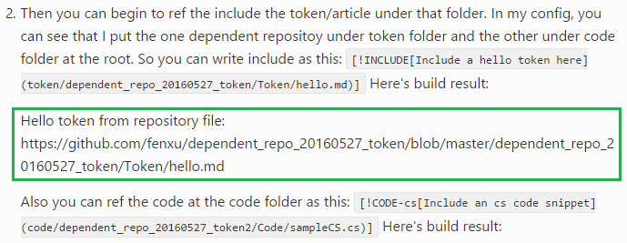

# Cross Repository Reference

Cross repository reference(shorten as CRR below) is a new model which is used to replace original git submodule model. We use git submodule to implement template reference and now we can use this new one. Besides, you can also use it to do other repository reference.

## Why we want to use CRR?
Git submodules is a feature that supported by git itself. However, currently, there are many git servers such as GitHub, VSTS and etc. Not all of them are support submodule model. Besides, git submodule feature is too advanced and complex to let common user to use. Base on those, we create CRR which may be much easier to use and understand.

## User scenarios of CRR
	1. Template reference in OP can use this way
	2. User's own cross repository reference can also leverage on this feature
	3. System token reference can use this way to implement
	4. Localization fall back can also use it if there's no concerns that localized page's en-us content is different with original en-us content

## Where the CRR configuration to store?
The CRR configuration is stored in .openpublishing.publishg.config.json file. That means you should write the CRR configuration as part of the JSON file.

## What's the data structure?
The data structure is CRR is a list of combination of path, repository and branch information.
Only when you want to use CRR, then the list property need to be added.

Configuration template and interpretation:
```json
{
    "dependent_repositories": [
        {
            "path_to_root": "<relative path to repository root>",
            "url": "<referenced repository url>",
            "branch": "<branch name of referenced repository>",
            "branch_mapping": {
                "<source repository branch>": "<referenced repository branch>",
                "<source repository branch>": "<referenced repository branch>"
            }
        },
        {
            "path_to_root": "token",
            "url": "https://github.com/Microsoft/token",
            "branch": "master",
            "branch_mapping": {
                "master": "master",
                "develop": "test"
            }
        }
    ]
}
```

| **Metadata Name** | **Meaning** | **Is Parameter Required** |
| ------------- | -----------| ------------- |
|**dependent_repositories**| the CRR relationship list name | Yes |
|**path_to_root**| A relative folder path to repository root. The folder is not required to created. | Yes |
|**url**| Url of the reference repository which current repository is dependent on. | Yes |
|**branch**| The branch of reference repository that you want to use when doing build. | Yes |
|**branch_mapping**| **Advanced feature**: A branch map of current repository and reference repository. Key is current repository's branch and value is reference repository's branch. This property allows you to use different reference branches content when you build source different branches. **If the source build branch is not specified in this property, so the branch value will be used.** | No |

## Provision for different user scenario
Different user scenarios need different provision steps now. Some even don't need user to do anything but just be aware of the data structure in case you want to modify some configuration of that.

### Template CRR
Currently, template CRR provision will done in provison step and user don't need to care about how to add it manually.

Here just give some explainations to the current implementation in case you want to know it.
All the static pages should use templates to render page. So those repositories need template repository reference.
However, there're some limitation of adding this template CRR.
- *path_to_root*: this property should always be "_themes". Otherwise, rendering page with this template can't work.
- *url*: currently it is some pre-defined ones. en-us repository will use `https://github.com/Microsoft/templates.docs.msft` and other locale will use `https://github.com/Microsoft/templates.docs.msft.{locale}`
- *branch*: product we always use **master** branch to build content. However, you can speicify any valid template branch to render your content as long as the branch you speicify is existed.

Sample
```json
"dependent_repositories": [
  {
    "path_to_root": "_themes",
    "url": "https://github.com/Microsoft/templates.docs.msft",
    "branch": "master"
  }
]
```

> [!NOTE]
> If you only have template submodule in your rpeository, which means in the .gitmodules file there's only one link to our templates url. Then you could also delete the .gitmodules file in the repository root folder.
> Once the .gitmodules file is removed, that means you totally use CRR and retire the submodule modle. Local build will be faster from the second time.

###<a name="User_own_CRR"></a> User's own CRR
This allows user do CRR among his own repository. For example: fenxu has some repositories as following shows:

| Repository | Usage |
|------------|--- ---|
| [source repository](https://github.com/fenxu/dependent_repo_20160527) | Provisioned in OPS system and will the content will be published. |
| [token repository](https://github.com/fenxu/dependent_repo_20160527_token) | Store some token and image in this repository. The content is shared to different repositories. Don't need to be provisioned in OPS. |
| [code repository](https://github.com/fenxu/dependent_repo_20160527_token2) | Store some code snippets in this repository. Those code are shared to different repositories. Don't need to be provisioned in OPS. |

#### How to provision the CRR if the dependent repository wants to use token/code repositories content?
If source repository wants to use token repository's master branch and code repository's develop branch to do content build.

##### Provision CRR
There're two ways to do provision as following shows.
1. Do it manually.
   - configurate it in [.openpublishing.publish.config file](https://github.com/fenxu/dependent_repo_20160527/blob/master/.openpublishing.publish.config.json) as below shows.
      ```
      "dependent_repositories": [
      {
          "path_to_root": "fenxu_dp_repo_20160527/token",
          "url": "https://github.com/fenxu/dependent_repo_20160527_token",
          "branch": "master"
      },
      {
          "path_to_root": "fenxu_dp_repo_20160527/code",
          "url": "https://github.com/fenxu/dependent_repo_20160527_token2",
          "branch": "develop"
      }]
      ```
   - Add the CRR folders to [.gitignore file](https://github.com/fenxu/dependent_repo_20160527/blob/master/.gitignore). By doing this step, you can avoid to see some git change after build locally.
     Otherwise, you'll see a new folder is created after the build which may bring some confuse to you.
   - Adjust the [docfx.json file](https://github.com/fenxu/dependent_repo_20160527/blob/master/fenxu_dp_repo_20160527/docfx.json) if you don't want to publish the content in reference repository.
     
     In this case, we can see that the source repository only wants to reference token and code. They are all used by `[!INCLUDE]` or `[!CODE]` syntax which means the token and code will be directly expanded into the content.
     So there's no need to publish to code and token independently. That's why you will see the following configuration is added in docfx.json file under docset folder.
     ```json
     "exclude": [
        "**/obj/**",
        "token/**",
        "code/**"
     ]
     ```
     > [!NOTE]
     > please don't exclude the image file if you want to reference. Otherwise, you will see image broken link after publishing.
     
2. By command:
All the above things should have done by command. However currently we haven't implemented that. It will be done soon.

##### Use CRR
After the provision is done, now you can use the reference repository in your source repository now.

- How can we use that?

  It's simple, just use it as the reference repository content is there in your source repository. 

- Sample and hint
  
  In the above case, we can see that we have the dependent [token repository](https://github.com/fenxu/dependent_repo_20160527_token) in folder "fenxu_dp_repo_20160527/token".
  That means you can directly use that now. Here's sample that how can use it.

  I have a file name [dependent_ref_sample.md](https://github.com/fenxu/dependent_repo_20160527/blob/master/fenxu_dp_repo_20160527/dependent_ref_sample.md) in source repository.
  Now I want to ref some token in the dependent repository. I can write content as below shows:
  ```md
  Here's build result:
  [!INCLUDE[Include a hello token here](token/dependent_repo_20160527_token/Token/hello.md)]
  ```
  You can see that in the [folder structure](https://github.com/fenxu/dependent_repo_20160527/tree/master/fenxu_dp_repo_20160527), there's no folder with name token, let alone file in that.
  However, after build, you can find the token is included. [Sample page link](https://docspilot.azurewebsites.net/en-us/fenxu_dp_repo_20160527/dependent_ref_sample?branch=master)
  
  
  > [!NOTE]
  > You may have concerns that why you need to write reference such as `token/dependent_repo_20160527_token/Token/hello.md` but not like `token/hello.md` to ref token.
  > It dependents on the folder structure of reference repository.
  > 
  > If you see the [token repository](https://github.com/fenxu/dependent_repo_20160527_token), you can see that hello.md file is in path "dependent_repo_20160527_token/token/hello.md".
  > Append the folder you specified in the configuration "fenxu_dp_repo_20160527/token", the relative path of the hello.md to source repository should be "**fenxu_dp_repo_20160527/token/dependent_repo_20160527_token/token/hello.md**".
  > 
  > The dependent_ref_sample.md relative path in source repository is "**fenxu_dp_repo_20160527/dependent_ref_sample.md**".
  > 
  > So the reference relative path becomes to "**token/dependent_repo_20160527_token/token/hello.md**".

### System token CRR
The following is just an assumption of system token CRR implementation.

Similar with template CRR, we can also add one more dependent_repositories entry when provisioning. Such as following shows:
```
"dependent_repositories": [
{
    "path_to_root": "OPSToken",
    "url": "https://github.com/Microsoft/OPSToken",
    "branch": "master"
}]
```

After adding the CRR, then the source repository can use the token under the OPSToken folder in the repository.
All the system tokens are maintained by us and can be referenced by users. Once we update some content in the token repository, users content can also been updated after next build.


### Localization CRR - for fall back token/code reference
Currently localization CRR is just an assumption. Synced with localization team, the conclusion is that user can accept if non-localized page shows en-us page that not consistant with latest en-us one.

Localization CRR configuration is similar with [User's own CRR](#User_own_CRR). The difference is the repository url and one more step done by OP build.
For example, we have [en-us repository](https://github.com/PowerShell/PowerShell-Docs) and [de-de repository](https://github.com/PowerShell/powerShell-Docs.de-de).
If we want to do the fall back logic of get token/code once it doesn't exsits in de-de repository. There's one step need to be done by user and one step to be done by build.

- User's step: Add the CRR in to de-de's .openpublishing.publish.config file. It's similar with user's own CRR.
- Build step: Copy the token/code from reference repository(namely en-us) to corresponding place in de-de repository.
  Certainly This step is controlled by one flag. (not implemented yet)
 
 
 After this two steps are done. The de-de repository can be build without any localized token/code in its own repository. But it will use en-us' content.
