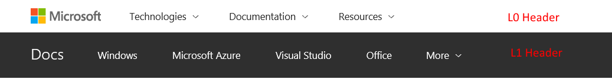
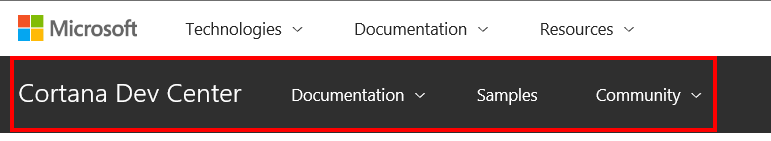
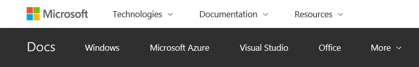

# Customizing your header via UHF

UHF stands for "Universal Header/Footer" and is a One Microsoft initiative being driven by Chris Capossela in Microsoft branding. For more information, please review [the UHF Overview slides](https://microsoft.sharepoint.com/teams/MSCOM/_layouts/15/WopiFrame.aspx?sourcedoc=%7B0D8CCB40-6A06-4FAD-A68A-9A8117B32322%7D&file=UX-UI%20alignment%20Summit%202016_v1.pptx&action=default&DefaultItemOpen=1). UHF is already adopted on sites like https://www.microsoft.com and https://www.visualstudio.com/ and there is a cross-company mandate for customer-facing sites to onboard. For additional questions about UHF, you may contact [Duane Clare](mailto:duaclar@microsoft.com).

> [!IMPORTANT]
> Only docs.microsoft.com has adopted the UHF. UHF is not supported in other documentation sites such as msdn.com.

## Customization

The UHF consists of two headers. The topmost header is referred to as the L0 Header. The header below that is referred to as the L1 Header. 



The L0 Header for docs.microsoft.com will be the same across every docset. In fact, it is the same L0 used on other sites like https://www.microsoft.com and http://developer.microsoft.com. This version of the L0 is referred to as the "Microsoft Technical Header" and is intended for technical customers.

The L1 Header can be customized on a per-docset basis. Therefore, each product team can actually choose to have their own L1 on their content. Product teams have full control over the L1 header, including changing colors, labels and menus. Here are a few examples you can see of what others are doing:
 
* [Cortana](https://review.docs.microsoft.com/en-us/cortana-test/getstarted)
* [Edge](https://review.docs.microsoft.com/en-us/microsoft-edge/)
* [UWP](https://review.docs.microsoft.com/en-us/windows-test/layout/)

#### Example Custom L1 Header



**We recommend that you build a custom L1.** However, if you do not have one, the L1 will fallback to [the standard Docs L1 Header](http://docs.microsoft.com).

#### Standard Docs L1 Header


 
We’re looking to drive some consistency across the variations in the L1 header as we move forward. That process will likely be orchestrated by an IA expert on our side more in the future. For now, to build your header, you need to use the Compass tool, provided by the UHF team. The documentation on that is provided in the [Compass Setup FAQ](https://microsoft.sharepoint.com/teams/RedTiger_Partner/_layouts/OneNote.aspx?id=%2Fteams%2FRedTiger_Partner%2FDocuments%2FUHF%20Partner&wd=target%28FAQ.one%7C8D801016-6BD2-4A45-B747-23A7BDF34E59%2FSetup%20FAQ%7CB159C9C0-9D03-4AA4-B895-19F9B38D366A%2F%29
onenote:https://microsoft.sharepoint.com/teams/RedTiger_Partner/Documents/UHF%20Partner/FAQ.one).
 
1. Send an email to the UHF team. In the email to the UHF team, please let them know that you want a new "site" and also that you are planning to create a new Category Menu, to be used as an L1 in an existing header. **We recommend that you have a primary and secondary person with access your compass configuration.**
 
2. After that's taken care of, use the Compass tool to build a Category Menu.

3. Once your Category Menu is built, make sure the publish it.

4. Next, you’ll need to email [Rob Eisenberg](mailto:reisen) with the information about where to find your Category Menu configuration within the compass tool (it’s a bit like a virtual folder structure).

5. We’ll then take your Category Menu and build out a docs header for you, sending you back a header Id that you can place in your docfx.json file, in every branch that you would like to see the custom header, using the `uhfHeaderId` property.

> [!Note]
> The docs engineering team creates a custom header that combines the Microsoft Technical Header with your Category Menu. These headers also exist inside compass, under shellservice.microsoft.com/Global/MSDocs\* The docs engineering team maintains these headers but you retain full control of your Category Menu, which you can update at any time as needed without involving the docs team, after this initial setup.

#### Example docfx.json Configuration

```
"globalMetadata": { 
  "breadcrumb_path": "/microsoft-edge/breadcrumbs/toc.json", 
  "titleSuffix": "Microsoft Edge Development", 
  "uhfHeaderId": "MSDocsHeader-MSEdge", 
  "extendBreadcrumb":true 
},
```

Once, you've pushed the change to the docfs.json file, the custom header will appear on docs.microsoft.com on the branch you added the `uhfHeaderId` property to. If you enter a wrong Id, you will not see your custom Category Menu. Instead, you will see the default docs.microsoft.com header.

> [!Note]
> We realize that this process is highly manual. This is due to various constraints in the way that UHF itself works today. We're hopeful that this process can be improved in the future.
