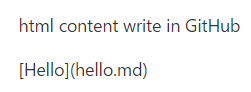
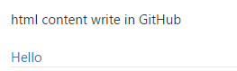
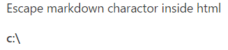

# Difference parser result between OPS and GitHub
OPS has its own parser, namely docfx, which is used to parse and build markdown content. It trys to keep same behavior with GitHub as our mostly user use GitHub to edit and view their markdown content.
However, OPS has it's own extension and after all docfx is not GitHub parser. So there'll always be some differences between OPS and GitHub rendering page.

In this article, we want to give some already known differences between GitHub and OPS page.

## GitHub doesn't parse markdown content inside html tags while OPS does.
On GitHub, if you write a piece of independent html content in the markdown file, it won't regard the content inside the html as markdown.
That means all the html content won't be parsed on GitHub. However, OPS will. Here's some examples for reference.

### Markdown link content inside html tags render difference.
```markdown
html content write in GitHub
<p>[Hello](hello.md)</p>
``` 
On GitHub, it render as below shows:
 

 
However, on OPS, it render as this:
 

 
Obviously, you can see that the link can't be resolved on GitHub but it can on OPS.

### Markdown content inside html tags sometimes affect the render result of pags on OPS.
Take escapse charactor as example, if we have markdown content as this
```markdown
Escape markdown charactor inside html
<div><strong>c:\</strong></div>
```
On GitHub, it render as below shows:



However, on OPS, it render as this:


Because of the escape markdown character "\", the **<** at the beginning of `</strong>` is shown. And that part also isn't recognized as a closed tag but a normal text content.

## The others more wait to update.
