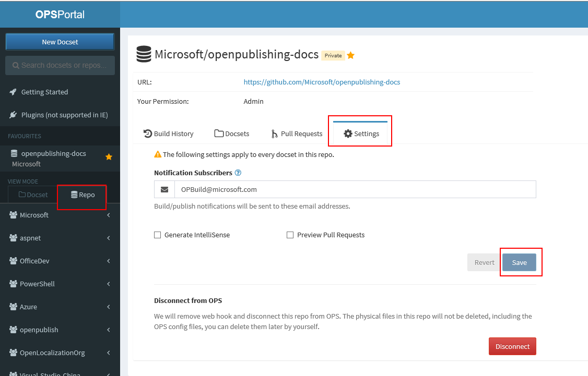

# Editing repo properties

Now you can edit the following repository properties.

* [Rename the repo](rename-repo.md)
* Notification subscribers
* Public Repository URL and Branch
* Generate PDF for live branch
* Generate IntelliSense for live branch
* Review Pull Requests
* Disconnect a repo from OPS

> [!NOTE]
> Changes are done at the individual repo level, so you need to do the changes for each of the repos.

Steps:

1. In the [OPS portal](https://OPS), switch to Repo view mode from the left navigation.
2. Find your repo and select it. 
3. Click on `Settings` tab.
4. Make your changes 
5. If you would like to undo the changes ***before saving***, click on `Revert` button.
6. If you are sure of your changes click on `Save` button.

## Disconnect a repo from OPS
1. In the [OPS portal](https://OPS), switch to Repo view mode from the left navigation.
2. Find your repo and select it. 
3. Click on `Settings` tab.
4. Click on `Disconnect` button. 