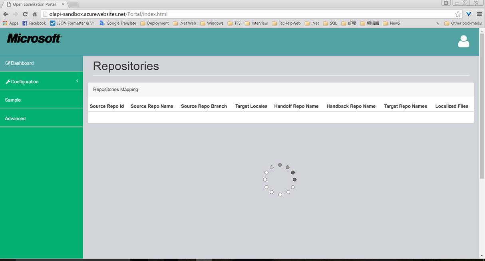
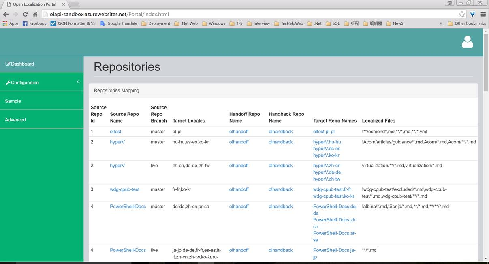
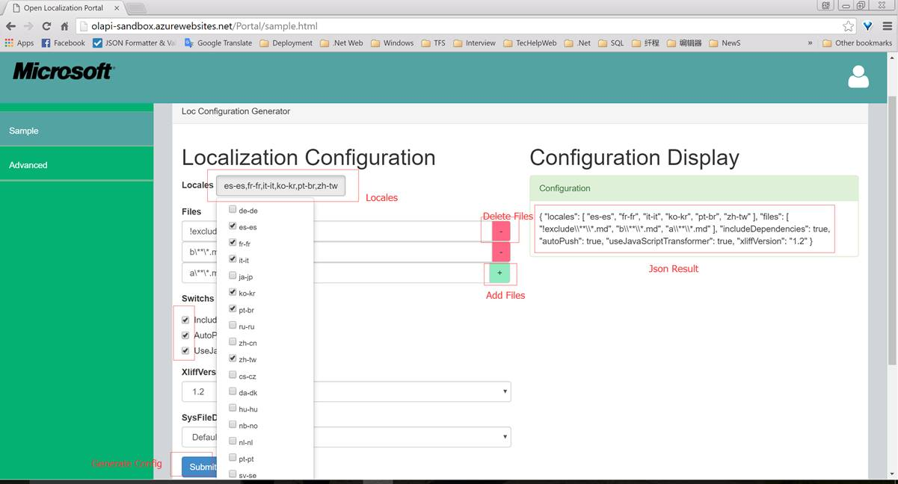
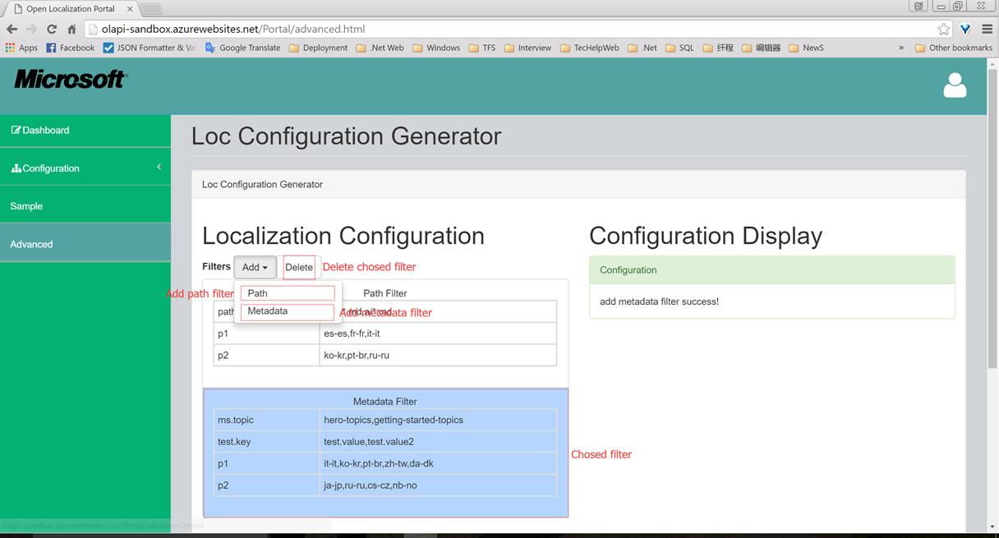
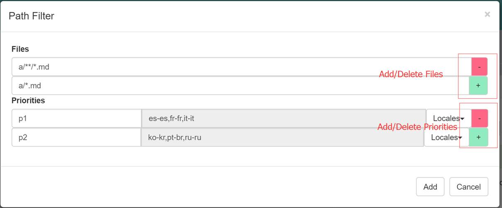
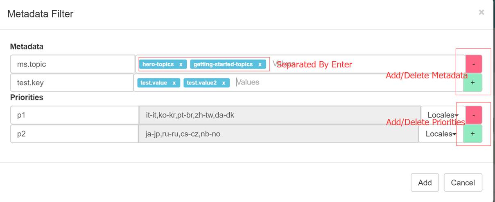
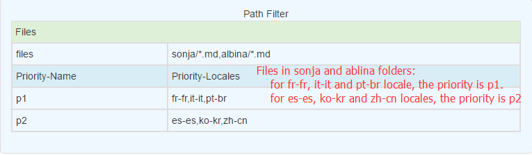
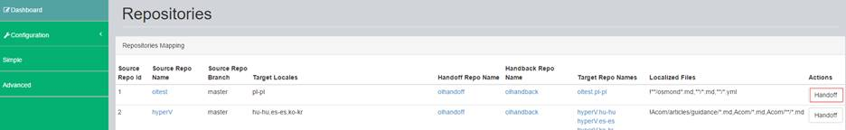

# OL Portal

[Portal URL](http://olapi-sandbox.azurewebsites.net/Portal/advanced.html)
 
## Dashboard:
 
It shows the repositories mappings.
 
* Repository Loading

* Show Repositories:
	

 
## Sample Configuration:
 
Generating sample configuration without filter.
 
	
 
## Advanced Configuration(Filter):
 
Generating advanced configuration with metadata/path filters.
 
* Add/delete metadata/path filter

* Add path filter

* Add metadata filter

* Added Path filter

* Added metadata filter

## Using Portal to do Handoff(force)

* Click the **Handoff** button at dashboard page:
	

	 
* Jump to new page:
	

	 
* Click ***create*** button to create handoff
* Click ***refresh*** button to get the handoff process.
