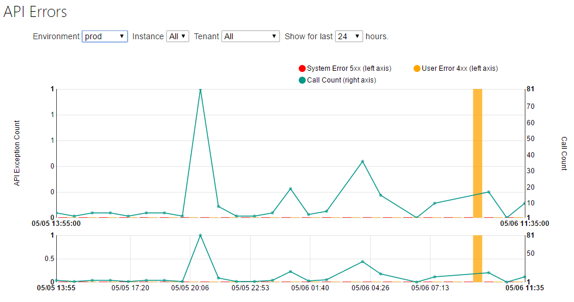
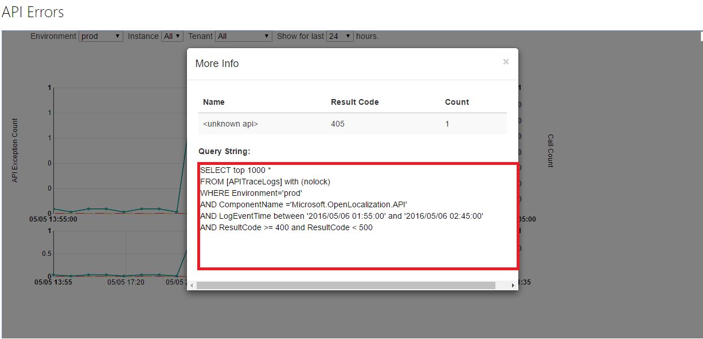
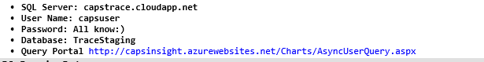
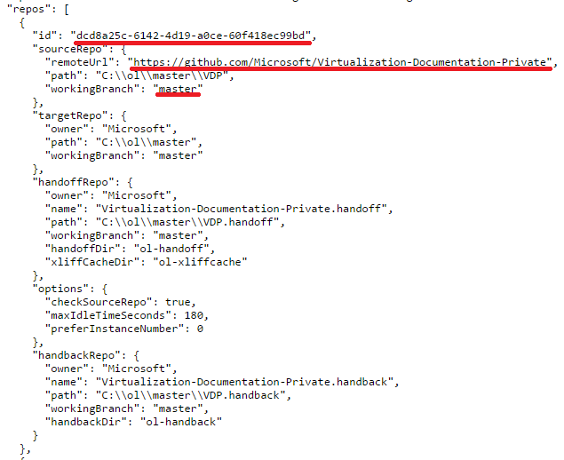

# Open Localization API Trouble Shooting

## Detect API error:
Trace User Error(4XX) System Error(5XX) in [CHIP portal](https://capsinsight.azurewebsites.net/Charts/APIException2.aspx?env=prod&comp=Microsoft.OpenLocalization.API)'s API Errors chart.

## Find error detail:
Query errors and warning from database:

## Find the issue repo:
1. Find API request URL via ApiInput column in error detail. 
2. The URL contains the repo and branch information via API definition.
3. Use [openlocalization_prod.json](http://ambientconfiguration.blob.core.windows.net/openlocalization/openlocalization_prod.json) to find the repo's information with repo id or source repo url and working branch.

	
## High frequency of occurrence error and common solution:
1. 400 Error with error code ***filter_is_invalide***: 
    * Root cause: Request body or one repo's .localization-config is invalid
	* Solution: 
	    * If the request body is not null and is invalid, ignored the following steps.
		* Find the issue repo's .localization-config:The .localization-config can in both(not either) source repo's root level and handback repo's path "ol-config/<Onwer>/<Repo>/<Branch>"
		* Validate json and locales:Check whether it is a valid json file.Check whether each locale in "locales" array is valid: XX-XX
		* Send a PullRequest to fix the .localization-config
2. 404 Error with error code ***git_repository_not_found_by_owner_and_name : The git repository with {repo name} and {repo owner} is not found***:
	* Root cause: the {repo name} (It should be a target repo with locale) is not created or we have no access privilege
	Solution:
		* Check whether the repo exist and olprod has access to it
		* Find the .localization-config in handback repo or source repo,  find the people who added the locale to cause corresponding target repo not found.
		* Send a mail to the people to ask access for corresponding repo.
