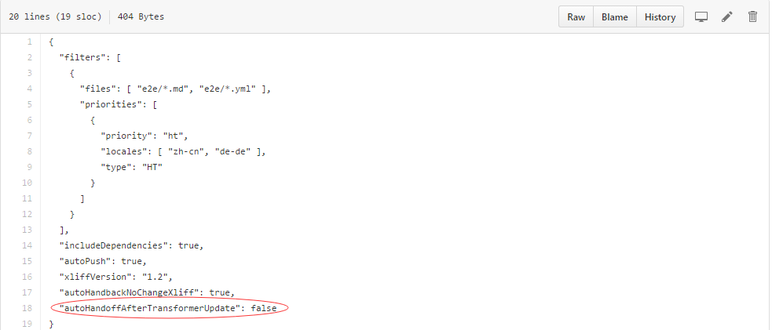
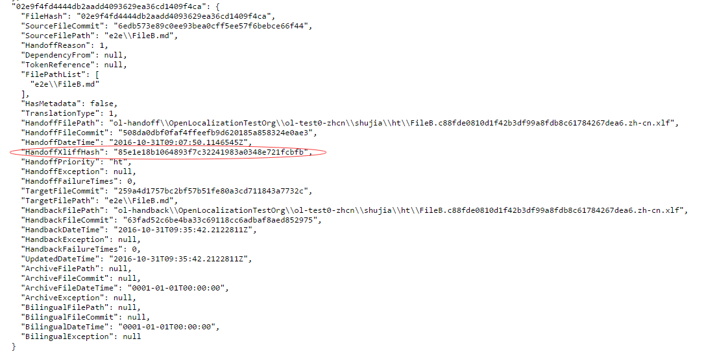
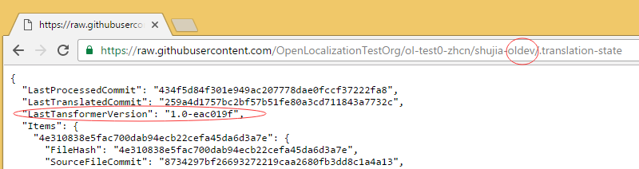
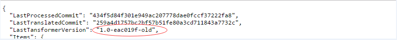
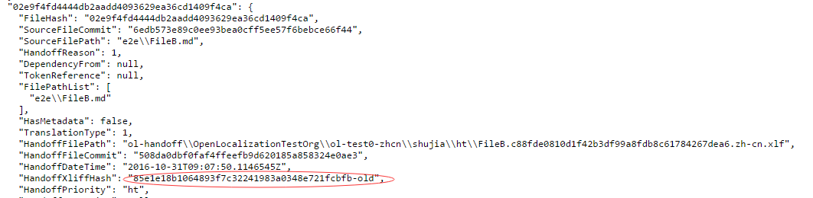
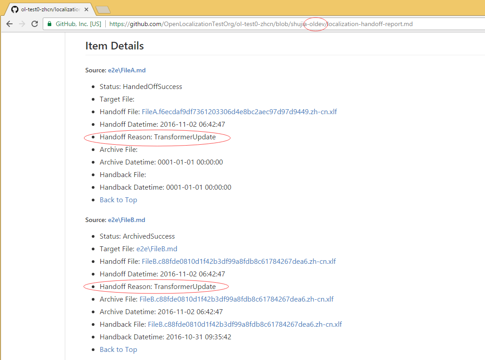
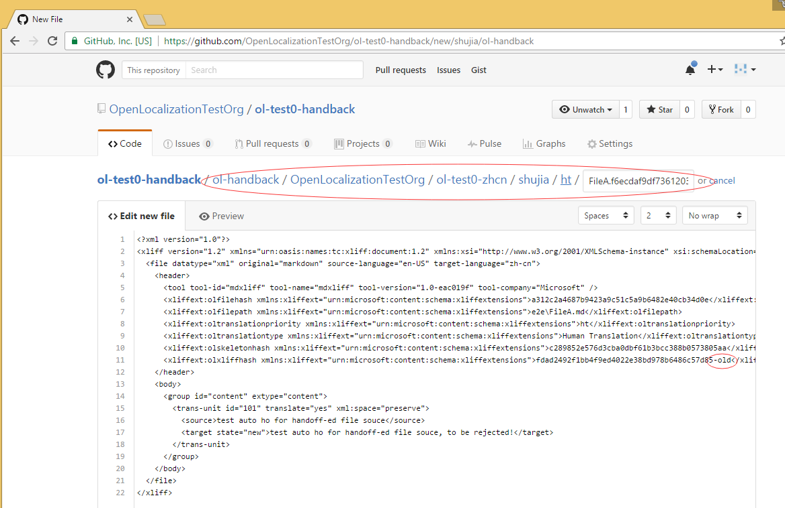
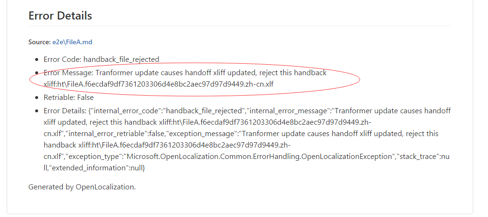
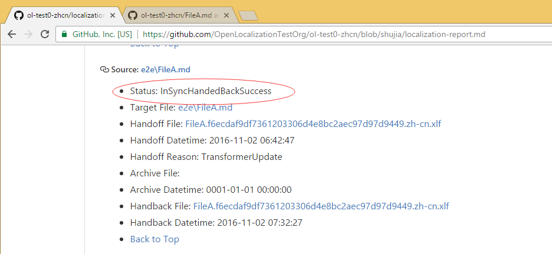

# OL Auto Re-handoff After Transformer Update

## What is this feature?
This feature is mostly for fixing transformer bugs. Sometimes transformer may generate wrong xliff due to bugs. When the bugs are fixed, OL will automatically check for every source file if the new transformer will generate a different xliff content(compare to the handed off xliff). If so, OL will handoff the file. This is called 'Auto Re-handoff'.

## How to enable this feature?
In the sourceRepo/.localization-config, set **"autoHandoffAfterTransformerUpdate": true** to turn on the switch. Not set or set it false could turn this switch off. Here is a sameple `.localization-config` file:

## Trigger conditions:
This feature will auto re-handoff a file when **all these conditions are satisfied**:
* The 'switch' in sourceRepo/.localization-config is turned on. Set "autoHandoffAfterTransformerUpdate": true.
* The transformer version updated. Check current version here: http://mdxliff.azurewebsites.net/info.
* Source file is already handed off or localized.
* Source file is handed off after this feature is ready.
* (source file content not change) After transformer updated, the new generated xliff file is different from the original one.

## About handback:
If there is a `fileA.md`, handoff to `fileA.version1.ch-zn.xliff`. Then it is archived. At this time, transformer updated and triggered the auto re-handoff, generate new file `fileA.version2.ch-zn.xliff`. Then:
1.	Handback file according to `fileA.version1.ch-zn.xliff` will be rejected.
2.	Handback file according to `fileA.version2.ch-zn.xliff` will succeed.

## How to test:
This feature is complex and very hard to test. Please follow the steps carefully. I will use a sample repo to introduce:

1. Prepare a FileA.md(already handoff), and FileB.md(already localized). Back up their handoff xliff.    

    **Checkpoint**: In the target repo, check the '.translation-state' file in the branch: {workingbranch}-oldev. **The new generated items(always appended to the end of the file) should have value of 'HandoffXliffHash'**, this stands for the xliff content(or translation units). While the old items do not have this property. Like this:

    

2. Set "autoHandoffAfterTransformerUpdate": true in the sourceRepo/.localization-config.

    **Checkpoint**: In the target repo, check the '.translation-state' file in the branch: {workingbranch}-oldev. If source repo never turns the switch on. There should be no "LastTansformerVersion". After swtich is turned on, **there should be a value of "LastTansformerVersion"**. Like this:

    

3. Open targetRepo/.translation-state in branch: {workingbranch}-oldev, modify the "LastTansformerVersion" to simulate the transformer update. Modify the "HandoffXliffHash" of FileA.md and FileB.md(the two items we just found in step 1) to simulate a transformer bug fixed(so it generate xliff with different content/hash). Checkin the file. Like this:
    
    

    **Checkpoint**: In the target repo, check the 'localization-report.md' file in the branch: {workingbranch}-oldev. **The two items are handed off with handoff reason: TransformerUpdate**. See it here:
    

4. Create handback file(FileA.f6ecdaf9df7361203306d4e8bc2aec97d97d9449.zh-cn.xlf in this case) in the handbackRepo, modify the 'olxliffhash' in the xliff to simutlate the xliff is out of date(because transformer generated new handoff xliff with new olxliffhash). Like this:
    
    
    **Checkpoint**: In the target repo, check the 'localization-report.md' file in the branch: {workingbranch}-oldev. **The items are rejected with transformer update error message**. See it here:
    

5. Create handback file(FileA.f6ecdaf9df7361203306d4e8bc2aec97d97d9449.zh-cn.xlf in this case) in the handbackRepo, **do not** modify the 'olxliffhash' in the xliff to simutalte the xliff is according to the latest handoff xliff.

    **Checkpoint**: In the target repo, check the 'localization-report.md' file in the branch: {workingbranch}-oldev. Handback succeed. Like this:
    