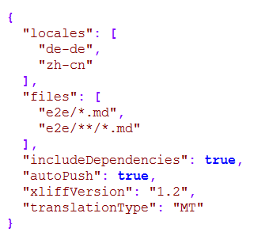
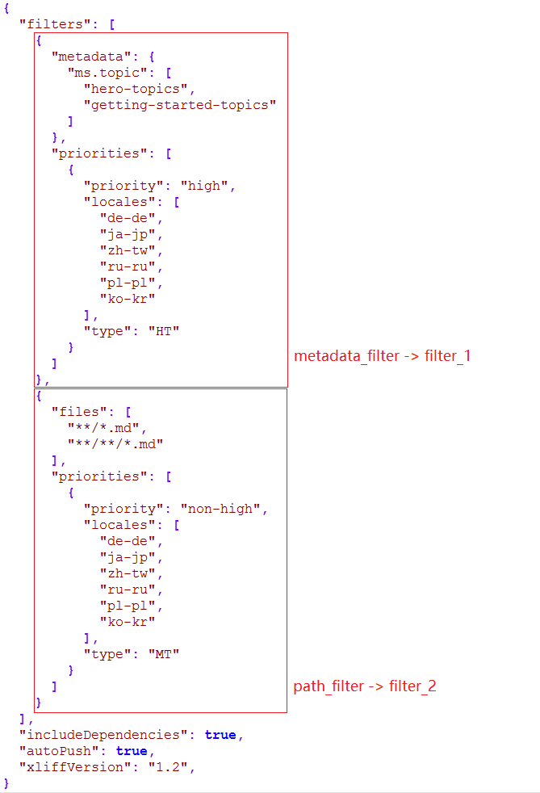
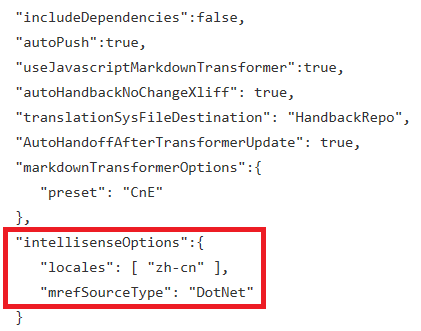

# OL Configuration File Usage

## Description:

The `.localization-config` file is used to control the localization process. This file can be located in a number of locations, including the source repo. See [Open Localization Configuration File and System Files in different places](ol_configfile_systemfiles_different places.md) for more information

> [!IMPORTANT]
> Please do send a pull request of changing this file to our dev before you check in

## Fields:

Field | Description | Default Value | Note
------|-------------| --------------|--------
None-Filter/Path-Filter/Metadata-Filter/MetadataExpression-Filter | Indicate which files and locales should be localized and the priority (per file/metadata and per locale) | N/A | We have three kinds of filters
includeDependencies | Include image dependencies | **false** | When **true**, all images are handed off
autoPush | Directly push to the target branch in the target repo | **true** | When **false**, opens a pull request
xliffVersion | **1.2** or **2.0** | **1.2** |-
forceHandoff | Re-generate all xliff files | **false** | Please reference to How to re-handoff the handed back files (force handoff)
useJavascriptMarkdownTransformer | Use the Javascript-based markdown transformer | **true** | -
dontDeleteFiles | Suppress deletion of files from the target repo which don't exist in the source repo during synchronization | **false** | -
autoHandbackNoChangeXliff | auto-handback/archive files with no-localizable content changing | **false** | -
autoHandoffAfterTransformerUpdate | force handoff of all files when the markdown/xliff transformer is updated | **false** | -
translationSysFileDestination | Name of repo to store localization system files | target repos | -
markdownTransformerOptions | Fine-grained control over markdown/xliff transform behavior | - | Please refer to Transformer Options
translationType | The translation type for all files when no filter is set | **HT** | If there is a filter, this field is ignored
intellisenseOptions | Control over intellisense handoff behavior | - | Please refer to Intellisense options

## Filters

### None-Filter

This filter is our original filter which has two fields to indicate which files and  locales to localize.

Field |	Description | Note
------|-------------| --------------
Locales | A collection of target locales | If the target repo doesn't exist, localization system will create it automatically
Files |	A collection of file list | The file path can use pattern matching, such as `docset/*.md` or `docset/**/*.md`
	
***Path Filter: This filter is to use the file path to identify the translation priority(per file and per locale)***

Field |	Description | Note
------|-------------| --------------
Files |	A collection of the files path | The file path can use pattern matching, such as "docset/*.md" or "docset/**/*.md"
Priorities | A collection of the `priority` | The priority contains the locales and corresponding priority information, please reference below for the details
	
### Metadata Filter

This filter uses metadata in the markdown file to identify the translation priority (per metadata and per locale)

Field |	Description | Note
s------|-------------| --------------
Metadata | A collection of key value pairs: \<string, list\<string>> | If the one of the metadata in markdown file is contained in this this collection, this file will be applied this filter
Priorities | A collection of the `priority` | The priority contains the locales and corresponding priority information, please reference below for the details
	
	
> [!NOTE]
> The markdown of which the metadata or the path are included in the filter will be marked as corresponding translation priority for each locale. 
> If one topic is included in both metadata and path filters, the metadata filter wins.
### MetadataExpression Filter

This filter uses metadata expression to identify the translation priority per locale

Field |	Description | Note
------|-------------| --------------
MetadataExpression | A expression string of metadata. For example, "ms.topic != Hero-Topic"| MetadataExpression works only when Metadata is not provided. 
Priorities | A collection of the `priority` | The priority contains the locales and corresponding priority information, please reference below for the details

> [!NOTE]
> * Only Metadata or MetadataExpression field can be used in one filter. If both Metadata and MetadataExpresion fields are provided in one filter, MetadadateExpression field will be **ignored**, as metadataExpression might have conflict HO scope with Metadata. 
> * String operators are **case insensitive**
> * Quote "" is necessary only when metadata value contains space. However, the metadata value without space can also be quoted. 

#### Metadata Expression Operators

Operator | Syntax
---------|-------
String.Equals | ==
Srring.NotEquals | !=
String.Contains | .Contains()
Logic.ADN | && 
Logic.OR | \|\|
Logic.NOT | !
Grouping | ()

#### Metadata Expression Examples

Given one MD file contains below 2 metadata 

***ms.topic: hero-topic***

***ms.title: "value with space"***

Metadata Expression | Evaluation Result
--------------------|------------------
"ms.topic == Hero-Topic" | true
"ms.topic != Hero-Topic" | false
"ms.topic.Contains(Hero)" | true
"!ms.topic.Contains(Hero)" | false
"ms.title.Contains(\"with space\")" | true
"!ms.title.Contains(\"with space\")" | false
"ms.topic == Hero-Topic && ms.title == \"value with space\" && ms.topic.Contains(hero)" | true
"ms.topic == not-hero-topic && ms.title == \"value with space\" \|\| ms.topic.Contains(hero)" | true
"ms.topic == hero-topic && (ms.title != valuewithoutspace \|\| ms.topic.Contains(hero))" | true
"ms.topic == hero-topic && (ms.title == \"value with space\" \|\| !ms.topic.Contains(test))" | true
"ms.topic != hero-topic \|\| ms.title == \"value with space\" \|\| !ms.topic.Contains(test)" | true
"ms.topic == hero-topic && ms.title == \"value with space\" && ms.topic.Contains(test)" | false

## Priority

Field |	Description	|Note
------|-------------| --------------
Locales | A collection of locale | If the target repo doesn't exist, localization system will create it automatically
Priority | A custom string to present the translation priority | The string can be very flexible, it can be HT, MT or any string which can present the translation priority
Type | Indicates the translation quality | Should only be "HT" or "MT". No other input allowed.
	
## Intellisense Options
Field |	Description	|Note
------|-------------| --------------
locales | A collection of locale should do intellisense handoff | For target locales not in this collection, OL will do normal MRef handoff
mrefSourceType | Indicate type of source mref contents | Supported type: **DotNet**

## Example:

1. Translation configuration without filters

Without filter, all markdown files will be localized without translation priority, all xliff files will be put in:
* Handoff path: `“olhandoff/<targetrepoorg>/<targetreponame>/<targetbranch>/”`
* Handback path: `“olhandback/<targetrepoorg>/<targetreponame>/<targetbranch>/”`

2. Translation configuration with filters:

*  “e2e/metadata/test1.md” contains “ms.topic”: “hero-topics” metadata will be include in `filter_1`, then for zh-tw locale, the priority will be “high”, handoff path will be `“olhandoff/testorg/targetrepo.zh-cn/targetbranch/high”`
* “e2e/test2.md” doesn’t contains any metadata which is include in filter_1, then it will be included in `filter_2` as the path is included in “e2e/*.md”, for zh-tw locale, the priority will be “ht”, the handoff path will be “olhandoff/testorg/targetrepo.zh-cn/targetbranch/ht”
* “e2e/test3.md” contains “ms.topic”: “hero-topics” metadata and also the path is include in “e2e/*.md”, the `filter_1` win, then for zh-tw locale, the priority will be “high”, handoff path will be “olhandoff/testorg/targetrepo.zh-cn/targetbranch/`high`”

3. Translation configuration with IntellisenseOptions:

## Discussion Emails:
	
[Discusssion email](https://microsoft.sharepoint.com/teams/Visual_Studio_China/MSDN/_layouts/15/guestaccess.aspx?guestaccesstoken=MtRRt4YM8KCeOQYNWDxduw%2fQ0XV1y5typ59csa7EyG4%3d&docid=2_19596ae92b03f4787be57fcc4664794d1&rev=1)
