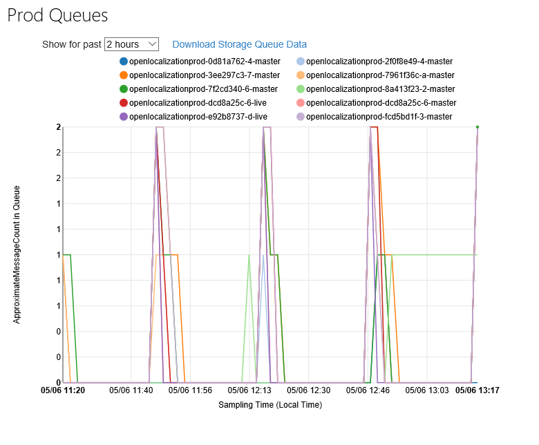
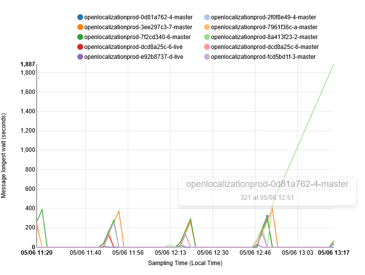
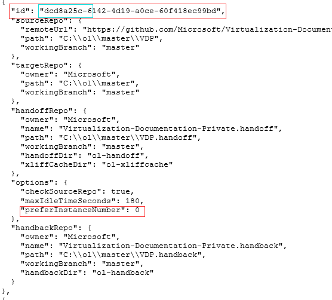
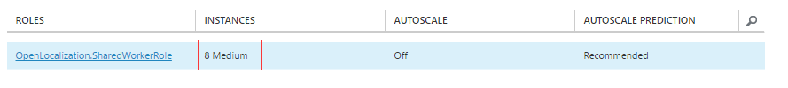
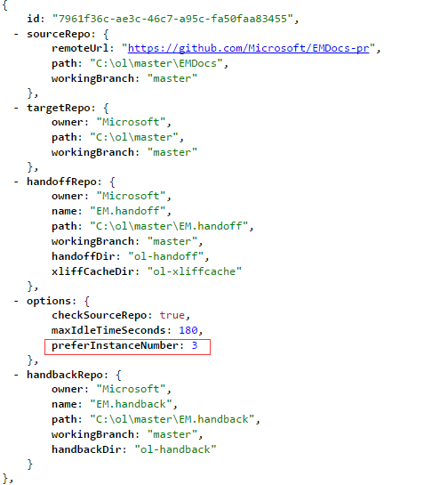

# Open Localization Performance Trouble Shooting

## How to detect the performance issue:
1. Queue Length

    * Check queue length for each repo from: https://capsinsight.azurewebsites.net/Charts/StorageQueue.aspx?env=prod&comp=OpenLocalization&height=580

    

	* Check queue message waiting time from: https://capsinsight.azurewebsites.net/Charts/StorageQueue.aspx?env=prod&comp=OpenLocalization&height=580
		
    	
2. Alert
    * If the queue length or queue message waiting time is much higher than normal, email will be sent to open localization team.

## How to deal with the performance issue:
1. Login to the corresponding machine
    * Check queue name(repository id) and find the corresponding repository defined in ambient configuration: http://ambientconfiguration.blob.core.windows.net/openlocalization/openlocalization_prod.json
	* Find corresponding instance id and login to this machine, user is .\openloc, password: allknow :)
    
    
		
2. Check the log of the machine, find out where it stuck:
    * You can find detail log from D:\temp\(latest 1 minute log) and D:\commited\traceex\(latest 7 minutes log) folders
3. Find more log from query portal: http://capsinsight.azurewebsites.net/Charts/AsyncUserQuery.aspx
4. Restart this machine or restart the worker role host process if need.

## Scale out to improve performance:
1. Currently Open Localization can Resize the instance size(small -> media -> large..) to improve performance.

2. Separate the repositories to more instances to improve performance(change the instance configuration in our ambient configuration)

