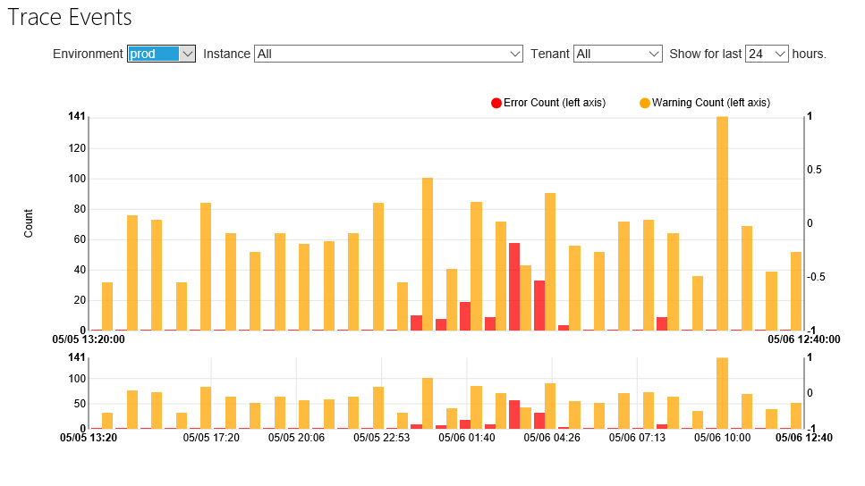
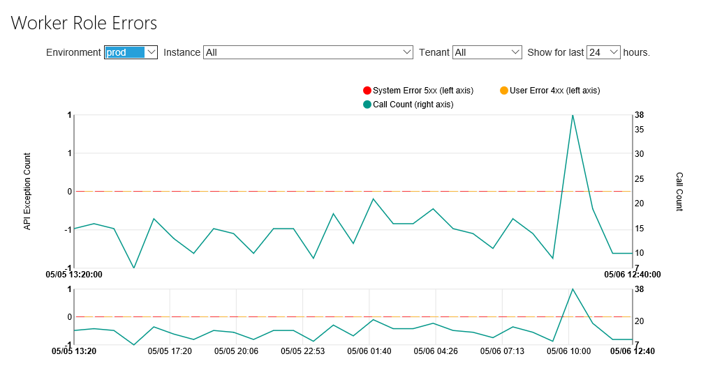
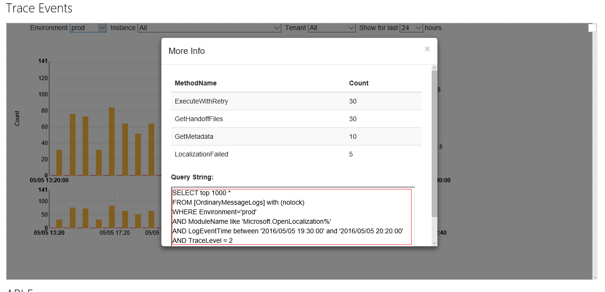
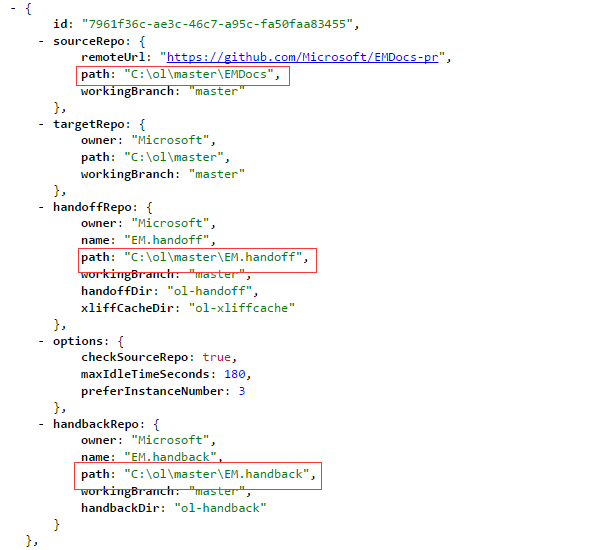

# Open Localization Workflow Failover Mechanism

## How to detect the workflow failure:
1. Trace Error and Warning at: https://capsinsight.azurewebsites.net/Charts/TraceEvents.aspx?env=prod&comp=Microsoft.OpenLocalization
	

2. Workflow Error and Waring at: https://capsinsight.azurewebsites.net/Charts/APIException2.aspx?env=prod&comp=Microsoft.OpenLocalization.Service
	

3. Email alerts of workflow error and warning

## How do we detect the issue repo:
1. Using instance id to find the corresponding repository from ambient configuration.
2. Using API input log to find the corresponding repository.

## How do we find the error details:
1. Query errors and warning from database.

	
2. Query full information form query portal.

## Common solution to environmental issues:
1. Restart instance or restart worker role host process to resolve stuck issue.
2. Delete local repository to resolve locale git environment.

