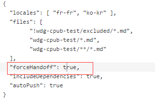
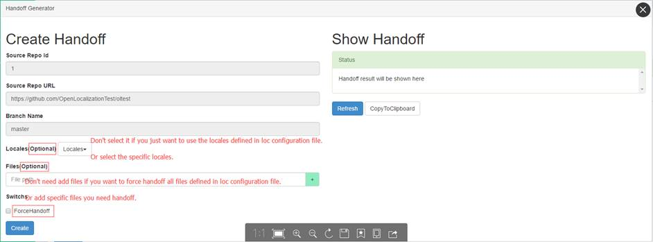

# How to re-handoff the handed back files (force handoff)

# Description:

Force handoff will re-handoff all files defined in loc configuration file, no matter what's the translation state of the files in source repo. You can use force handoff via two ways:

## Way 1: Force handoff via Handoff API Create Handoff
	
* ***Force handoff for all files:***
    * Add a query string to the handoff request like below:
	
    	`URL: POST http://olapi-sandbox/repositories/1/branches/master/handoff?forceHandoff=true`
		
* Force handoff for partial files:
	* Add a query string to the handoff request and file list to the request body like below:

        ```	
		URL: POST http://olapi-sandbox/repositories/1/branches/master/handoff?forceHandoff=true
		BODY:
		{
			"files":["a/a.md", "a/b.md", "c/*.md"] // force handoff for a/a.md, a/b.md and the whole c folder
		}
        ````
		
## Way 2: Force handoff via changing the loc configuration to add a new switch:

	

> [!NOTE]
> If you use the second way, please do change the loc configuration back(remove forceHandoff) when you don't need force handoff, otherwise the force handoff will always occur every two hours.

## Using Portal to do Handoff(force)
1. URL: http://olapi-sandbox.azurewebsites.net/Portal/index.html

2. Click the ***Handoff*** button at dashboard page:

	
	 
3. Jump to new page:


	 
4. Click ***create*** button to create handoff
5. Click ***refresh*** button to get the handoff process.
