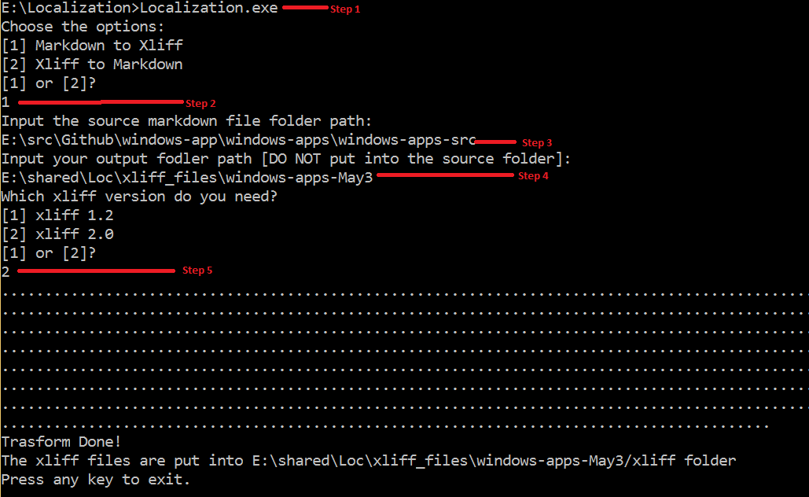
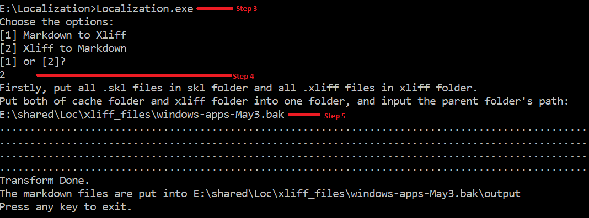

# Xliff<-->md transformer

[Tool download location](https://microsoft.sharepoint.com/teams/Visual_Studio_China/MSDN/Shared%20Documents/Open%20Localization/Tools/StandaloneTool.20170329.zip)

## Usage:

### Markdown -> xliff
1. Open command prompt, run Localization.exe
2. Input “1” to choose markdown to xliff
3. Input the markdown source folder
4. Input the output folder
5. Select xliff 1.2 or 2.0 based on your requirement
6. Then the tool will start transforming all the markdown files in source folder to xliff. After it is done, you will see the following files in output folder
    * The xliff files will be in `[output]/xliff` folder
	* The `[output]/cache` folder contains the non-translation part of the markdown files, which will be needed when converting xliff back to markdown
	* The txt file is the log of the transform

### Xliff -> markdown
1. Copy all the files under cache folder to a folder, e.g. c:\windows-apps\cache
2. Create a "xliff" folder in parent, and copy the translated xliff files to xliff folder, e.g. c:\windows-apps\xliff
3. Execute **localization.exe***
4.  Input “2” to choose xliff to markdown
5. Input the parent folder, e.g. c:\windows-apps
6. Then the tool will start transforming all the xliff files to markdown. After it is done, you will see there is a new folder "output" created, which contains the translated markdown files

### Xliff 1.2 -> 2.0
1. Execute **localization.exe***
2. Input “3” to choose xliff 1.2 -> 2.0
3. Input the xliff 1.2 folder path, and xliff 2.0 output folder path
4. Then the tool will start transforming all the xliff 1.2 files to xliff 2.0 files. After it is done, all xliff 2.0 files will be placed under xliff 2.0 output folder

#### How to switch transformer options(like markdowntransformeroptions flag in ol-config)
There is a new added json file `transformer_query.json` in the execution directory, which contains a Dictionary<string, string> to control transformer behavior. 
E.g. The already exist part is as the following image. To pairing the HTML tags, change the false to true. 
If transformer support further query string, add query key-value pair into the json, this tool can post it to transformer.

> [!NOTE]
>  Please make sure your transformer_query.json is a valid json file and can be deseriliazed to a Dictionary<string, string>.
