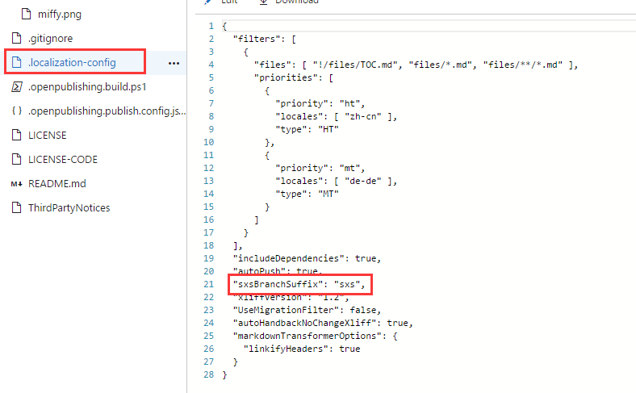
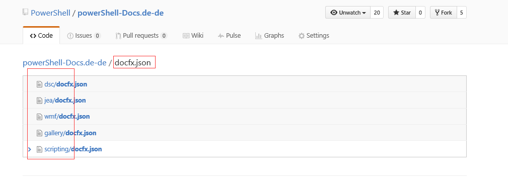
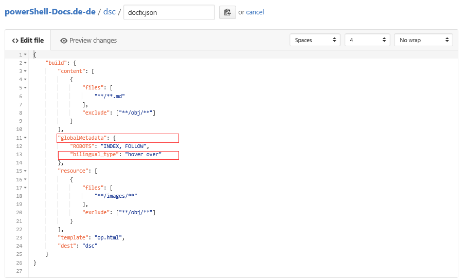
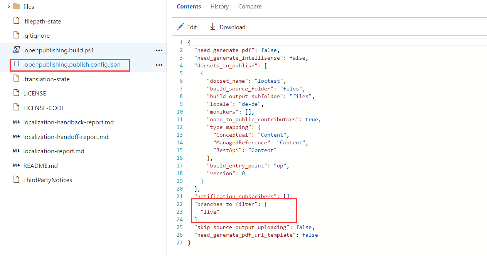

# Bilingual

Bilingual feature has two parts in Open Localization system and Open Publish system.

[!NOTE] there are two versions of OpenLoc:  standalone OpenLoc and iCMS-integrated OpenLoc (a.k.a. "CEO"), which differ in feature set and functionality

## What OL does for bilingual feature:

1.	Vendor or automation put the localized xliff in the HB repo and OL will pick up these loc xliff files to start HB.
2.	During HB process, OL will generate sxs loc markdown files and checkin these sxs loc markdown files to live-sxs(master-sxs) branch of loc repo

## What OP does for bilingual feature:

1.	For each localized repo, we have a metadata in docfx.json file to control the bilingual feature. During the publishing process, OP will inject the bilingual UI script from template repo to published pages and add the bilingual metadata to the published pages they exist.  
2.	When user loads and views the page, if the bilingual script found that there is a bilingual metadata "bilingual_type" equals to "hover over" or "side by side", the script will show the published sxs markdown files as bilingual view.  

## How to enable bilingual feature for loc repos：

1. Standalone OpenLoc only (this is automatically enabled for all iCMS-integrated OpenLoc projects): Loc repo owner needs to enable sxs bilingual branch for Open Localization in loc configuration:  
  

2. Bilingual is triggered by HB, so make sure to HB a file to trigger the bilingual process. The live-sxs(master-sxs) branch will be created during the bilingual process.  

3. Loc repo owner needs to find the loc repo for which to enable bilingual feature, .e.g: https://github.com/PowerShell/powerShell-Docs.de-de  

4. Loc repo owner needs to find all the docfx.json files in the repo in *live-sxs(master-sxs)* branch.  

  

5. Edit the docfx.json file to add the bilingual metadata for Open Publish:  

  

6. After the live-sxs(master-sxs) branch is created in loc repo, please exclude live(master) branch from the OPS configuration from both live(master) and live-sxs(master-sxs) branch, live-sxs(master-sxs) will replace live(master) branch to be used to publish content to live site(stage site)  

 

