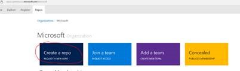
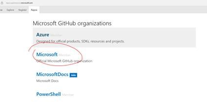
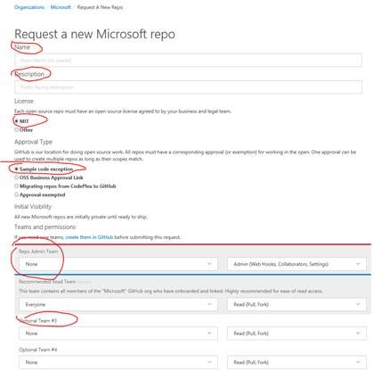

#How to create loc repos under Microsoft docs/Azure/Powershell org using open source portal  

##Steps:
a.	Login to Microsoft Open Source Portal: https://repos.opensource.microsoft.com.  
b.	Select the org which you want to create repo under.  
  
c.	Click create repo.  
  
d.	Fill the name, description, Admin Team, and optional teams.  
  
7. Submit the request and wait for the result, the repo should be created immediately.
