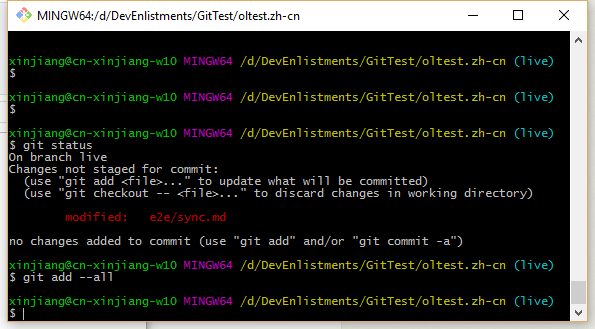
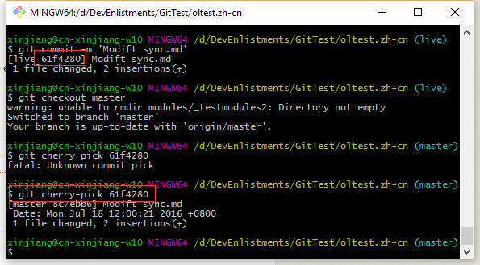

# How to do manual fix in localized repos

## Background:
Right now there are some localized repos which have two branch: live and master. 
***Live branch*** will be the release branch which should only be touched when PROD deployment process(merged from master branch).
***Master branch*** will be the working branch into which loc writer or OL will directly checked the loc files. 

## Problems:
There may be conflicts during the PROD deployment process(merged from master branch) if the live branch was modified for hotfix.

## Solution:
Never directly modify the live branch without master branch. If you need apply a hotfix to live branch, please follow the below step to avoid the conflicts:

1. Modify the content in live branch and commit to live branch
2. ***Cherry pick*** the commit from live branch and merge to master https://git-scm.com/docs/git-cherry-pick 
	
## Example:
1. Modify sync.md in live branch:

	
2. Commit to live branch:

3. Copy the commit id and checkout to master branch:

4. Push to remote

## Status: Handback with translation issue (invalid xliff, no need re-handoff)

Operation: Fix xliff and re-handback

## Status: Already Handback with transformer issue (need re-handoff)

Operation:
1. Download the md files from github
2. Use the off-line tool [Xliff<-->md transformer](Xliff_to_md_transformer.md) to generate xliff files
3. Supplier gets the xliff files and do translation, return the translated xliff files back
4. Use the off-line tool [Xliff<-->md transformer](Xliff_to_md_transformer.md) generate translated md files from xliff files in #3
5. Check In localized file to target repo's ***oldev*** branch.
[E.G. if a file in windows-app.fr-fr master branch need fix, use the already localized file to replace the wrong file in master-oldev branch]
Delete all the xliff files (which may be generated by the transformer without bug fixes) from handoff repo except for the archive folder (e.g. [https://github.com/Microsoft/WDG.handoff/tree/master/ol-handoff/Microsoft/windows-apps.de-de/master](https://github.com/Microsoft/WDG.handoff/tree/master/ol-handoff/Microsoft/windows-apps.de-de/master)). When there is any change in source repo, OL will regenerate these xliff files with correct transformer

## Status: Has been Archived but not handback (via API call)

Operation:
1. Handback the previous xliff file (important)
2. Go to "Already Handback" Status

## Status: Handoff but not Archived

Operation:
1. Delete the wrong xliff file in Handoff Repo
2. Trigger another Handoff, the xliff file will re-generated

