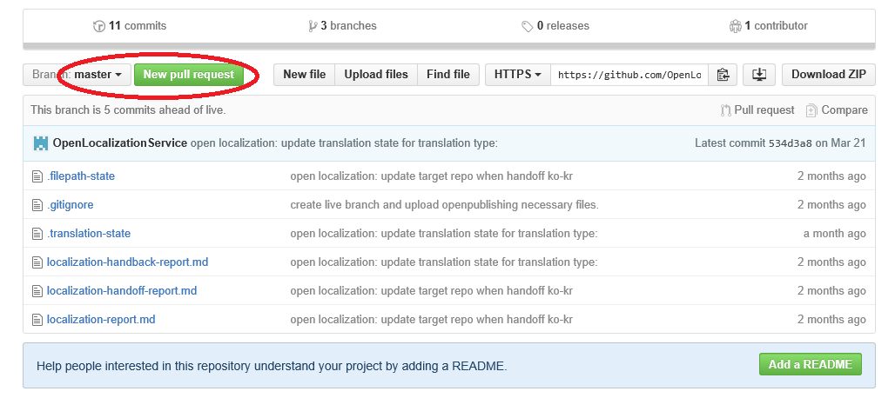
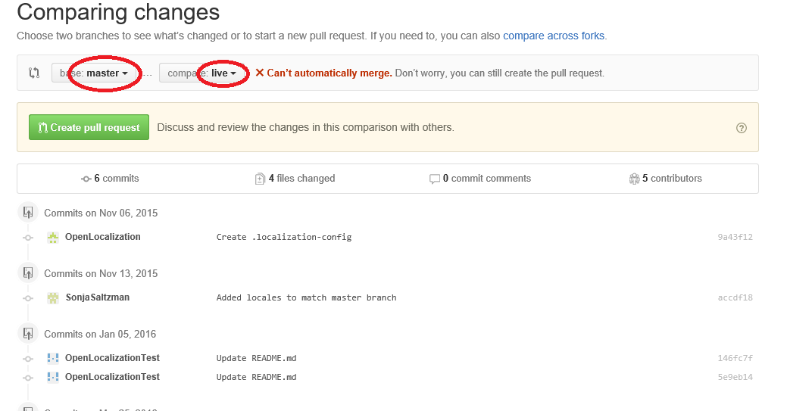
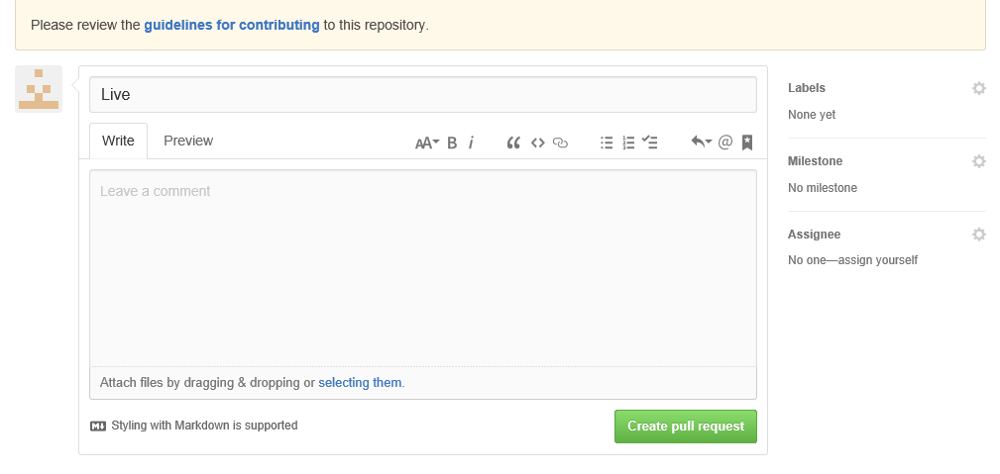
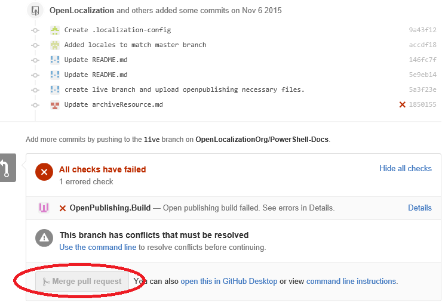

# How to move from master branch to live branch

1. Make sure the HO/HB in master branch are all done (no more handoff)
2. In target repo, merge master branch to live branch
    * Go to the repo in github and select master branch
	* Then click "New pull request"

    

    * In the page, select the base branch "master" and the target branch "live", github will list the changes by comparing the 2 branches
    * Click ***Create pull request***

    
		
    * Click ***create pull request***
	

    * In the pull request page, click "merge pull request" will merge master branch to live (in the screenshot I attached, the button is gray as there is conflict in 2 branches)

    
	
3. When it is done, ask VSC to de provision the master branch in OL, and provision the live branch in OL

