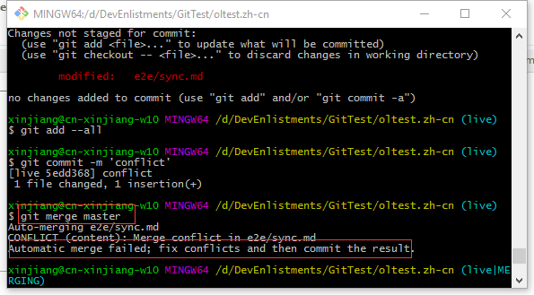
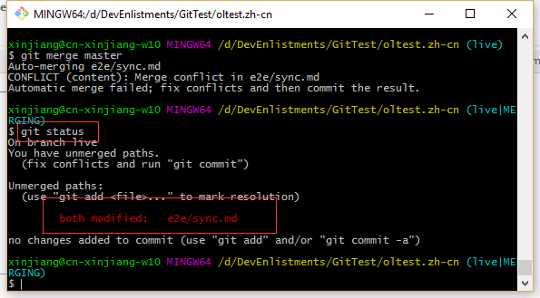
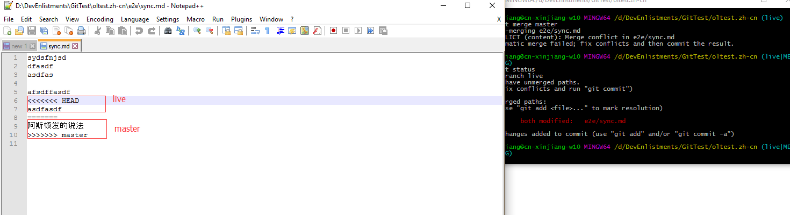
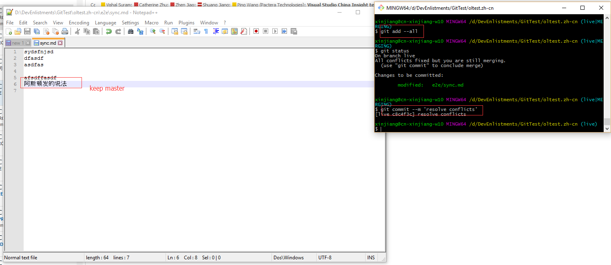
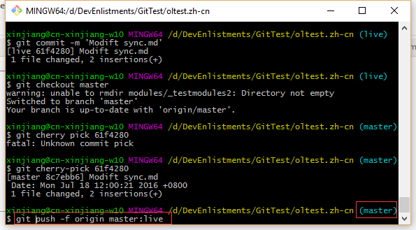

# How to resolve conflict between release (live) branch and working (master) branch

## Background:
Most of time, we should not have conflicts between these two branch, but if it does, we need manually resolve the conflicts.

There are two solutions to resolve the conflicts, the first one is resolve the conflict, the second one is just force push the  master content to live branch(overwrite).

## Solution 1 Merge Conflict:
1. Merge from master and found conflict
2. Git status to check which file has conflicts
3. Resolve the conflicts using notepad and commit
4. Push to remote

### Example 1: Merge Conflict:

* Merge from master and found conflicts
	

* Git status to check which file has conflicts
	

* Resolve the conflicts using notpad++ and commit
	

	

* Push to remote
	
## Solution 2 Force Push:
Most of the conflicts should be just over-write by master content if we treat the master content as the next correct version, so just use the force push to over-write the content in live branch.

1. Sync the repo to local
2. Checkout to master branch
3. Force push to live branch https://git-scm.com/docs/git-push

### Example2 Force Push:

## Solution 3 KDIFF3 Tool:
You can use some existing tool to resolve the conflicts, below are the steps how to use KDIFF3 tool to resolve the conflicts during the merge process  

1. Install Kdiff3 tool, please go to http://kdiff3.sourceforge.net/ to download and install kdiff3 tool to your computer  
2. Setup the Kdiff3 tool as your git mergetool:   
	a. Open GitBash Command  
	b. Run below commands to setup your GitBase to use Kdiff3 as the git mergetool  
	
		git config --global --add merge.tool kdiff3
	        git config --global --add mergetool.kdiff3.path "C:/Program Files/KDiff3/kdiff3.exe"
		git config --global --add mergetool.kdiff3.trustExitCode false
		git config --global --add mergetool.keepBackup false

		git config --global --add diff.guitool kdiff3
		git config --global --add difftool.kdiff3.path "C:/Program Files/KDiff3/kdiff3.exe"
		git config --global --add difftool.kdiff3.trustExitCode false
		
3. Use git mergetool command to merge conflicts  
	a. Open GitBase command in your conflicts repo.  
	b. Type "git mergetool" command to lunch KDIFF3 tool.  
	c. Using the KDIFF3 tool to resolve the conflicts.  
