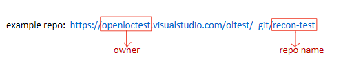

# How to use VSTS.git

* Manage repo
    * [Create a repo](https://www.visualstudio.com/en-us/docs/git/create-new-repo)
	* [Delete a repo](https://www.visualstudio.com/en-us/docs/git/delete-existing-repo)
* Manage branches
    * [Send pull request](https://www.visualstudio.com/en-us/docs/git/pull-requests#start-creating-a-pull-request)
    * [Complete pull request](https://www.visualstudio.com/en-us/docs/git/pull-requests#complete-the-pull-request)
    * [Compare branches](https://www.visualstudio.com/en-us/docs/git/tutorial/history#compare-branches)
* Permission control
    * [Add permission to project](https://www.visualstudio.com/en-us/docs/setup-admin/permissions#team-project)
    * [Add permission to git repo](https://www.visualstudio.com/en-us/docs/setup-admin/permissions#git-repository)
* Manage files
    * Information of Owner
	* Get files from HO repo (See below)
	* Upload files to HB repo (See below)

## Information of Owner

## Get files from HO repo (Manually)

***Xliff file path:***

`ol-handoff/<onwer>/<target repo name>/<target repo working branch>/<priority>/<xliff file name>`

***Download all files***

Use sourcetree clone the repo to local can get all files.

## Upload files to HB repo (Manually)

***Xliff file path:***

`ol-handback/<onwer>/<target repo name>/<target repo working branch>/<priority>/<xliff file name>`

***The handback path should be same as the handoff path except the "ol-handoff" and "ol-handback"***

## Upload all files

Use sourcetree clone the repo to local, copy files in the local folder. Add them include handback repo, commit then push them to remote.
