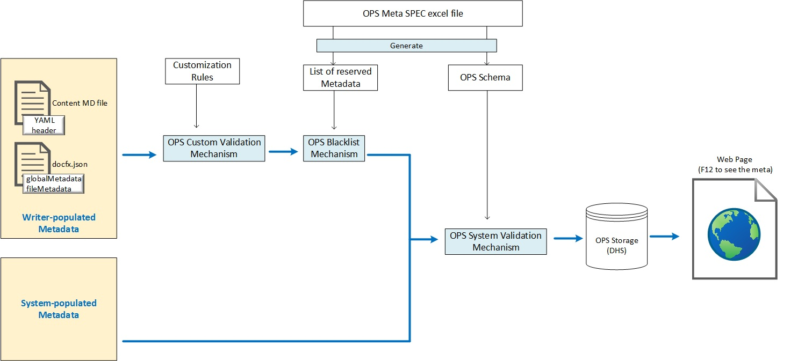

---
# Metadata Sample
# required metadata

title: Metadata - OPS User Manual
author: sharriexie
ms.author: huxie
ms.topic: get-started-article
ms.prod: .net
ms.technology: devlang-fsharp


# optional metadata

description: This is to introduce metadata mechanism and rules in OPS.
keywords: metadata, user manual
manager: yegu
ROBOTS: 
audience:
ms.devlang: 
ms.reviewer: sudeepku
ms.suite: ems
#ms.custom:
#ms.tgt_pltfrm:
---

# Metadata Management

OPS metadata is managed in OPS system as following:



OPS system supports two kinds of metadata:
- Writer/Author-populated Metadata: Controlled by content owner. OPS system pass it through and build into HTML <meta> tag. See [guidelines how to manage author-populated meta](http://aka.ms/skyeye/meta)
- System-populated Metadata: Fully controlled by OPS system. 

## 1. How to Input Writer-populated Medatadata

OPS provides three kinds of mechanism to input writer-populated metadata:

| Place to Input metadata              | Priority in OPS | Applies to|
| :--- | :---: | :--- |
| YAML header in MD file               | 1               | Current, individual topic | 
| "fileMetadata" mechanism | 2               | Each content matching the rule. The rule can be very flexible, e.g. topic level, folder level, docset level, pages under a certain pattern, etc. |
| "globalMetadata" mechanism | 3              | All contents under the docset |

> [!NOTE]
- If a meta is specified by multi mechanisms at the same time, OPS follows "Priority in OPS" to decide which mechanism takes effect first. Here lower value means higher priority.
- "fileMetadata" and "globalMetadata" can be put into docfx.json file or into separated metadata files.

Our suggestion to content author:

| Scope of Meta                  | Suggested mechanism |
| :--- | :---|
| Topic Specific      |  YAML header in MD file|
| Folder level or pattern based | "fileMetadata" |
| docset level        | "globalMetadata" |


### 1.1 YAML header in MD file
In each topic, you can use YAML header to store metadata in Markdown file. It will be transformed to `yamlheader` tag when processed by OPS build system.

YAML format is widely used in Github and will be rendered into a table in Github Markdown preview. That's why OPS system choose YAML format for metadata management. 

Yaml header MUST be the first thing in the MD file and MUST take the form of valid YAML set between triple-dashed lines. 

> [!IMPORTANT]
- All metadata labels are case-sensitive and need to be used with the casing that is documented.
- All metadata attributes should be followed by a colon AND a space. ": ". See [YAML spec](http://www.yaml.org/spec/1.2/spec.html#id2759963). 

***Sample***

Content source of this page has provided meta sample.
Clicking **Contribute** button (at right-top side of this page) then you can see the metadatas.
Also paste below for convenience:
```
---
# Metadata Sample
# required metadata

title: Metadata - OPS User Manual
author: sharriexie
ms.author: huxie
ms.date: 07/22/2016
ms.topic: get-started-article
ms.prod: .net
ms.service: active-directory
ms.technology: devlang-fsharp


# optional metadata

description: This is to introduce metadata mechanism and rules in OPS.
keywords: metadata, user manual
manager: yegu
ROBOTS: 
audience:
ms.devlang: 
ms.reviewer: sudeepku
ms.suite: ems
#ms.custom:
#ms.tgt_pltfrm:
ms.assetid: 9e1d63fe-d71b-446c-88cc-812afc821cc0

#Redirection

#redirect_url: https://msdn.microsoft.com/virtualization/windowscontainers/
#redirect_document_id: FALSE
---

```

### 1.2 "fileMetadata" section in docfx.json file

Rules can be specified in "fileMetadata" section of docfx.json file.
Any file matching the rule(s) will have the meta applied.

***Sample***

Meta "ms.prod", "ms.service", "ms.technology", "ms.date", "manager" are applied at folder level in this example.

```
...
...
    "fileMetadata": { 
       "ms.prod": 
       { 
         "api/**.yml": "azure" 
       }, 
       "ms.service": 
       { 
         "api/**.yml": "active-directory-b2" 
       }, 
       "ms.technology": 
       { 
         "api/**.yml": "intune" 
       }, 
       "ms.date": 
       { 
         "api/**.yml": "Jun 27, 2016" 
       }, 
       "manager": 
       { 
         "api/**.yml": "jeffgilb" 
       } 
     }, 
...
...
```


### 1.3 "globalMetadata" section in docfx.json file
Docset level meta is specified in "globalMetadata" section of docfx.json file.
Any file in the docset will have the meta applied.

***Sample***

Meta "author" is applied to docset level in this example.

```
...
...
   "globalMetadata": { 
       ...  , 
       "author": "sharriexie" 
   }, 
...
...
```


### 1.4 Keep your metadata in a separate file

"globalMetadata" and "fileMetadata" can be de-coupled from docfx.json file and store into separated metadata files. This functionality is useful mainly in the case that "globalMetadata" and "fileMetadata" are too long to noise the docfx.json file.

Here we will show you how to set "globalMetadata" and "fileMetadata" using separated metadata files. 

Take global metadata for example, you can set `globalMetadataFiles` in `docfx.json`. The usage of `fileMetadataFiles` is the same as `globalMetadataFiles`.

There're some examples about how to use separated metadata files.

+ use `globalMetadataFiles` in `docfx.json`
    ```json
    ...
    "globalMetadataFiles": ["global1.json", "global2.json"],
    ...
    ```

+ use `fileMetadataFiles` in `docfx.json`
    ```json
    ...
    "fileMetadataFiles": ["file1.json", "file2.json"],
    ...
    ```


There're some metadata file examples:

+ globalMetadata file example 
    ```json
    {
        "_appTitle": "DocFX website",
        "_enableSearch": "true"
    }
    ```

+ fileMetadata file example
    ```json
    {
        "priority": {
            "**.md": 2.5,
            "spec/**.md": 3
        },
        "keywords": {
            "obj/docfx/**": ["API", "Reference"],
            "spec/**.md": ["Spec", "Conceptual"]
        }
    }
    ```


+ If same key for global metadata was set, the order to be overwritten would be (the later one will overwrite the former one): 
    1. global metadata from docfx config file
    2. global metadata from global metadata files

+ If same file pattern for file metadata was set, the order to be overwritten would be (the later one will overwrite the former one): 
    1. file metadata from docfx config file
    2. file metadata from file metadata files

Given multiple metadata files, the behavior would be **undetermined**, if same key is set in these files.


## 2. Metadata List
### 2.1 Unique Identifier for a content
Document ID is the Unique Identifier for a content across OPS system. The meta name seen by WEDCS is "ms.documentid". And the meta name seen by LiveFyre commenting service is "Article ID".

Document ID is auto generated by OPS system for all kinds of pages, including conceptual page, reference page, and Hub Page.

> [!NOTE]
> The way to generate document ID in OPS is:
> ```
> Document ID = HASH (docset name + product family + relative Git path of the content file inside docset).
> ```
>
> Example: for [current page](https://github.com/MicrosoftDocs/openpublishing-docs/blob/master/openpublishing/docs/partnerdocs/metadata.md)
>
>       - Git path of the content file is `{repo-root}/openpublishing-docs/openpublishing/docs/partnerdocs/metadata.md`
>
>       - Docset folder in the Git repo is `{repo-root}/openpublishing-docs/openpublishing/docs`
>
>       - Relative Git path of the content file inside docset is `partnerdocs/metadata.md`
>
>       - Docset name is `OPSDocs`
>
>       - Product Family is `MSDN`
> So the document id of current page = HASH (`OPSDocs` + `MSDN` + `partnerdocs/metadata.md`)
>
> Based on this algorithm, the document ID will change when:
>
>	- File/folder is renamed/moved in Git inside a docset
>
>	- Docset is renamed (can been done only by re-provisioning)
>
>	- Product Family is changed (can been done only by re-provisioning)

> [!IMPORTANT]
> In order to keep document ID unchanged in above cases so as to avoid comments loss and BI broken, below are the "Action List":
>
> For writer:
>- When move a file or folder in Git inside a docset, redirection must be setup by `redirect_url` and `redirect_document_id` meta.
> 
> For docset owner:
>- When a file or folder is moved cross docsets (no matter by Git file movement or by docfx.json configuration), docset owner must work with engineering team for special build configuration so as to keep the document ID.
>- When re-provision a docset (i.e. de-provision an existing docset then provision it again), docset owner must work with engineering team special build configuration so as to keep the document ID.
>- When re-organize docsets (e.g. merge several docsets into one, or split one docset into multiple docsets), it's with high risk to lose document ID even under special build configuration by engineering team. Docset owner needs to be aware of the impact and better check with engineering team for advice before doing so.


The value of document ID keep the same for below cases:
- Same value cross different locales
- Same value for rating/commenting/side note/page view under a given page


For A/B testing, different document ID is used for different versions sharing same URL, but BI has a way to distinguish and link them. This work is tracked by A/B testing feature, not in metadata feature.

When redirect a OPS page to another OPS page, OPS provide a mechanism to allow carrying over document ID to the target OPS page by meta pair `redirect_document_id` and `redirect_url`.
For example, the redirected-out page can be specified as following:
```
---

redirect_url: virtualization/windowscontainers/index.md
redirect_document_id: TRUE

---
```

### 2.2 List of metadata

See [Metadata](http://aka.ms/skyeye/meta) for author-populated metadata.

> [!IMPORTANT]
> Make sure you do not have spaces in front of the metatada. Otherwise, it will not be processed correctly.

| Metadata Name | Usage | Value Format | Default |  Sample |
| --- |:---|---|:---|---|
| redirect_url | User can specify the value to indicate the topic to redirect to some other url. See [redirection page](OPredirection.md) for more detail. | string | null | redirect_url: https://msdn.microsoft.com |
| redirect_document_id| This meta is used together with "redirect_url". Indicates whether to carry "ms.documentid" to the redirection target. | boolean | FALSE |  redirect_document_id: TRUE |
| layout| Indicated which template is applied to this content page. Corresponding template name is defined in template repo. | string | Conceptual | layout: HubPage|


> [!NOTE]
> Can I add additional metadata to my topic?
- If the meta is purely controlled by content side (i.e. OPS system don't have to be aware of the business logic), then the meta is transparent for OPS system and pass through by OPS. Adding this kind of meta don't have to inform OPS team. Just take care that don't use the OPS reserved meta name, then it should be fine.
- If a new meta need OPS awareness for business handling, please raise the requirement to your feature PM.


## 3. Metadata Validation

OPS system supports two kinds of metadata validation mechanism:
- System Validation
- Custom Validation

In addition, OPS system support blacklist mechanism for OPS reserved metadata.

### 3.1 Metadata System Validation

All "core" metadata is validated by "System Validation". 

"Core" metadata is the system aware metadata, i.e. meta that with OPS system involved into business handling. 

Check column "category" of the [OPS Meta SPEC excel file](https://microsoft.sharepoint.com/teams/Visual_Studio_China/ALPS/_layouts/15/WopiFrame.aspx?sourcedoc=%7bCFA26869-F6FA-43B2-BDED-8B0DE8417C5B%7d&file=OPS%20Metadata%20all.xlsx&action=default) to understand which meta are considered as "core" metadata.

> [!NOTE]
> Metadata System validation is skipped for redirected-out pages.


For **System Validation**, it's based on OPS schema. 

Here OPS schema includes:
- Meta type
- Meta Presence
- Choice set

Metadata name is not validated.

OPS throw out warning in build log when a meta not follows OPS schema.

> [!IMPORTANT]
> If meta type is not supported by OPS at infrastructure level (e.g. value type is not supported by DHS), then OPS will throw out error during build.
Value types supported by DHS are:
- String
- String Array
- Boolean
- Integer (32bits)
- Integer (64bits)
- Double
- DateTime  

### 3.2 Metadata Custom Validation

For **Custom Validation**， it's based on customization rules, which is specified in another file under a Git Repo. Configuring the position of that file then OPS system can know from where to read the customization rules.

> [!NOTE]
> Custom Validation is only run for Writer-populated metadata.

### 3.3 Blacklist mechanism
OPS system reserved metadata are protected by blacklist mechanism.

When meta conflicts happens (e.g. writer attempts to overwrite OPS system reserved meta in MD file), OPS will ignore the writer-populated value and throw out warning in build log.

> [!NOTE]
> Blacklist mechanism is only run for Writer-populated metadata.


## 4. ACOM to OPS metadata mapping
Metadata in ACOM is specified at the beginning of MD file by "properties" tag. For example:
```
<properties 
	pageTitle="DocumentDB hierarchical resource model and concepts | Microsoft Azure" 
	description="Learn about DocumentDB’s hierarchical model of databases, collections, user defined function (UDF), documents, permissions to manage resources, and more."
	keywords="Hierarchical model, documentdb, azure, Microsoft azure"	
	services="documentdb" 
	documentationCenter="" 
	authors="AndrewHoh" 
	manager="jhubbard" 
	editor="monicar"/>

<tags 
	ms.service="documentdb" 
	ms.workload="data-services" 
	ms.tgt_pltfrm="na" 
	ms.devlang="na" 
	ms.topic="article" 
	ms.date="06/20/2016" 
	ms.author="anhoh"/>

```
When publish ACOM content to OPS system, MD file will be transformed on-the-fly and saved in OPS repo.
During the transformation, metadata is handled as following:

|  Meta        |ACOM DPS           | OPS  | ACOM DPS MD->OPS MD transformation|
| ------------- |:-------------| :-----|:-----|
|Author|DPS MD meta "authors" is shown on ACOM UI; Another MD meta "ms.author" is seen by WEDCS.|OPS MD meta "author" is shown on DOCS UI|Meta name mapping: Fill OPS "author" with the first value got from DPS "authors"|
|Last Updated | DPS MD meta "ms.date" is shown on ACOM UI, and also seen by WEDCS as "ms.date"|Since S108: Show up "ms.date" value in DOCS UI for Last updated field (Feature 647184).|Copy DPS "ms.date" to OPS YAML meta and pass it through to WEDCS.|
|SEO HTML "title" tag|"pageTitle" in MD|"title" in MD|Meta name mapping: Fill OPS "title" with DPS "pageTitle"|
|Unique Identifier|No specific Unique Identifier in ACOM/DPS. Only use Page URL as unique identifier, but it changes after rename a file.|"ms.assetid" in MD|Fill OPS "ms.assetid" with ACOM/DPS page URL.|
|Others|  |  |All other <properties> and <tags> are copied from DPS MD into OPS MD as YAML meta, and pass through by OPS system.|


## 5. API Scan
See [API Scan](APIScan.md).

