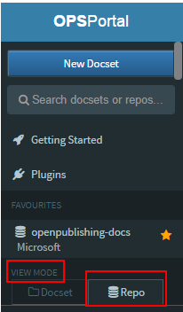
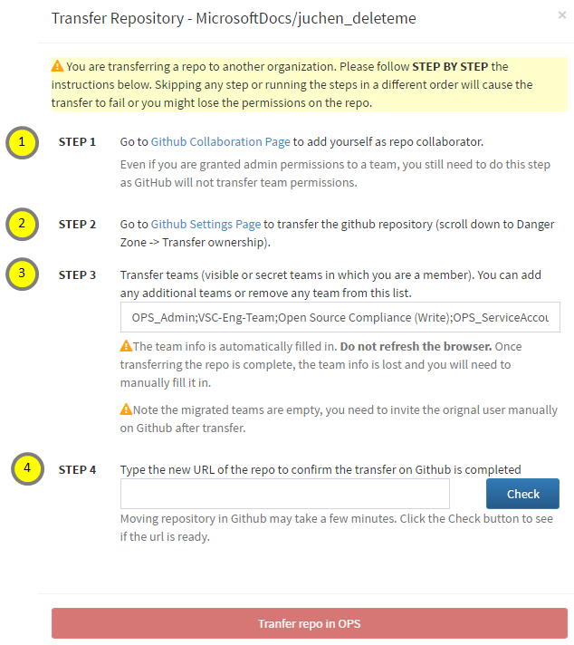

# Partner steps for migrating OPS repos out of Microsoft organization

> [!NOTE]
> This plan is for teams to **move out** of Microsoft organization in GitHub. We have created an organization in GitHub called Microsoftdocs that can host the OPS repos. However, you can move the repo to you own GitHub organization if you wish, or to VST as per your organization guidelines.

> [!IMPORTAN]
> If you are transferring localized repos, coordinate BEFORE the transferring with APEX localization team to ensure OL is updated so handoffs and handback can continue.

## Timeline: April 1 - June 27

Steps are only valid for moving OPS repos across GitHub organizations.
- If you need to move your repos from GitHub to VSTS and need assistance, please contact Sandra Aldana.
- If you need to move non OPS repos (handoff, hand back, and public repos in private-public scenario), you will **not** be able to use the portal for that moving, but you can use the steps in this document and the portal as a guideline. Read "Moving public-private repos" below.

## Pre-requisites
People doing the transfer should be:

- Repo owner - to ensure they can transfer the repos without having to wait for repo owner approval. **[Here](https://microsoft.sharepoint.com/teams/Visual_Studio_China/MSDN/Shared%20Documents/Open%20Publishing/MicrosoftRepositoryOwnerInfo_v2.xlsx?web=1)** is the list of repo owners in Microsoft organization.
- Team maintainer or belong to all the teams accessing the repo - to ensure the transfer of all the teams to the new organization.

Steps:

1. Read the [FAQ](#moving-repos-FAQ) later in this page.
2. For a success transfer of your teams, ensure all your teams are public (i.e. no Secret).
3. Ensure all the users who have access to the repo, including service accounts, are part of the new organization (**Microsoftdocs** or another). See [How to Join a Microsoft GitHub Organization](https://www.1eswiki.com/wiki/How_to_Join_the_Microsoft_GitHub_Organization). **If a person does not have access tothe new organization in GitHub at the time of the transfer, their forked repo will be deleted**
4. Look at all the individual users assigned to the repo and either make a note of them or add them to a team.
    - Information for individuals not in a team will not be carried over, so those people might lose access to the repo in the new organization.
5. **Coordinate the transfer with your localization team.**
6. Send heads up and then notify your users when you are ready to make the change and ask them to stay away from the repo until you finish the transfer. You can use the following template as a heads up.


```
SUBJECT: Moving OPS content repos out of GitHub organization on <date_and_time_slot>
BODY:
Hello,

We have company guidelines that we need to move our OPS content repos from GitHub Microsoft organization by June 27, 2017. The reason is that organization was used originally for code repos. As we have many content repos, we think users might have a hard time to find the right code repo via GitHub Search.

As a result, we are moving the following repos to <organization_name>:
•	<repo_1>
•	<repo_2>

The total moving time would be about one hour per repo. Based on that and our upcoming releases and work, we have decided to do the transition on <date_and_time_slot>. We ask you not to access the repos during that time. We will send a notification once the repos are transitioned.

IMPORTANT: In order to ensure a smooth transition and avoid disruption in your access to the repo, we ask you to make sure you are a member of the <organization_name>, and if not, join it before that date: How to Join a Microsoft GitHub Organization.

Please read the FAQ or let me know if you have any questions or concerns.

Regards,
<your_name>
```

## Migration steps - Common Scenario (Public repos without a private repo sync)
**Duration: 1 hour**

1. Go to [OPS portal](https://ops.microsoft.com) and look for your repo.
2. In **View Mode** on the left navigation, click on **Repo**.



3. Find your repo and select it.
4. Click on **Settings**.


5. Scroll to the OPS portal's **Danger Zone** and next to **Transfer ownership**, click on **Transfer**.
6. Follow the steps in the screen.

Step 2 takes you to GitHub. You must transfer the repo there but do NOT transfer any teams. Once you have transferred the repo to the MicrosoftDocs org in GitHub, wait for a few minutes. If you lost admin rights to the repo, the Settings tab will have disappeared. Contact the APEX team to get admin access reinstated.

Step 3 takes you back to OPS. Follow the guidance to continue.



|STEP  |Additional instructions  |
|---------|---------|
|1     |  You need to be an individual collaborator on the repo. Make sure you are an admin in a team and then **have a peer to give you admin permissions as an individual contributor.** If you add yourself, GitHub will add you with "Write" permissions and that is not enough. GitHub does not allow you elevate your individual permissions.<br><br> If a user tries to move the repo without being an admin collaborator, then he will lose control of that repo. The only thing he can do is contract with MicrosoftDocs org owner (Sandra Aldana) to give him the permission of that repository.        |
|2     | By clicking the link in this step, you are going from the "Danger Zone" in OPS to the one in GitHub. <br><br> This step allows you to select teams to have access to your repos. If you would like to carry over your teams, you can simply ignore that part and let OPS to do that for you in Step 3.        |
|3     | Any team specified in this step, will have access to the repo. If the team does not exist in the new organization, OPS will create the team empty, i.e. with no members on it.        |
|4     | Type the URL for the repo in the **new** organization and click on "Check". If the repo is transferred in GitHub, then the "Transfer repo in OPS" button will be enabled. <br> > [!IMPORTANT] <br> > You need to do this step, otherwise, OPS will not be able to update the pointers, so your teams will not get transfer and you will not see the repo in the OPS portal. |


## Partner - Post-migration steps

1. In GitHub, go to the teams that got transfer in the new organization and add the individuals to it. You can go to the team in the previous organization and see who was assigned in the team.
2. Ensure that the teams have access to the repo you just transfer.
3. Make a commit in the repo and ensure the builds are running automatically.

> [!IMPORTANT]
> All the build history will be lost in the portal. You can do a [force publishing](publish.md#a-namemanualpublish-amanual-content-publishing) on your branch if you would like to have a build report to fix errors and warnings.

4. Notify your users. You can use the following template.

```
SUBJECT: Transfer of OPS repos to <organization_name> is completed
BODY:
Hello,

We have a successful transfer the following OPS repos out of the GitHub Microsoft organization into <organization_name>:
•	<repo_1_URL>
•	<repo_2_URL>

No worries if you still use the old URL, GitHub offers automatic redirection, so you will be taken to the new organization automatically.

You should all access to the repos above with the same permissions than before. If not, please let me know.

NOTE: All the build history in the portal will be lost. You can do a force publishing of your content if you need a build report to fix errors or warnings.

Regards,
<your_name>

```

## Migration steps - Private repo sync'ed with Public repo

1. Verify your team members and team admins are in the MicrosoftDocs org, if they are not, please add them.
2. Go to your repo in Github.
3. Click setting -> options -> scroll down to the Danger Zone -> click Transfer and add the required info in that box: the name of the repo you want to move and the name of the new organization (MicrosoftDocs). 
4. Done!

## <a name="moving-repos-FAQ"></a>FAQ
1. Can I use these steps to move non OPS repos?
	- You can use this guideline, but not OPS portal, as those repos are not in our system.
2. Do I need to transfer the repo to MicrosoftDocs organization?
	- No, if you have an organization that better suit your needs, you can transfer it there. Note that both English and localized repos need to be in the same organization though. The goal is to have all the documentation repos out of Microsoft organization by the given deadline.
3. How long would the full transfer take place?
	- An hour or less. During that time, we advise teams not working in the repo.
4. Is my published content affected?
	- No, your published content (internal or external) will not be affected: no downtime or not change in URLs.
5. What happens if people try to go the previous URL after the migration?
	- GitHub has automatic redirection, so users will be redirected automatically to the new URL.
			i. Note that if users do not have access to the organization or to the repo, they will get a 404 error though.
			ii. If users create a repo with the same name in the former organization, redirection will be broken.
6. Some of the OPS files in my repo point to the old URL. Do I have to update any files?
	- No, the engineering team will do a one-time update on all repos once the repos have been transferred out of the Microsoft organization.
7. Can I cretate my teams ahead of time in the new organization and assign team members to it?
	- Yes, you can. If so, our migration logic will detect that the teams are already in place and assign them to your repo.
8. Do we need to have a HB completed before we can move localized repos?
	- OL doesn’t require user to finish the handback before transferring repository.            
9. Do we lose contribution history because of this move?
	- No.
10. Do I lose publishing information in the portal because of this move?
	- Yes. You can do a force publishing build if you need the full log with errors and warnings on it.
11. If I have my repo cloned, do I need to update my local configuration?
    - Example: *remote.upstream.url=https://craigg-msft:>>>my token<<<<<<<<<@github.com/microsoft/sql-docs-pr.git*
	- No, GitHub redirection will work.
12. When should we move repos to VSTS, for example, for WDG?
	- It should happen at the same time than the rest of the moving.
13. Do we support having English repo in GitHub and localized repos in VSTS?
	- No, that scenario is not supported.
14. Will this change affect anything how we build sitemaps for all OPS content?
	- This change will not affect our sitemap generation.
15. Can OSS tool handle the load of all this change? We had many contributors who ran into problems getting membership in the Microsoft org when we moved to it from Azure.
	- We should be OK. There were a large number of people who were in the Microsoft organization from years ago but not in the “everyone” team, so as a result, they had to request permission to “everyone”. This is not a problem in MicrosoftDocs since it is new and we have taken features to make the everyone team automatically available.
16. I am not in Microsoft organization, do I have to move?
	- No, you don't. You can stay in your organization, so long both English and localized repos are in the same org.
17. Can we have more than 1,500 private repos in a GitHub organization?
    - The limit is not technical per se.  Their current pricing plans only go so high.  At a certain point you will need to talk to them about how to pay for more.
    - On a related note, eventually they will push us towards per seat pricing.  That is what you see with the “unlimited” private repos.  For $9 / month/person you get unlimited private repos in an org.  Today, a private repo is roughly $1/month.  So just for example purposes, if you have 1500 private repos let's assume that that is $1500.  In the new pricing model, that is equivalent to ~170 users.  I’m not sure on how you want to manage the docs user base but it seems likely that you will want more than 170 users to have access to the private repos.
    - As for the per seat model, I don’t know the timeline.  Formally today when you create a new org they create it with per-seat pricing.  So that model is in effect today.  They recognize that that model, as stated, does not work for groups like us and have grandfathered us into the old model while a new model is sorted out.  That is an active discussion with no set timeline.  It is most likely 6-12 months from now.  could be more.  Not likely to be less. 
    - So, you are painting yourself into a potentially very expensive or very closed situation with a heavy dependency on private repos at GitHub. 
18. Can I add a new locale when English is in one organization and loc repos are still in Microsoft org?
    - We do not recommend this scenario. We have not tested.
19. What happens with the references from/to my dependent repos?
    - You get automatic redirection from GitHub. So all that will keep working. APEX engineering will do a data fix once all the repos are moved out of Microsoft organization to update all the pointers across all OPS and its services.
