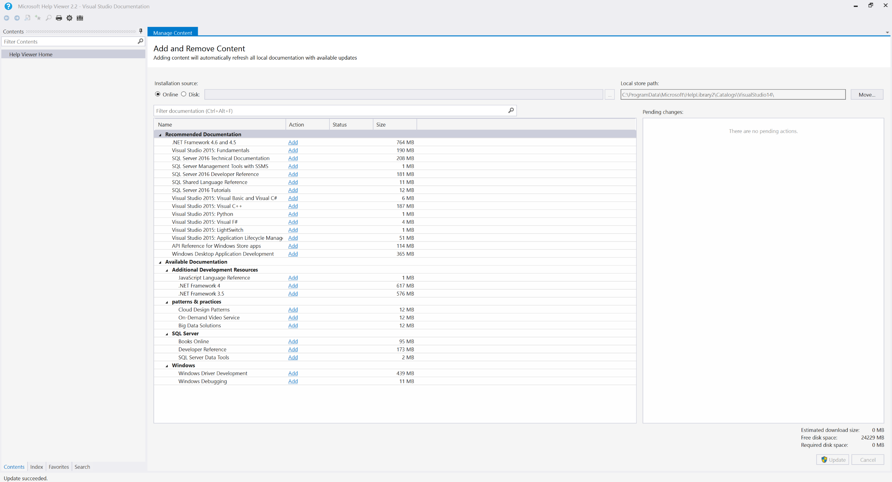
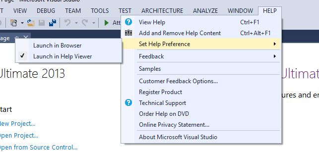
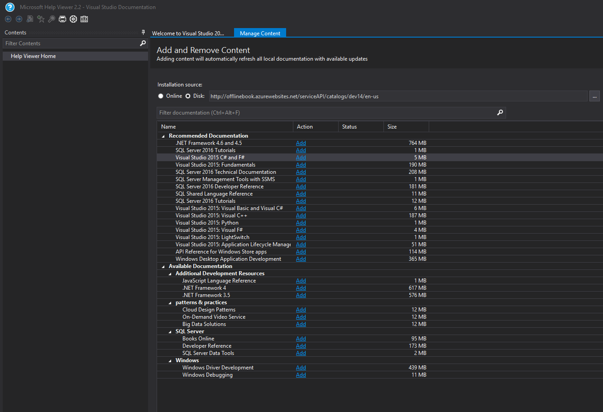
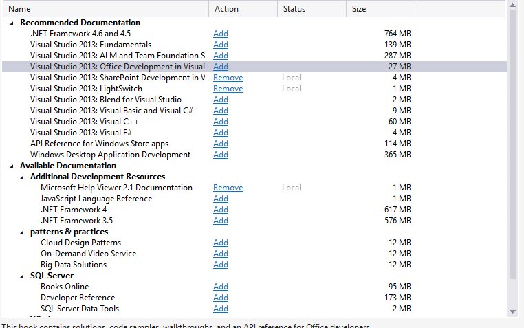
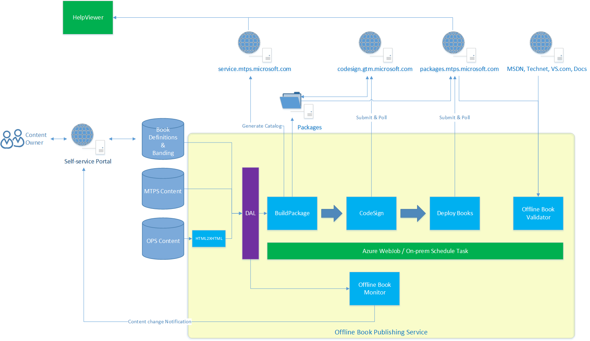

# Offline Book

## What is Offline Book?

"Offline Book" means the books that can be opened by HelpViewer in VS Shell.
User can download books when they have public network access, then view the books by HelpViewer (inside VS Shell, e.g. VS IDE, SSMS) when they're in offline environment.

HelpViewer have two different version set:
- HelpViewer v1.x: Used by VS2010 and SSMS (SQL2014).
- HelpViewer v2.x: Used by VS2012 and up, as well as SSMS (SQL2016 and up). 

There's no support for HelpViewer v1.x offline book anymore. The books can still be accessed, downloaded, but not able to add new book or update existing books for HelpViewer v1.x.

All we talk below are for HelpViewer v2.x offline book.

>[!IMPORTANT]
>The Help Viewer is NOT automatically included in VS installations anymore since VS2017. 
>
>After launch **Visual Studio Installer**, if you click "Modify" on your installed VS2017 product and go to the **Individual Components** tab, you can install the Help Viewer by checking its checkbox in the **Code Tools** category.

>[!NOTE]
>Since March 2017, books serving HelpViewer v2.x are generated and hosted by Offline Book new Tooling.
>The main changes introduced by this offline book new tooling (comparing with legacy tooling) are:
>- Support content source from OPS in addition to MTPS
>- Host offline book ServiceAPI in Azure instead of on-prem server
>- De-couple book generation from content publishing status so as to simplify the E2E workflow
>- De-couple book generation from Eng dev cycle so as to decrease the book generation turnaround time

## Which books are shipped in VS2017

9 Tier1 books are shipped by VS2017 offline book release (Tier2+ books will come later).
5 books replace the corresponding VS2015 version:
- Visual Basic 
- Visual C#
- Visual C++ 
- Visual F# 
- Visual Studio 2017 Fundamentals

4 are new books for VS2017:
- ASP .NET Core 
- ASP .NET API Reference
- NuGet
- Scripting Language Reference

Offline books available in VS2015 HelpViewer:

Offline books available in VS2017 HelpViewer:

## How to view Offline Book?

Step1: choose Help Viewer as the way to surface help content (instead of "Browser" option which will go to online page): VS Shell -> Help -> Set Help Preference -> Launch in Help Viewer

Step 2: invoke Help Viewer by click "F1", then you can see Help Viewer windows pop up.

## Offline Book ServiceAPI towards HelpViewer

HelpViewer show up the books returned from offline book ServiceAPI, e.g.
https://services.mtps.microsoft.com/ServiceAPI/catalogs/visualstudio12/en-us

The ServiceAPI link is different per product release and per locale, e.g.
- https://services.mtps.microsoft.com/ServiceAPI/catalogs/sql2016/en-us
- https://services.mtps.microsoft.com/ServiceAPI/catalogs/dev14/en-us
- https://services.mtps.microsoft.com/ServiceAPI/catalogs/dev14/ja-jp

The ServiceAPI link is to be configured/hardcoded in corresponding product, which means that each time releases a new product (e.g. VS2017), it should have its own ServiceAPI link so as to define its own book list.

What returned by this ServiceAPI link is generated dynamically, with:
- All the generated books that matching the product release, and
- "essential" books that are designed to match all product releases. 

It means:
- A book can show up in HelpViewer2.x once it is generated at back-end
- An updated book can be seen by HelpViewer2.x immediately
- A book created as "essential" book can show up in all HelpViewer2.x

>[!NOTE]
>**Known limitation**
>
>In VS2013 and older releases, SKU id and SKU name are used for book filtering, so it's possible that a book is returned by ServiceAPI link but not show up in HelpViewer.

## Which kind of content can be requested as offline book?

Library content published to MTPS or OPS can be requested as offline book. It means library pages of these three websites: https://docs.microsoft.com, https://msdn.microsoft.com, https://technet.microsoft.com.

>[!NOTE]
>Before March 2017, offline book can support MTPS content only.
>
>After March 2017, Offline Book new Tooling is in place so as to support content from both MTPS and OPS.

The general design rule is to have offline book built from online TOC(s). Those online TOC(s) can be pure OPS, pure MTPS, or combination of MTPS and OPS. 

Definition of offline book is as following:

    Root id (mandatory)
    - Sub-item id1 (optional)
    - Sub-item id2 (optional)
    - Sub-item id3 (optional)
    Excluded items: topic title 1 (in toc), topic title 2 (in toc), topic title 3 (in toc) (optional)

When sub-items are absent, root id and its sub-tree are built into offline book.
When sub-items are given, root id is built as the top node, with sub-items (together with their sub-trees) are built as children nodes into offline book.

Only one layer of sub-items is allowed, to keep offline-online alignment, also to minimize offline book maintenance effort. However, there're still some needs to exclude items in offline TOC, so "excluded items" are designed for this purpose.

> [!WARNING]
> There're several limitations in HelpViewer, so that the content for offline book need follow below rules:
> - Topic can't duplicate cross books - otherwise HelpViewer will auto merge the books that share same topic
> - Topic can't duplicate inside a book - offline packaging tool will randomly remove duplicated nodes in a book so as to meet HelpViewer requirements
> - TOC can’t be a flat list - the offline TOC has to have a top root node. To handle the TOCs without top root node, offline book tooling provide one option: if the first node of the flat list in TOC is a leaf node (normally it’s an overview page of that TOC), then offline book tooling will promote that leaf node  as the top root node.

## How offline book TOC looks like?

Offline TOC is trying to align with online TOC as much as possible, but still have below "difference":

|Difference between online and offline TOC  |Applicable for OPS?  |Applicable for MTPS?  |
|---------|---------|---------|
|Cross-docset topic is excluded from offline book TOC     |     Yes    |  -       |
|Redirected-out topic is excluded from offline book TOC     |    Yes     |    Yes     |
|Removed/retired topic is excluded from offline book TOC     |   -      |    Yes     |
|Flat TOC will have its landing page promoted as parent node (by setting "left_toc_as_child" to TRUE)     |    Yes     |    -     |
|Nested TOC is expanded into offline book TOC (note: cross-docset nested TOC is skipped)     |     Yes    |    -     |
|"Container" node of online TOC will be generated as fake page in offline book TOC     |    Yes     |    -     |

### Example to explain how Nested TOC is expanded into offline book TOC

For a given online TOC:
 
    ...
    A1
    B1
    -- B1.1
    ----B1.1.1
    -- B1.2
    C1 (referencing a cross-docset file)
    D1 (referencing  a same-docset file but has its own TOC, case-1)
    E1 (referencing a same-docset file but has its own TOC, case-2)
    F1 (referencing a same docset file but has its own TOC, case-3)

Case-1: D1 has children nodes in its own TOC

    G1
    H1
    D1
    --D1.1
    ----D1.1.1
    --D1.2
    ----D1.2.1
    --D1.3
    ----D1.3.1
    ----D1.3.2
    I1
    J1
    K1

Case-2: E1 don’t have children but is the first node in its TOC

    E1
    L1
    M1
    --M1.1
    --M1.2
    N1

Case-3: F1 don’t have children, also not the first node in its TOC

    O1
    F1
    P1
    --P1.1
    --P1.2
    Q1

Then the offline book TOC will become:

    ...
    A1
    B1
    -- B1.1
    ----B1.1.1
    -- B1.2
    D1
    --D1.1
    ----D1.1.1
    --D1.2
    ----D1.2.1
    --D1.3
    ----D1.3.1
    ----D1.3.2
    E1
    --L1
    --M1
    ----M1.1
    ----M1.2
    --N1
    F1

NOTE
1. C1 is cross-docset file, so it’s excluded by offline book build automatically.
2. D1 is a same-docset file and has children nodes in its own TOC, so its children nodes are expanded into the offline book TOC.
3. E1 is a same-docset file, don’t have children nodes in its own TOC, and is the first node in its own TOC, so it’s considered as landing page of its own TOC. All its brother nodes are expanded into offline book TOC as its children nodes.
4. F1 is a same-docset file, don’t have children nodes in its own TOC, also not the first node in its own TOC, so only F1 node itself is included into offline book TOC.

## How to request new offline book?

Each time there's a new product release shipping HelpViewer (e.g. VS2017, SSMS for SQL2016), a offline book project will be run by APEX team; contact your [onboarding PM](https://microsoft.sharepoint.com/teams/Visual_Studio_China/_layouts/OneNote.aspx?id=%2Fteams%2FVisual_Studio_China%2FShared%20Documents%2FDOCS.MSFT&wd=target%28Overview.one%7CAC65D90B-5DA7-458E-9AA6-D2C98F06E207%2FTeam%7C94DC06FE-C59B-4D69-8BD6-D12060CF2F55%2F%29) to initiate conversation with content teams about defining a new book list for that new product.

Besides, request on offline book update/addition can be raised by content team, by contacting your [onboarding PM](https://microsoft.sharepoint.com/teams/Visual_Studio_China/_layouts/OneNote.aspx?id=%2Fteams%2FVisual_Studio_China%2FShared%20Documents%2FDOCS.MSFT&wd=target%28Overview.one%7CAC65D90B-5DA7-458E-9AA6-D2C98F06E207%2FTeam%7C94DC06FE-C59B-4D69-8BD6-D12060CF2F55%2F%29). 
Then PM will help to operate on the book generation and send out review to the requester.

## Metadata for Offline book (by Content Writer)

Meta name for HelpViewer Indexing

| Publish Pipe | Meta Name|
|-----------------|----------|
|OPS|helpviewer_keywords|
|MTPS|Microsoft.Help.Keywords|

## System Architecture for Offline Book System

## Offline Book High-level Creation Steps

- Onboarding PM gather requests from partner team and raise ticket to APEX Pubdesk (area path and assignee set as [this](https://mseng.visualstudio.com/TechnicalContent/_workitems?id=998488&_a=edit&triage=true) one) 
- APEX Pubdesk generate book (in PROD Stage) according to [Pubdesk's offline book process](https://review.docs.microsoft.com/en-us/pubdesk-internal/topics/offline-books), then ask for content fix and visual review from book owner
- After book is signed-off by book owner, APEX Pubdesk trigger to promote the book to PROD live
- Book will go through code-sign (need two FTE to approve) before arrives live

## Required Partner Information
* Book Name. Example: Visual C#
* Book Description. Example: This book contains programming concepts, tutorials, language reference, and code samples for the C# language.
* Book release date.
* Locales. Example: en-us, es-es, etc.
* Links to the content Enlish and Loc (if there is localized content). En-US example: https://docs.microsoft.com/en-us/dotnet/articles/csharp/  
* Offline book version. Example: Dev15.
* Book owners: alias of your content contact.
* Legacy? This means that the offline book was created with older tooling and might need to be "repackaged".

## SLA, Limitations & Sign-Off

### Limitations

1. There are cases where fixes are needed, for example, a landing page might need tweaks to work properly in the offline book mode.

### SLA

2. Book Creation ETA: this depends on 2 things: Pubdesk work load and book size. An approximate is 3-6 business days.
3. Publishing live can take 1-2 days approximately.

### Sign-Off

4. A meeting with the content owner/s, Pubdesk and your APEX onboarding PM is required for sign-off.

