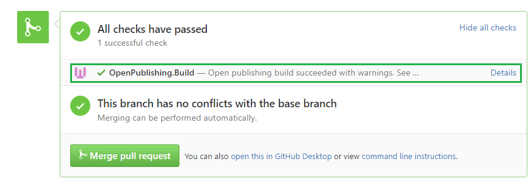

# Preview Pull Request
This feature allows users to preview the pull request content before it is merged to target repository.

## Why it is necessary?
Before OPS supported pull request (Shorten as PR) preview, OPS only gave status whether the PR is valid or not as the following pic shows.

With that, user can only know whether the content can be successfully published after the PR is merged.
However, user can't know how the final page will look like, which is a big concern.

For the PR created inside the provisioned repository, the branch preview function can help.
For the PR that was created cross repository, especially when the source repository is not provisioned, user doesn't get the chance to see final page unless the PR is approved and merged to the target repository.

## How can user enable PR Preview?
User can enable this function by adding a property in the OPS configuration file within the live branch in the provisioned repository.
Please go to [publish configuration](publish-configuration.md) to see the detailed configuration.

## Where can user see the PR published content?
User can preview the content like any other branch on the staging site. Simply add the preview branch name to the URL in the query string like `?branch={pr_branch_name}`. You can also pick the PR from the dropdown on the right-hand side.

### What's the branch name of the pull request?
The rule for generating the branch name of the pull request (pr_branch_name) is: `pr-{locale}-{pull_request_id}`
For example, if your docset locale is "en-us" and the pull request id is 1, then the PR branch name is: "pr-en-us-1".

### When will the pull request branch be created/deleted?
* Whenever a PR is created/reopened, the PR preview branch will be created.
* Whenever a PR is abandoned/closed, the PR preview branch will be deleted.

## What's the side effect of enabling PR preview?
Obviously, PR preview will publish the content to DHS. So the performance will be worse than the original one.

## Differences between branch preview and PR preview
| properties | Branch preview | PR preview |
| ----------- | -------------- | ---------- |
| Branch name | Always same with branch name | A combination of locale and pull request id |
| Contribute button | Follow the rule that defines in [publish configuration](publish-configuration.md) | Always jump to pull request source branch to allow user edit conveniently |

## Published url will also show in the pull request
In order to make user locate the published url of PR quickly. We also enable the feature that adding comment in the PR to tell user where to visit the PR preview page.
The comment body content is writen as below shows:
```md
The pull request content has been published and here are some sample preview links:
- Docset 1: [<Docset1_name>](<one_url_of_docset1>)
- Docset 2: [<Docset2_name>](<one_url_of_docset2>)
- Docset 3: [<Docset3_name>](<one_url_of_docset3>)
```
