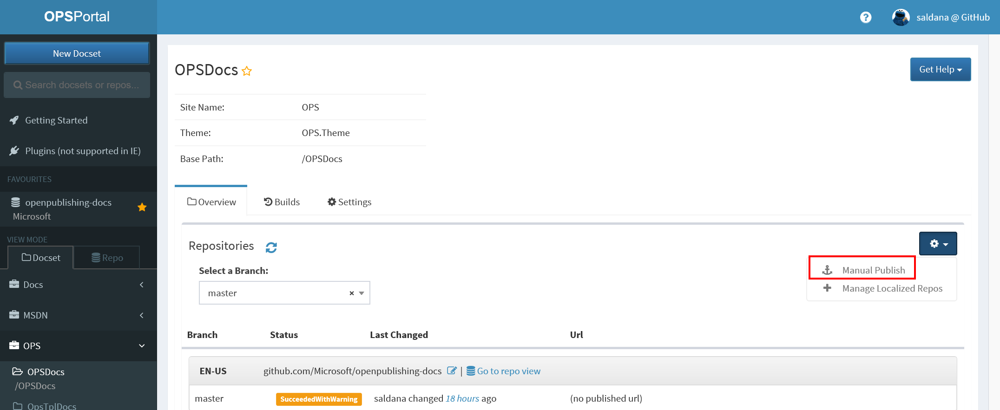
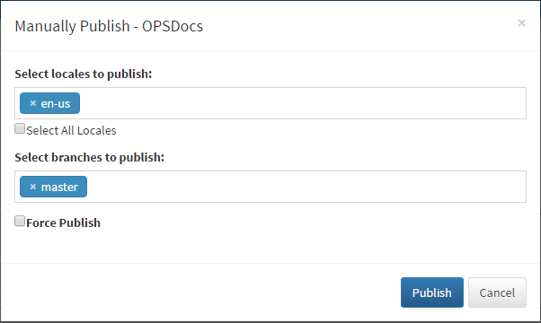
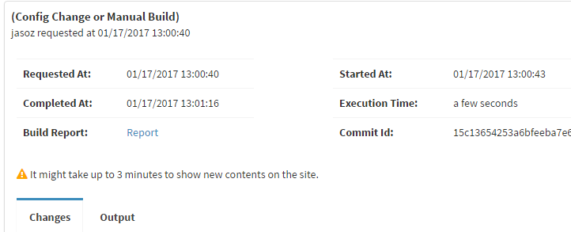
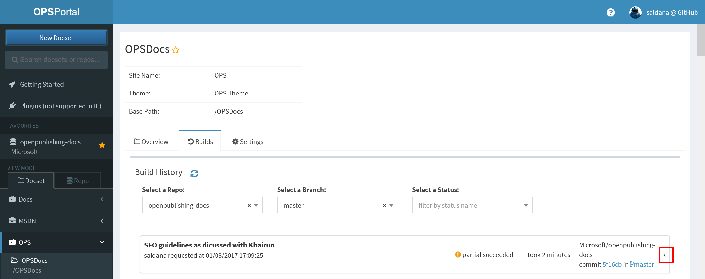
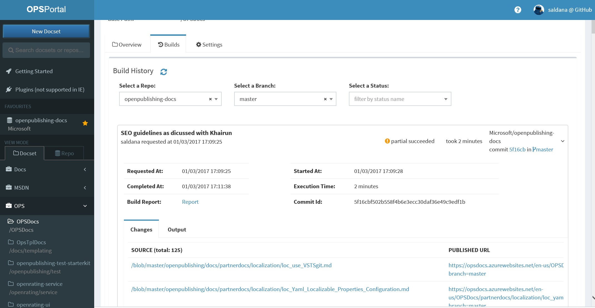
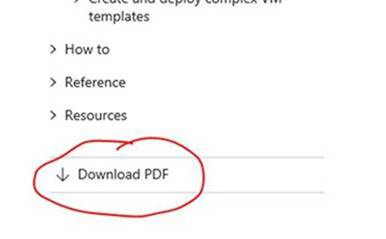
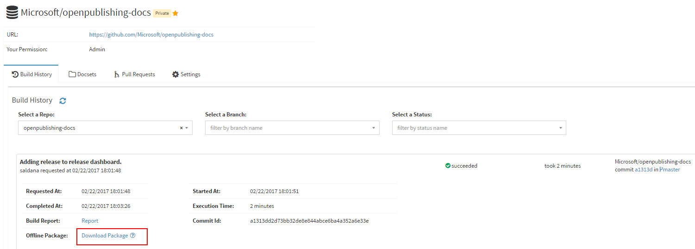

# Content Publishing

Alike other systems, publishing to stage and live is done via branch management. This is configured by OPS during [repo provisioning](../OPSPortal.md). 

In general:

- any branch but **live** branch is the branch associated with staging end point.
- **live** branch is the production branch associated with live end point.

Note that this means that once the content is committed to one of the branches, the content will automatically get published to its assigned environment. 

Both English and localized content follow the same logic.

## OP portal link
[OPS self-service portal](https://OPS).

## Manual content publishing

### Auto publish on content update in Git repo

Once the repo is provisioned, OPS monitors changes in the repo and publishes the contents in updated branch automatically upon commit.

> [!NOTE]
> By default, all branches are monitored for auto publishing.
> You may disable monitoring on a specific branch by setting [branches_to_filter](publish-configuration.md#publish-config-docsets_to_publish.branches_to_filter) in publish configuration.

### Manually trigger publish on [OPS portal](https://OPS)

In some cases, you may need to trigger a manual publish on OPS portal.

Select the docset and click on the Settings button and the on Manual Publish.

On the popup window, select:

* Locales to publish. You can now select all the locales with one click.
* Branches to publish.
* Force publishing instead of incremental build and publishing. Useful when you do not see your content published correctly.
    
Then click Publish.
o

## <a name="PullRquest"> Pull requests

Validation build is automatically triggered when a pull request is opened.

You can see all the pull request in the rep or in OPS portal:
1. Select **Repo view** in OPS portal and find your repo.
2. Click on the **Pull requests** tab. 
## Notification mail

The submitter of the changes as well as those in the [notification list](publish-configuration.md#publish-config-notification_subscribers), will get a mail indicating whether the build is successful or not, a link to the documentation, as well as a link to the build report.

## Publishing history on OPS portal

Alternatively, teams can look at the OPS portal for build status and logs of current and past publishing jobs. You can click on the **Builds** tab to bring the **Build History** window.

Then select the branch you would like to filter for the reports. You can also filter by build status.

Build history page  displays commit message, requested datetime, status, build duration, commit id, etc.

It also shows a message that the published content might take up to 3 minutes to load.

Click on one of the builds to see the full details of the build. Additionally, you can choose either view the changes in the build and its corresponding Urls or entire published URLs for this docset. There is also a total count for changed URLs.

## PDF build output

> [!NOTE]
> Only available for docs site
> Make sure you have turned on 1. [build of PDF](publish-configuration.md#branch-target-mapping) and 2. [see the link in docs](publish-configuration.md#need-generate-pdf-url-template) in the publish configuration file.

When publish or build of pull request finishes, open the published content and select the branch that you built the PDF. You will see a link to download the PDF.

## Intellisense build output
> [!NOTE]
> Make sure you have turned on the build of Intellisense in [publish configuration](publish-configuration.md#publish-config-need_generate_intellisense).

When publish finishes, open OPS portal and go to **Publishing History** and expand the build. Click on **Download Package** next to **Offline Package**.

After download finishes, unzip the downloaded package. The generated intellisense file(s) are in the subfolder `{docset name}\_intellisense`. 

## LiveFyre 
Every published technical article supports a comment stream provided by the Livefyre service. Livefyre allows customers to comment not only at the bottom of a page, but also on any part of a page, i.e. at the sentence or paragraph level. 

For more information on using LiveFyre including: 
* available reports, 
* signing up, 
* moderating, 
* notifications 

Please visit: http://aka.ms/skyeye/documentation/livefyre

## Internal Rating System aka Is this page helpful?
This rating system comes by default and it is available for different locales. The comments and tatings are private.
Reports on the ratings and verbatims are available on http://aka.ms/skyeye/verbatims

