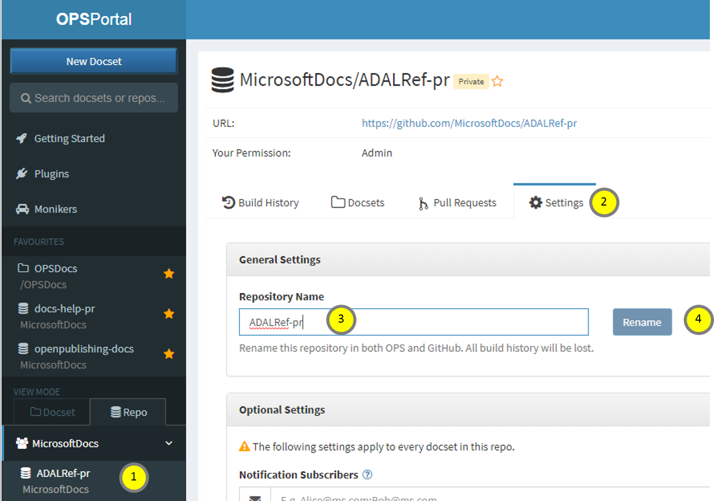

# Renaming a repo
If you need to rename your repo, please do not do this from GitHub or Open Source Portal directly. That will make the webhooks for OPS to be disconnected, so you will not be able to find the repo in OPS Portal or get any builds until we do a backend fix.

Instead, follow these steps:

1. Find your repo in the *Repo* tab and click on it. You can also search for it.
2. Click on *Settings* tab.
3. Edit the repo name
4. Click on "Save"

