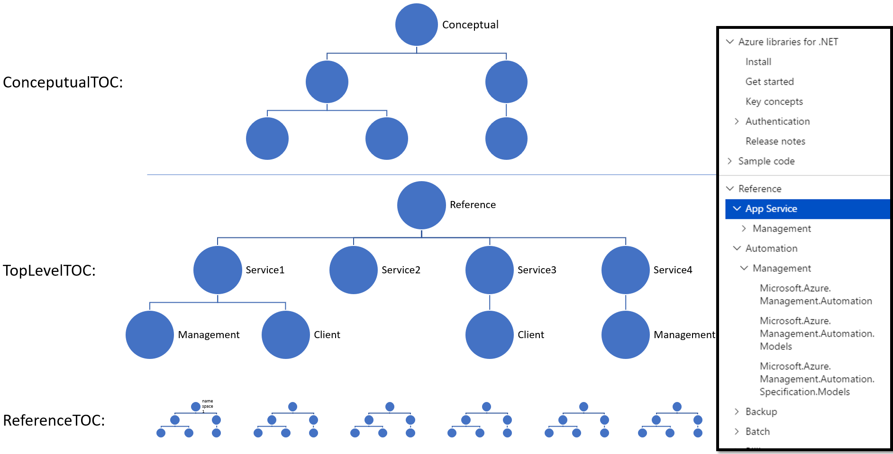
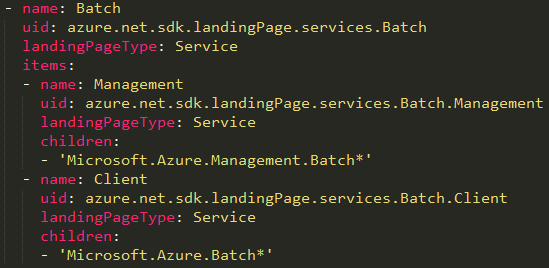
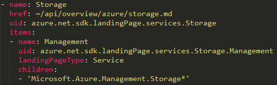

# Fusion TOC Plugin

## Basic Infomation
- Nuget Package Id: Microsoft.OpenPublishing.CommonPlugins
- Nuget Package Feed: https://www.myget.org/F/op/api/v2
- Entry Point: `tools/JoinTOC.ps1`

## Purpose
This plugin was built specificly to support [fusion TOC feature for Azure](https://review.docs.microsoft.com/en-us/new-hope/specs/reference/net-and-java-fusion-tocs?branch=master). 

## Concept


We model fusion TOC with 3 seperated TOC files:

- ConceptualTOC: the TOC of the conceptual topics
- TopLevelTOC: the high level structure of the "Reference" TOC, often maitained manually
- ReferenceTOC: auto-generated reference TOC, normally exists as a forest of small TOC trees. For example for .Net or Java, each small TOC tree is a namespace.

## How it works
The plugin works in 3 phases:

1. **Joining TOCs** - join the TopLevelTOC with ReferenceTOC to produce one big TOC for reference content.

   The plugin will do a DFS (depth-first-search) in TopLevelTOC, for each TOC node:
   - if it has has `children` metadata:
     - Use it as a list of wildcard **name** pattern, to find match in ReferenceTOC root nodes
     - Matched subtrees will be inserted into this node’s `items` property, and `children` will be deleted
   - if it has both an `uid`, and `href/topicHref` that points to .md file:
     - Insert this `uid` to the .md file’s yaml header
     - Delete `href/topicHref`, use only uid to refer to this topic
   
   In the end: if there’re remaining nodes in ReferenceTOC, they will be added to the end. One big joint TOC is now formed, and it will overwrite ReferenceTOC file on the disk.

2. **Generating Landing Pages**
   
   2nd round of DFS will traverse in this one big joint TOC:
   - Cut off any empty nodes if HideEmptyNode=true is defined in configuration
   - If a node has `landingPageType` and `uid`, and its `items` is not empty:
     - Generate a yml file for it, with type=`container`
     - Yml MIME can be set in config (optional, ManagedReferece by default)

3. **Metadata Setting** - As described in [the spec](https://review.docs.microsoft.com/en-us/new-hope/specs/reference/net-and-java-fusion-tocs?branch=master#feature-design), this plugin will help set below metadata:

   - if both `ReferenceTOCUrl` and `ConceptualTOC` exist in configuration, the value of `ReferenceTOCUrl` will be set as `universal_ref_toc` metadata in `ConceptualTOC` file
   - if both `ConceptualTOCUrl` and `ReferenceTOC` exist in configuration, the value of `ConceptualTOCUrl` will be set as `universal_conceptual_toc` metadata in `ReferenceTOC` file

## TopLevelTOC Examples
TopLevelTOC is essentially a toc.yml file with a few enhancements for fusionTOC. These enhancements can sometimes be confusing, so here's a few examples for some typical cases that cannot be done in normal TOC.yml:

1. Auto-generated service page node
   
   This is the most common case for Azure fusion TOC. In below image, all three nodes, "Batch", "Management" and "Client", are auto-generated pages.
   They have a `landingPageType` metadata, so the plugin knows that they need their pages generated.
   
   
   
   For "Management" and "Client", the plugin will replace their `children` property with matched `items`, and then generate page. For "Batch", its page will show two chilren: "Management" and "Client".

2. Service page that points to conceptual topic

   In this case, the page already exists as conceptual .md file, it does not need auto-generation, so `landingPageType` should **not** appear. However a service page still need to be included in its parent's (Reference node) page, so it still needs an `uid`. This `uid` will be inserted to the .md file's Yaml header, as described in [How it works](#how-it-works) phase 1.

   

## Repo Configuration
Please refer to [repo configuration in Azure .Net repo](https://github.com/Azure/azure-docs-sdk-dotnet/blob/master/.openpublishing.publish.config.json) as an full example of how to enable this plugin. Some key points are described below:

1. Import the nuget package:

   ```json
    "dependent_packages": [
      {
        "id": "Microsoft.OpenPublishing.CommonPlugins",
        "nuget_feed": "https://www.myget.org/F/op/api/v2",
        "path_to_root": "_dependentPackages/CommonPlugins",
        "target_framework": "net45",
        "version": "latest"
      },
      ...
    ]
   ```
2. Configure the entry point:

   ```json
    "customized_tasks": {
      "docset_prebuild": [
        ...
        "_dependentPackages/CommonPlugins/tools/JoinTOC.ps1",
        ...
      ],
   ```
3. Setup plugin configuration (all the path and url below are only FYI, they should be different in every repo):

   ```json
    "JoinTOCPlugin": [
      {
        "TopLevelTOC": "docs-ref-toc/top_level_toc.yml",
        "ReferenceTOC": "api/toc.yml",
        "ConceptualTOC": "docs-ref-conceptual/toc.yml",
        "ReferenceTOCUrl": "/dotnet/api/azure_ref_toc/toc.json",
        "ConceptualTOCUrl": "/dotnet/azure/toc.json",
        "HideEmptyNode": true,
        "OutputFolder": "api/overview/azure",
        "ContainerPageMetadata": {
          "langs": [
            "csharp"
          ]
        }
      }
    ]
   ```
   - `OutputFolder`: If set, landing pages will be saved to this folder. If not set, the folder of `ReferenceTOC` will be used.
   - `ContainerPageMetadata`: metadata from here will be carried over to generated landing pages.

4. [Optional] Since a lot of modifications to the content (like landing pages, conceptual pages and TOC metadata setting, etc) happen at build time, there's no trace of it in the change list, so to support incremental build, please use [DiffFolder](DiffFolder.md) plugin to track those build time changes.