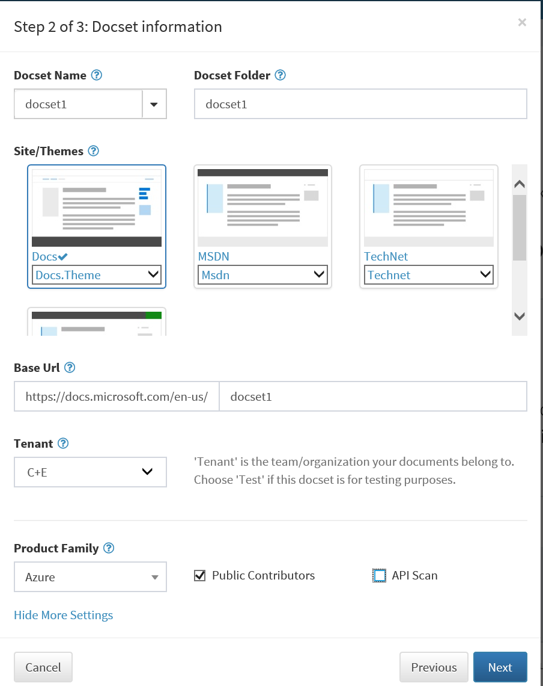

# How to Onboard Powershell Project

## Recommended folder structure

Each powershell project has its own content repo in GitHub or VSTS.
The following folder structure is strongly recommended for content repo:

```
REPOROOT
|   Folder_Name
|       Module_A_Name
|           Version
|               Doc_A.md
|               Doc_B.md
|       Module_B_Name
|   README.md(optional)

```

Examples could be found in both below repos:
* [Azure powershell] (https://github.com/azure/azure-docs-powershell)
* [Azure powershell AD] (https://github.com/azure/azure-docs-powershell-azuread)

## Provision in OPS

Content repo is the repository from which OPS publishes content too.

Navigate to the [OPS portal](https://OPS.microsoft.com) to provision the repo.

1. Click the **Create Docset** button, select the GitHub repo, and click on **Next**.
2. Create common metadata:
  * Default local: **en-us**
  * Site: **Docs**
  * Theme: **Docs.Theme**
  * Product family: **Azure**
  * Set tenant to **test** for a testing repo, or to **C+E** for production.
  * Enter the right values for docset name, docset folder, and base URL, please note that docset name and base URL have to be unique in OPS.



After all of these steps completed, OPS will config and set the webhook to the GitHub repository.

## Configuration

OPS initiates required configuration files during provision, including .openpushing.publish.config.json, docfx.json and breadcrumb.json.
Update each file with additional configurations according to different scenarios. And validate the json files before checking in is encouraged.

## Schema of moniker mapping file

Moniker mapping file is JSON formatted, which is used to indicate which folder should be included in a moniker. Here's the schema:

```json
{
    "<name of moniker>": {
        "conceptualToc": "<relative path of toc.md for conceptual>",
        "serviceMap": "[relative path of service mapping file for the moniker]",
        "packageRoot": "<relative path of folder contains below modules>",
        "modules": {
            "<name of module folder>": {
                "_displayName": "[display name of the module]",
                "_version": "[name of version folder]",
                "_path": "[relative path of the module]"
            },
            ...
        }
    },
    ...
}
```
Value wrapped in `<>` means it's required, and wrapped in `[]` means it's optional.
Note that, relative path means that the path is relative to repo.

* If `serviceMap` is not set, we'll use module name as the service name for each cmdlet.
* If `_displayName` is not set, we'll use name of module folder as the display name.
* If `_version` is not set, we'll copy files under the module folder directly.
* If `_path` is not set, the path of module folder would equal to path combined by `packageRoot` and `name of module folder`.

There's an example:
```json
{
    "azuresmps-4.0.0": {
        "conceptualToc": "azureps-cmdlets-docs/ServiceManagement/docs-conceptual/TOC.md",
        "serviceMap": "azureps-cmdlets-docs/ServiceManagement/mapping/groupMapping-4.0.0.json",
        "packageRoot": "azureps-cmdlets-docs/ServiceManagement",
        "modules": {
            "Azure": {
                "_displayName": "Azure",
                "_version": "v4.0.0"
            },
            "AzureRM.Profile": {
                "_displayName": "AzureRM.Profile",
                "_version": "v3.0.0"
            },
            "Azure.Storage": {
                "_displayName": "Azure.Storage",
                "_version": "v3.0.0"
            }
        }
},
```

## docfx.json

There's a detailed introduction for `docfx.json` [here](http://dotnet.github.io/docfx/tutorial/docfx.exe_user_manual.html#32-properties-for-build).

This section will focus on how to write docfx.json for documentation with moniker.

### version

There's a key named `version` in docfx.json which has the same meaning of `moniker` here. For every content section, we need to specify the version of it. The value of section should be the name of moniker.

For example,

```json
{
  "build": {
    "content": [
      {
        "files": [
          "toc.yml"
        ],
        "src": "azureipps/docs-conceptual",
        "version": "azureipps",
        "dest": "azure/azureipps"
      },
      {
        "files": [
          "**/*.md"
        ],
        "src": "azureipps/docs-conceptual",
        "version": "azureipps",
        "dest": "azure/azureipps"
      },
      {
        "files": [
          "toc.yml"
        ],
        "src": "azureipps",
        "version": "azureipps",
        "dest": "module/azureipps"
      },
      {
        "files": [
          "**/*.md"
        ],
        "src": "azureipps",
        "version": "azureipps",
        "exclude": [
          "docs-conceptual/**"
        ],
        "dest": "module"
      }
    ]
  }
}
```

For the above example, all the three content section belongs to moniker `azureipps`.

* The first content section includes conceptual toc.yml generated automatically by plugin.
* The second content section includes conceptual markdown files. `src` should always be `<module_name>/docs-conceptual`.
* The third content section includes reference toc.yml generated automatically by plugin.
* The fouth content section includes reference markdown files. `src` should always be `<module_name>` and exclude `docs-conceptual/**`.

Note that there need `versions` mapping in `build` configuration, which tell `DocFX` where the version should be saved.
```json
"versions": {
  "azureipps": {
    "dest": "azureipps"
  }
}
```

### toc

`AzurePSPlugin` will generate reference toc.yml according to the moniker mapping file automatically, and save it in `<repo_root>/<moniker_name>/toc.yml`. So please include it in content section of `docfx.json`.

As for the `dest` of toc, it's up to your decision. However, I suggest to set it with `azure/<moniker_name>` for conceptual toc and `module/<moniker_name>` for reference toc. And you will need reuse the value of `dest` in config of `JoinTOC`, which is used to combine with conceptual toc.yml into fusion toc.

### global metadata

Make sure you have add `"showPowerShellPicker": "true"` to enable PowerShell picker for monikers.

### breadcrumb.json

Add "breadcrumb.json" to the resources, set the **globalMetadata** with correct breadcrumb path, set other necessary metadatas.
Usually, the breadcrumb path would be **/url_set_in_provision/breadcrumb.json**.

File breadcrumb.json describes the toc of the site. The default root level toc is *Docs*. Set nested toc node name and level, href value and homepage under the root level to specify the expecting toc.
Here is an example of [powershell] (https://docs.microsoft.com/en-us/powershell/):

```json
[
   {
      "toc_title":"Docs",
      "href":"/",
      "level":1,
      "children":[
         {
            "href":"/powershell/",
            "homepage":"/powershell/",
            "toc_title":"PowerShell Reference",
            "level":2,
            "children":[
               {
                  "href":"/powershell/azureps-cmdlets-docs/",
                  "homepage":"/powershell/azureps-cmdlets-docs/",
                  "toc_title":"Azure PowerShell",
                  "level":3
               }
            ]
         }
      ]
   }
]
```

## .openpublishing.publish.config.json

Compared with initial `.openpublishing.publish.config.json`, there're some configurations important that **MUST** to be added.

1. `type_mapping`: add mapping `"AzurePSModulePage": "Content"` in this section.
2. `customized_template_paths`: add customized template path `"_dependentPackages/azurecli.plugins/azurecli"`.
3. `customized_tasks`: add two customized tasks below

    ```json
    "customized_tasks": {
      "docset_prebuild": [
        "_dependentPackages/Microsoft.OpenPublishing.AzurePSPlugin/tools/Restructure.ps1",
        "_dependentPackages/CommonPlugins/tools/JoinTOC.ps1"
      ]
    }
    ```

4. `dependent_packages`: add three dependent packages, including `opbuild.templates.azurecli`, `Microsoft.OpenPublishing.AzurePSPlugin`, `Microsoft.OpenPublishing.CommonPlugins`.

    ```json
    "dependent_packages": [
      {
        "path_to_root": "_dependentPackages/azurecli.plugins",
        "id": "opbuild.templates.azurecli",
        "version": "latest",
        "nuget_feed": "https://www.myget.org/F/op/api/v2"
      },
      {
        "id": "Microsoft.OpenPublishing.AzurePSPlugin",
        "path_to_root": "_dependentPackages/Microsoft.OpenPublishing.AzurePSPlugin",
        "version": "latest",
        "nuget_feed": "https://www.myget.org/F/op/api/v2"
      },
      {
        "id": "Microsoft.OpenPublishing.CommonPlugins",
        "nuget_feed": "https://www.myget.org/F/op/api/v2",
        "path_to_root": "_dependentPackages/CommonPlugins",
        "target_framework": "net45",
        "version": "latest"
      }
    ]
    ```

5. `monikerPath`: the input config for `Microsoft.OpenPublishing.AzurePSPlugin`, which indicates the moniker file's path.
6. `JoinTOCPlugin`: the input config for `Microsoft.OpenPublishing.CommonPlugins`, which is used for combining conceptual's toc and reference's toc into fusion toc. For details, please see [Fusion TOC Plugin](https://opsdocs.azurewebsites.net/en-us/OPSDocs/plugins/fusiontoc)

At last, take azure powershell azuread for example, plugin azurecli of latest version in specified nuget feed source is configured as following:

```json
{
  "build_entry_point": "docs",
  "need_generate_pdf": false,
  "need_generate_intellisense": false,
  "docsets_to_publish": [
    {
      "docset_name": "azureps-azuread",
      "build_source_folder": ".",
      "build_output_subfolder": "azureps-azuread",
      "locale": "en-us",
      "monikers": [],
      "open_to_public_contributors": true,
      "git_repository_branch_open_to_public_contributors": "master",
      "type_mapping": {
        "Conceptual": "Content",
        "ManagedReference": "Content",
        "RestApi": "Content",
        "AzurePSModulePage": "Content"
      },
      "build_entry_point": "docs",
      "template_folder": "_themes",
      "version": 0,
      "customized_template_paths": [
        "_dependentPackages/azurecli.plugins/azurecli"
      ],
      "customized_tasks": {
        "docset_prebuild": [
          "_dependentPackages/Microsoft.OpenPublishing.AzurePSPlugin/tools/Restructure.ps1",
          "_dependentPackages/CommonPlugins/tools/JoinTOC.ps1"
        ]
      }
    }
  ],
  "notification_subscribers": [],
  "branches_to_filter": [],
  "skip_source_output_uploading": false,
  "dependent_repositories": [
    {
      "path_to_root": "_themes",
      "url": "https://github.com/Microsoft/templates.docs.msft",
      "branch": "master",
      "branch_mapping": {}
    }
  ],
  "dependent_packages": [
    {
      "path_to_root": "_dependentPackages/azurecli.plugins",
      "id": "opbuild.templates.azurecli",
      "version": "latest",
      "nuget_feed": "https://www.myget.org/F/op/api/v2"
    },
    {
      "id": "Microsoft.OpenPublishing.AzurePSPlugin",
      "path_to_root": "_dependentPackages/Microsoft.OpenPublishing.AzurePSPlugin",
      "version": "latest",
      "nuget_feed": "https://www.myget.org/F/op/api/v2"
    },
    {
      "id": "Microsoft.OpenPublishing.CommonPlugins",
      "nuget_feed": "https://www.myget.org/F/op/api/v2",
      "path_to_root": "_dependentPackages/CommonPlugins",
      "target_framework": "net45",
      "version": "latest"
    }
  ],
  "monikerPath": [
    "Azure AD Cmdlets/mapping/monikerMapping.json"
  ],
  "JoinTOCPlugin": [
    {
      "TopLevelTOC": "azureadps-1.0/toc.yml",
      "ConceptualTOC": "azureadps-1.0/docs-conceptual/toc.yml",
      "ReferenceTOCUrl": "/powershell/module/active-directory/toc.json?view=azureadps-1.0",
      "ConceptualTOCUrl": "/powershell/azure/active-directory/toc.json?view=azureadps-1.0"
    },
    {
      "TopLevelTOC": "azureadps-2.0/toc.yml",
      "ConceptualTOC": "azureadps-2.0/docs-conceptual/toc.yml",
      "ReferenceTOCUrl": "/powershell/module/active-directory/toc.json?view=azureadps-2.0",
      "ConceptualTOCUrl": "/powershell/azure/active-directory/toc.json?view=azureadps-2.0"
    },
    {
      "TopLevelTOC": "azureadps-2.0-preview/toc.yml",
      "ConceptualTOC": "azureadps-2.0-preview/docs-conceptual/toc.yml",
      "ReferenceTOCUrl": "/powershell/module/active-directory/toc.json?view=azureadps-2.0-preview",
      "ConceptualTOCUrl": "/powershell/azure/active-directory/toc.json?view=azureadps-2.0-preview"
    }
  ],
  "need_generate_pdf_url_template": false,
  "dest": "_site"
}
```