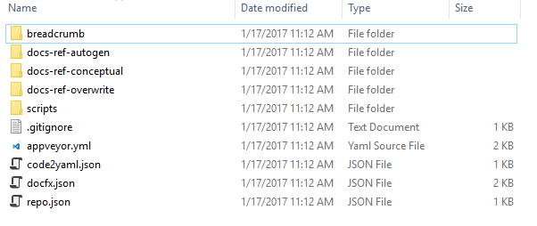

# How to onboard a Java project

Onboarding a Java project is a little different from a .NET refrence project.

The following parts will list all the differences. And some examples will be given.

## Recommended doc repo structure

To onboard a Java project you also need to prepare a doc repository. The recommended doc repo structure would be:

```
REPOROOT
|   appveyor.yml
|   repo.json
|   code2yaml.json
|   docfx.json
|   index.md(optional)
|
+---docs-ref-autogen
|       Project1.String.yml
|       Project2.String.yml
|       toc.yml
|
+---docs-ref-overwrite (optional)
|   +---project1
|   |       overwrite.md
|   |
|   \---project2
|           overwrite.md
|
+---scripts
|       build.ps1
|       UpdateSrcRepo.ps1
|       code2yaml.zip
|
+---breadcrumb (optional)
|       toc.yml
|
\---docs-ref-conceptual (optional)
        helloworld.md
        toc.md
```

Let's go through the differences:
* `code2yaml.json` is the config file of `code2yaml` which is the tool to generate metadata files from Java code.
* `code2yaml.zip` is the zip file of the tool `code2yaml`.
* `docs-ref-autogen` contains all of metadata files in current docset. Unlike .NET, different projects are flattened in this folder.

## Configure code2yaml.json

Unlike .NET, Java doc repo uses tool `code2yaml` to generate metadata file. The config file of the tool is `code2yaml.json`.
Here is a sample `code2yaml.json`.

```json
{
  "input_paths": ["src/azure-sdk-for-java/azure-batch"],
  "exclude_paths": ["src/azure-sdk-for-java/azure-batch/src/test"],
  "language": "java"
}
```

* `input_paths`: an array of input paths. `UpdateSrcRepo.ps1` would clone each repository to a subfolder under docs_repo_root/src, so the input path should follow this structure.
* `exclude_paths`: an array of exclude paths. Code in the paths wouldn't be extracted metadata.
* `language`: it is always `java` for Java doc repo.

The above sample indicates that we need `code2yaml` to extract metadata from all code under `src/azure-sdk-for-java/azure-batch` and save the results(metadata files which end with `.yml`) into folder `docs-ref-autogen`, except for code under folder `src/azure-sdk-for-java/azure-batch/src/test`.

Let's take a look how to configure `code2yaml.json` in below scenario:

### Scenario 1: Add a new folder in source code repo to a doc repo that is already set up

It's pretty easy to add a new folder in source code repo in this scenario. Given the doc repo with recommended structure, you only need to include the folder in `input_paths` section of `code2yaml.json`.

Let's take an example about how to add [Search folder](https://github.com/Azure/azure-sdk-for-java/tree/master/azure-mgmt-search) to doc repo [azure-docs-sdk-java](https://github.com/Azure/azure-docs-sdk-java). The only work is to add the following lines to the `code2yaml.json`:

```json
{
  "input_paths": ["src/azure-sdk-for-java/azure-batch", "src/azure-sdk-for-java/azure-mgmt-search"],
  "exclude_paths": ["src/azure-sdk-for-java/azure-batch/src/test"],
  "language": "java"
}
```
The added content indicates that besides `azure-batch` we need `code2yaml` to extract metadata from all code under `src/azure-sdk-for-java/azure-mgmt-search` and save the results(metadata files which end with `.yml`) into folder `docs-ref-autogen`.

After you make the change to the docs repo, CI process would update `docs-ref-autogen` folder with newly created metadata files(`.yml`). And OPS would trigger a publish of the doc repo.

## Configure repo.json

Let's take a look how to add a src repository in below scenario:

### Scenario 2: Add a new src code repo to a doc repo that is already set up

Just one more file need to be modified compared with scenario 1. Take an example about how to add [Azure IOT SDK](https://github.com/Azure/azure-iot-sdks) to doc repo [azure-docs-sdk-java](https://github.com/Azure/azure-docs-sdk-java), we only need two steps:

* Step 1: add the info of source code repo in `repo.json`.

  ```json
  {
    "repo": [{
        "url": "https://github.com/Azure/azure-sdk-for-java",
        "branch": "master",
        "name": "azure-sdk-for-java"
    },
    {
        "url": "https://github.com/Azure/azure-iot-sdks",
        "branch": "master",
        "name": "azure-iot-sdks"
    }]
  }
  ```

* Step 2: include the folder in `code2yaml.json`. Besides `azure-sdk-for-java`, it would extract metadata from all code under `java` and save the results(metadata files which end with `.yml`) into folder `docs-ref-autogen`.

  ```json
  {
    "input_paths": ["src/azure-sdk-for-java", "src/azure-iot-sdks/java"],
    "exclude_paths": ["src/azure-sdk-for-java/azure-samples"],
    "language": "java"
  }
  ```

  > *Note*

  > `name` in repo.json should be consistent with the paths in code2yaml.json.
  > Namely, the `input_paths`(`exclude_paths`) in code2yaml.json should be something like `src/[name]/...`

After you make the change to the docs repo, CI process would extract metadata from project `azure-iot-sdks/java` and update `docs-ref-autogen` folder with newly created metadata files(`.yml`). Then OPS would trigger a publish of the doc repo.

## Create a Java doc repo from zero

Just like .NET, to create a brand new java doc repo, there would be three main steps to do. The only difference is the step to create a corresponding doc repo with recommended folder structure. Take creating a doc repo for [Azure IOT SDK](https://github.com/Azure/azure-iot-sdks) as an example:

### Create a corresponding doc repo with recommended folder structure.

* Step 1: Install Yeoman generator to generate the recommended folder structure with command `npm install -g yo generator-ops`, and run `yo ops` in cmd shell, choose `Java`, it would create a template docs folder like below (take Java reference project for example):
   

* Step 2: update `repo.json` to fill in the src code repo info like below:
 
 ```json
 {
	"repo": [{
        "url": "https://github.com/Azure/azure-iot-sdks",
        "branch": "master",
        "name": "azure-iot-sdks"
    }]
}
 ```
 
* Step 3: update `code2yaml.json`.
 
 ```json
 {
  "input_paths": ["src/azure-iot-sdks/java"],
  "exclude_paths": [],
  "language": "java"
}
 ```

 > *Note*

 > `name` in repo.json should be consistent with the paths in code2yaml.json.
 > Namely, the `input_paths`(`exclude_paths`) in code2yaml.json should be something like `src/[name]/...`

* Step 4: run git command to push the repo to github, go to setting panel and add collaborator "openpublishbuild"
 
Next you can follow the steps in the [doc for .net](howto-onboard-reference-project.md) to provision the doc repo and set up CI server.
