# How to Onboard a Managed Reference Project

This doc describes the various steps to setting up a managed reference docset in OPS. 

>[!NOTE]
>This process will likely change as we work on automated onboarding. In the meantime, it gives enough resources for onboarding PMs to create documentation sets for managed reference. If you are not an onboarding PM, contact your onboarding PM for assistance.

## Prerequisites

To follows these steps, you need:

- Admin perms in the repo for the docset (or ability to create a new repo in the relevant GitHub organization).
- Write perms to https://apidrop.visualstudio.com/.
- Access to the **Prototype 2** Azure subscription. 
- Perms to add monikers in the OPS Portal - requires membership in https://github.com/orgs/openpublish/teams/moniker-admin.
- One or more NuGet packages non NuGet.org for the product to document, including XML comments if available, OR (**NOT recommended**) a set of DLLs and optional XML comments.

## Set up a CI JOb (NuGet)

The following steps only apply if you are using NuGet packages, as recommended. If you are using DLLs, see Set up a CI Job (DLLs), below.

### Create Your NuGet Package Listing

If you are using NuGet as recommended, start by configuring the package listing. Assuming that your NuGet packages are already on NuGet.org, you can create a new file in the `mrefconfig` repository, in the `master` branch:

1. Go to [https://apidrop.visualstudio.com/binaries/_git/mrefconfig?path=%2Fpackageconfig&version=GBmaster&_a=contents](https://apidrop.visualstudio.com/binaries/_git/mrefconfig?path=%2Fpackageconfig&version=GBmaster&_a=contents).
2. Create a new file and name it `{productname}-pac.csv`. This will be the file used to group packages for your CI job.
3. In the file, on a new line, enter the **moniker base**, **package ID on NuGet.org**, and comma-separated **versions that need to be supported**, like this:

```
ef,EntityFramework,6.2.0-beta1,6.1.3
```

>[!NOTE]
>The version of the product onboarded should not be included in the moniker that is placed before the package ID. The full moniker will be created at build-time, combined with individual required versions, as specified in the CSV.

There should be one moniker per package. For moniker naming guidelines, see [Reference Versioning & Monikers](../partnerdocs/versions-monikers.md).

If you need more packages as part of the same managed reference docset, add each on a new line (one package per line). Always combine multiple versions of one package in the same entry.

### Create a CI Job (NuGet)


[Click here](https://apidrop.visualstudio.com/binaries/_build) to go to the **Build** section of the **binaries** project in the **APIDrop** instance. If you need write perms, contact the [DOCS Product Team](mailto:docsproduct@service.microsoft.com).

As you navigate to the **Build** view, you might notice a range of build definitions that already exist:

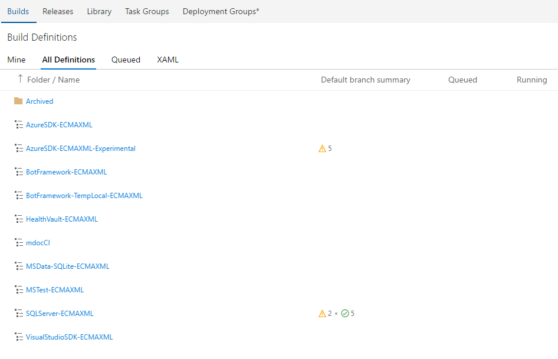

>[!WARNING]
>It is extremely important that you **do not** edit or remove existing build definitions.

Those definitions produce ECMAXML content for different products, and we will need one of those for yours. To reduce the friction, simply select _HealthVault-ECMAXML_, click on the ellipsis, and select **Clone**:

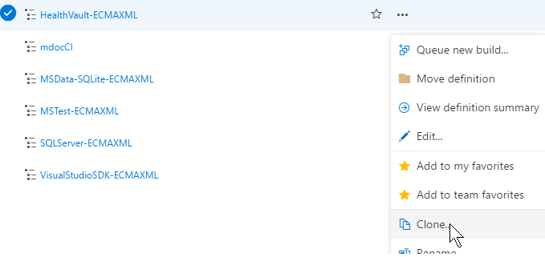

This will create a new build definition with some baseline steps that will produce the right ECMAXML. Of course, you don't _have to_ pick HealthVault as the baseline, but it's the one that will probably be the least confusing for simple scenarios.

Rename your definition to `{productname}-ECMAXML`.

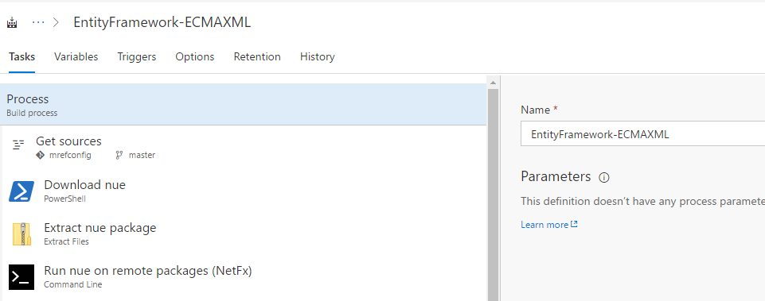

Save the definition under `\`.

### Specify the Package List (NuGet)

Next step is to actually specify the package list in the CI job - the **Run nue** step will run the `nue` tool to extract the packages from the given CSV file, so you need to properly specify the name of the file you just created:


## Set up a CI Job (DLLs)

To build managed reference from DLLs, you will need the DLLs, associated XML comment files if available, and all dependency DLLs.

### Create the DLL folder structure

1. Go to [https://apidrop.visualstudio.com/_git/binaries?_a=contents&path=%2F&version=GBmaster](https://apidrop.visualstudio.com/_git/binaries?_a=contents&path=%2F&version=GBmaster).
2. Clone the repo to your local machine.
   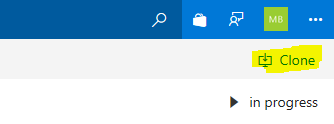
3. In your local clone, add a folder structure as follows:

   ```
   ROOT
   +---docset name
   |   +---{moniker}
   |   +---dependencies
   |   |   +---{moniker}
   ```   

   For example, for Dynamics 365 v9 Unified Service Desk, you might have:

   ```
   ROOT
   +---dynamics
   |   +---dynamics-usd-9
   |   +---dependencies
   |   |   +---dynamics-usd-9
   ```

4. Copy the DLLs to reflect and XML comment files, if available, to the `{moniker}` folder.
5. Copy dependency DLLs to the `dependencies/{moniker}` folder.
6. Commit your changes.

Now when you return to the binaries repo you will see your new folders, like this:

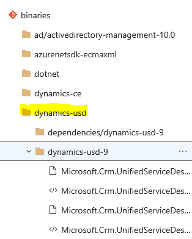

### Create the CI Job (DLLs)

1. [Click here](https://apidrop.visualstudio.com/binaries/_build) to go to the **Build** section of the **binaries** project in the **APIDrop** instance.
2. For convenience, clone the VisualStudioSDK-ECMAXML definition.
3. Rename your definition to `{productname}-ECMAXML`
4. Save the definition under `\`.


### Edit Inline Scripts

The next two steps use inline scripts to run mdoc:

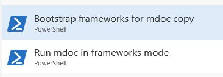

Click on each, and change all occurrences of the cloned docset name to your new docset name:

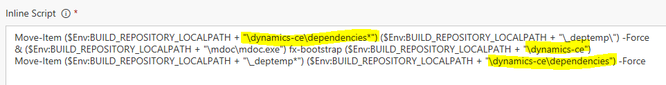

The rest of the steps apply to both NuGet and DLL CI jobs.

## Specify Blob Storage to Output the ECMAXML

Next, specify the blob storage container name where the XML files will be saved. To do that, open the **Publish new ECMAXML** step, and set the container name in the format of `{product}xml`:

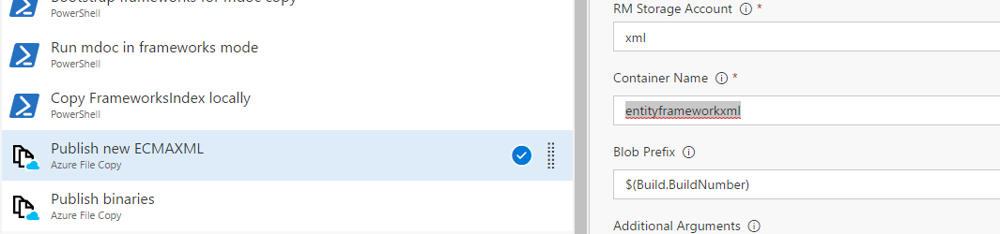

## Build the ECMAXML

You can now queue the build.

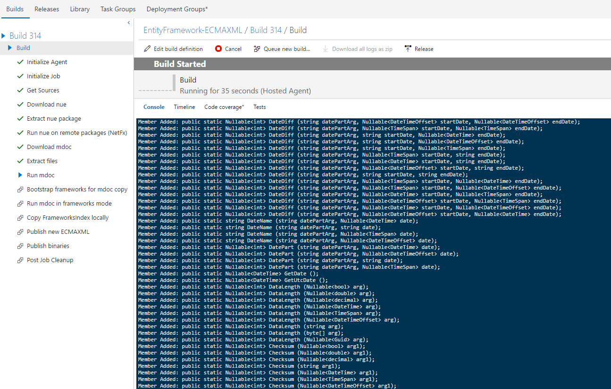

Once the build finishes, the XML files will be uploaded to the specified blob in the `xml` storage account under the **Prototype 2** subscription in Azure.

>[!NOTE]
>If you don't have access to the **Prototype 2** subscription, you will need a key to access the storage account and add it to a tool like [Azure Storage Explorer](http://storageexplorer.com/). [Contact Den](mailto:dendeli@microsoft.com) with your request.

You can download the ECMAXML files from the blob that has the same name as the build number that produced them.

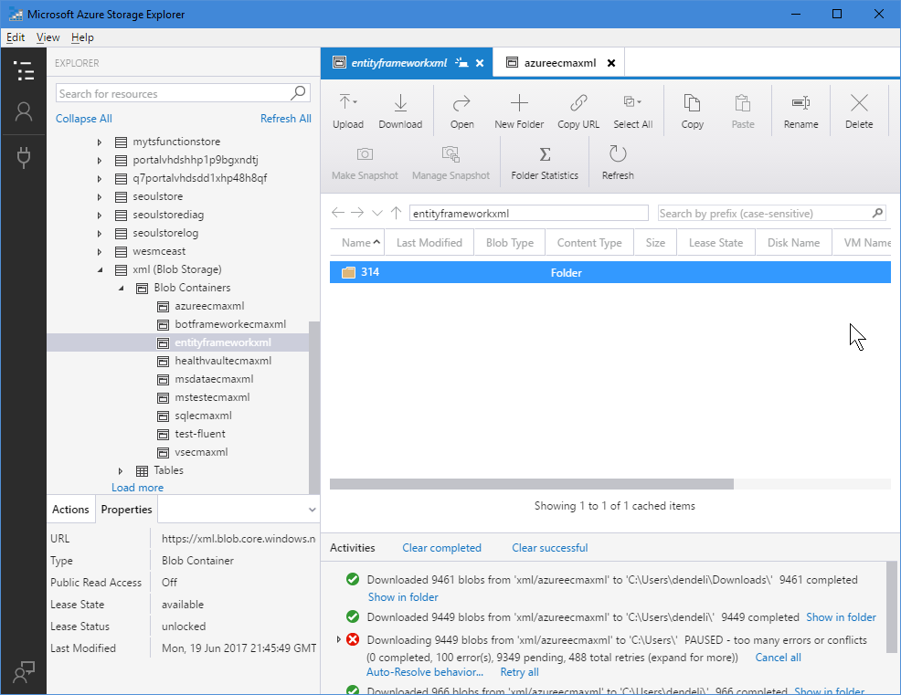

When the download completes, you will add the files in the repository provisioned to be a managed reference docset. 

## Add Monikers in the OPS Portal

1. Go to https://ops.microsoft.com/#/monikers.
2. Click Add New.

Add new monikers corresponding to the [package list](#specify-the-package-list) you created for the CI job. 

For example, this...

```
ef,EntityFramework,6.2.0-beta1,6.1.3
```

... becomes this:

```
Moniker Name       Moniker Display Name
ef-6.2.0-beta1     Entity Framework 6.2.0-beta1
ef-6.1.3           Entity Framework 6.1.3
```

## Add Monikers to the API Browser

Send an email to Mike Sampson with your new moniker list.

## Set up the docset

1. At the repo root in GitHub, add a folder called `dotnet`.
2. In the OPS Portal, provision a docset on the `dotnet` folder. 
3. Give the docset a descriptive name, such as `<technology>-dotnet`.
4. Choose the appropriate them (Docs for docs.microsoft.com).
5. Add a temporary base URL, generally the same as the docset name. This will later be changed on the backend to add your docs under the dotnet path.
6. Choose your tenant, such as C+E.
7. Click Show More Settings.
8. Select the Product Family, such as VS.
9. Select to enable APIScan (should be enabled for all new mref).

Here's an example. Numbers correspond to the steps above.
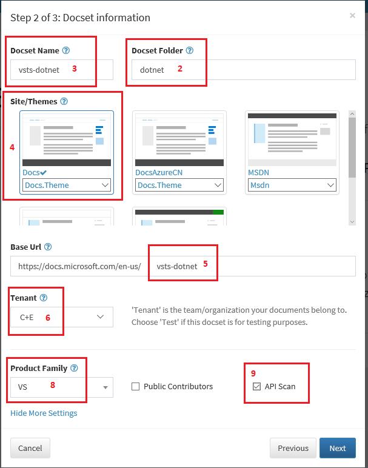

After provisioning runs, you will have the following repo structure:

```
REPOROOT
|   .gitignore
|   .openpublishing.build.ps1
|   .openpublishing.publish.config.json
|   LICENSE
|   LICENSE-CODE
|   README.md
|   ThirdPartyNotices
|   index.md
|
+---dotnet
|   |   docfx.json
|   |   TOC.md
```

## Add the ECMAXML

1. Fork and clone the repo.
2. In your local clone, add an `xml` folder under docset.
3. Copy the entire contents of the [ECMAXML build folder](#build-the-ecmaxml) that you downloaded from Azure Storage.

The resulting structure should be like this:

```
REPOROOT
| ...
|
+---dotnet
|   |   docfx.json
|   |   TOC.md
|   +---xml
|   |   +---FrameworksIndex
|   |   +---Namespace.Example.One
|   |   +---Namespace.Example.Two
| ...
```

## Add Cross Reference Zip Files

To link to APIs outside the docset, you will need to one or more cross reference zip files to map the xref links to the published URLs. For example, to link to the .NET Framework documentation currently published to MSDN, add msdn.4.5.2.zip. The repo structure now looks like this:

```
REPOROOT
| ...
|
+---dotnet
|   |   docfx.json
|   |   TOC.md
|   +---xml
|   |   +---FrameworksIndex
|   |   +---Namespace.Example.One
|   |   +---Namespace.Example.Two
|   +---msdn.4.5.2.zip
| ...
```

For additional zip files, contact Alice Wang's team with pointers to the documentation sets you need to link to.

## Configure docfx.json

Overwrite the default docfx.json with the following:

```json
{
  "build": {
    "content": [
      {
        "files": [
          "**/*.md",
          "**/*.yml"
        ],
        "exclude": [
          "api/overwrites/**",
          "**/toc.yml",
          "**/obj/**",
          "**/includes/**",
          "README.md",
          "LICENSE",
          "LICENSE-CODE",
          "ThirdPartyNotices"
        ]
      },
      {
        "files": [
          "**/toc.yml"
        ],
        "src": ".",
        "dest": ""
      }
    ],
    "resource": [
      {
        "files": [
          "**/*.png",
          "**/*.jpg"
        ],
        "exclude": [
          "**/obj/**",
          "**/includes/**"
        ]
      }
    ],
    "overwrite": {
      "files": [
        "api/overwrites/**/*.md"
      ]
    },
    "xref": [],
    "externalReference": [],
    "globalMetadata": {
      "apiPlatform": "dotnet",
      "author": ""
    },
    "fileMetadata": {},
    "template": [],
    "dest": "",
    "lruSize": 0
  }
}

```

The reference specific fields are as follows:


|Field    |Description  |Example  |
|---------|-------------|---------|
|`api/overwrites/**`|Tells the build to ignore overwrite files, if used. These are optionally used to apply metadata at the type level.|Keep the default.|
|`dest`       |For the first `dest`, under `content`, specify the TOC output file. This file will be generated at build time. The name should be similar to the docset name but with underscores and `_toc` at the end.  | `vsts_dotnet_toc` |
|`overwrite`  |Specifies the location for optional overwritre files.|Keep the default.|    
|`xref`       |Indicate any xref zip files required to cross link to other repos. We'll come back to this step later! |`msdn.4.5.2.zip` |
|`apiPlatform`|Add global metadata to indicate the type of reference. |For .NET, always use `dotnet`.|
|`author`     |Specifies the default author for the docset.          |         |
|`dest`       |For the second `dest`, toward the end of the file, use the docset name plus `-api`. |`vsts-dotnet-api` |

Other customizations, such as additional global or file metadata, can also be added, just like for other docset. See [DocFX Documentation](http://dotnet.github.io/docfx/tutorial/docfx.exe_user_manual.html) for more information.

Here's an example:

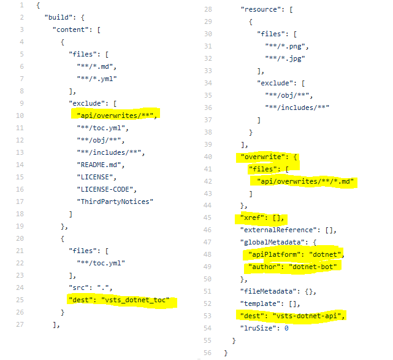

## Configure .openpublishing.build.config.json

Add the following custom sections to this file:

```json
"customized_template_paths": [
        "_dependentPackages/memberpage.plugins/content"
      ],
      "customized_tasks": {
        "docset_prebuild": [
          "_dependentPackages/ECMA2Yaml/tools/Run.ps1",
          "_dependentPackages/splitToc/tools/run.ps1",
          "_dependentPackages/ECMA2Yaml/tools/DiffFolder.ps1"
        ],
        "docset_postbuild": [
          "_dependentPackages/ECMA2Yaml/tools/PostBuild.ps1"
        ]
      }
```

```json
"template_folder": "_themes",
   "dependent_packages": [
    {
      "id": "Microsoft.DocAsCode.ECMA2Yaml",
      "nuget_feed": "https://www.myget.org/F/op/api/v2",
      "path_to_root": "_dependentPackages/ECMA2Yaml",
      "target_framework": "net45",
      "version": "latest"
    },
    {
      "id": "memberpage.plugins",
      "nuget_feed": "https://www.myget.org/F/docfx/api/v2",
      "path_to_root": "_dependentPackages/memberpage.plugins",
      "target_framework": "net45",
      "version": "latest"
    },
    {
      "id": "SplitToc",
      "nuget_feed": "https://www.myget.org/F/op/api/v2",
      "path_to_root": "_dependentPackages/splitToc",
      "target_framework": "net45",
      "version": "latest"
    }
  ],
  "ECMA2Yaml": {
    "SourceXmlFolder": "dotnet/xml",
    "OutputYamlFolder": "dotnet/api",
    "Flatten": true
  },
  "DiffFolder": [
    "dotnet/api"
  ],
  "toc_path_need_to_split": "dotnet/api/toc.yml"
```

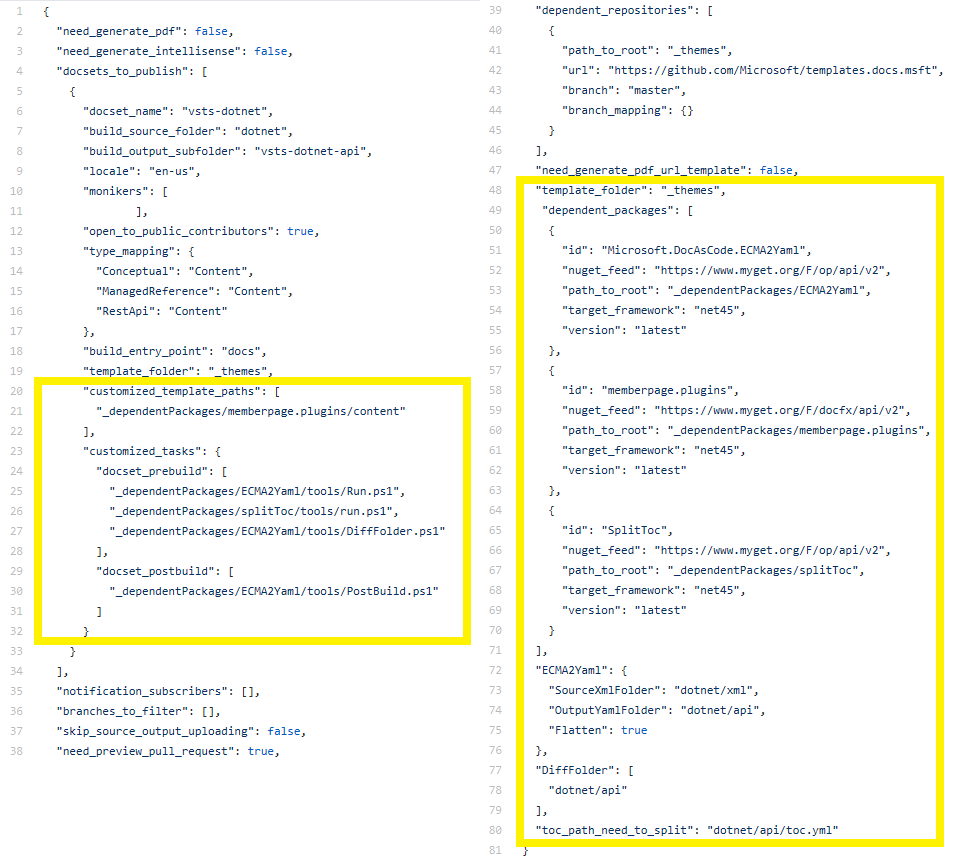


## Check in Your Local Changes

When all these steps are done in your local clone, create a pull request and check the build log. Fix any issues before merging into the upstream repo, especially if it is already live.

> [!NOTE]
> It is recommended that you always do this through a pull request, so that any problems are detected early - there is a chance that the `mdoc` process missed some specific code pieces, or it might have been misconfigured in the CI job, therefore it's a good idea to double check before making the repo check-in.

## Change Base URL (Backend)

To change the base URL to the standard .NET path, `https://docs.microsoft.com/en-us/dotnet/api/`, send email to Zhiliang Xu.

## Other things to document

- CAPS migration process.
- Process for updates, including when docset contains authored content!