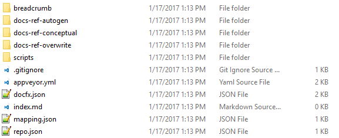

# How to onboard a REST project

## Steps to onboard a REST project

Please follow the basic steps and CI process in [onboard a reference project](howto-onboard-reference-project.md). The difference is the step to create a corresponding doc repo with recommended folder structure, and configuration of `docfx.json`.

### Create a corresponding doc repo with recommended folder structure.

* Step 1: Install Yeoman generator to generate the recommended folder structure with command `npm install -g yo generator-ops`, run `yo ops` in cmd shell and select `rest`, it would create a template docs folder like below:

 

* Step 2: update `repo.json` to fill in the source code repo info like below:
 
  ```json
  {
    "repo": [{
      "url": "https://github.com/azure/azure-rest-api-specs",
      "branch": "master",
      "name": "azure-rest-api-specs"
    }]
  }
  ```

* Step 3: update `mapping.json`, detailed instruction please refer to [introduction of mapping file](#introduction-of-mapping-file)

  ```json
  {
    "target_api_root_dir":"docs-ref-autogen",
    "mapping":{
      "documentation":[
        {
          "source_index":"docs-ref-conceptual/samplepath/index.md",
          "source_toc":"docs-ref-conceptual/samplepath/toc.md",
          "toc_title":"Sample Path"
        }
      ],
      "reference":[
        {
          "source_swagger":"azure-rest-api-specs/samplepath/sample.json",
          "target_dir":"samplepath",
          "toc_title":"Sample Path"
        }
      ]
    }
  }
  ```

* Step 4: update `docfx.json`

  Different from *.NET* project, we could **build** REST project directly without configuring **metadata** in `docfx.json` as below:
  ```json
  {
    "build": {
      "content": [
        {
          "src":"docs-ref-autogen",
          "files": [
            "**.json",
            "toc.md"
          ],
          "dest":"api"
        },
        {
          "src":".",
          "files": [
            "index.md"
          ],
          "dest":"api"
        },
        {
          "src":"docs-ref-conceptual",
          "files": [
            "**.md"
          ],
          "exclude": [
            "**/toc.md"
          ],
          "dest":"api"
        },
        {
          "files": [
            "*.md",
            "toc.yml"
          ],
          "exclude": [
            "**/obj/**",
            "_site/**"
          ]
        },
        {
          "files": [
            "breadcrumb/toc.yml"
          ]
        }
      ],
      "resource": [
        {
          "src":"docs-ref-conceptual",
          "files": [
            "**.png",
            "**.jpg"
          ],
          "dest":"api"
        }
      ],
      "overwrite": [
        {
          "files": [
            "docs-ref-overwrite/**.md"
          ]
        }
      ],
      "externalReference": [],
      "globalMetadata": {
        "breadcrumb_path": "~/breadcrumb/toc.yml"
      },
      "fileMetadata": {},
      "template": [
        "docs.html"
      ],
      "dest": "_site"
    }
  }
  ```

  ## Steps to onboard Azure REST project

  ### Introduction of mapping file

  By Azure REST project's requirement, mapping file `mapping.json` is configured for following purpose:
  1. One swagger file is splitted by specific rule to multiple small swagger files, for better organizing the API. 
  2. Output file structure could be customized, for more friendly URL.
  3. Root `toc.md` is auto generated, for clear navigation.

  The example of `mapping.json` is as below:
  ```json
  {
    "target_api_root_dir":"docs-ref-autogen",
    "mapping":{
      "documentation":[
        {
          "source_index":"docs-ref-conceptual/samplepath/index.md",
          "source_toc":"docs-ref-conceptual/samplepath/toc.md",
          "toc_title":"Sample Path"
        }
      ],
      "reference":[
        {
          "source_swagger":"azure-rest-api-specs/samplepath/sample.json",
          "target_dir":"samplepath",
          "toc_title":"Sample Path"
        },
        {
          "source_swagger":"azure-rest-api-specs/level1/level2/swagger.json",
          "target_dir":"level1/level2"
        }
      ]
    }
  }
  ```

* `target_api_root_dir`: target root directory to save all the splitted swagger files.
* `mapping`: mapping of documentation and source swagger files.
  * `documentation`: the index and toc file, which will be the description of swagger files.
    * `source_index`: source index file, which will be the file link of the auto generated `service area` swagger toc.
    * `source_toc`: source toc file, the toc structure will be inserted before auto generated swagger toc structure.
    * `toc_title`: merge key to match with the swagger file in same `toc_title`.
  * `reference`: the relationship between source swagger files and target splitted swagger files, to better organize the target direcory structure.
    * `source`: original swagger file path. **Note** it should start with original repo name, to distinguish with different source repos.
    * `target_dir`: target directory to save splitted swagger files under `target_api_root_dir` folder.
    * `toc_title`: optional, toc.md would be auto generated after splitting swagger files, first level toc title would be:
     * if `toc_title` is set, the toc title would be the value.
     * if `toc_title` is not set, the toc title would be info.title from swagger files.

Take above `mapping.json` as example, the `docs-ref-autogen` output folder structure is as below:

```
docs-ref-autogen
|   toc.md
+---samplepath
|   x.json
|   y.json
+---level1
|   +---level2
|   |       m.json
|   |       n.json
```

* *samplepath/sample.json* of source repo *repo-name* is splitted to *x.json* and *y.json* by specific rule under *samplepath* direcory, which is configured by `target_dir`.
* The root `toc.md` of `docs-ref-autogen` is auto generated as below:
  * First level toc title is generated by `toc_title` with priority. If `toc_title` is not set, we will fetch the info.title from swagger files.
  * Second level toc title is generated by `operation group`, which is extracted by `operationId`. For example, if `operationId` is *VirtualNetworks_CreateOrUpdate*, its `operation group` would be *Virtual Networks*.

  ```
  # [Sample Path](../docs-ref-conceptual/samplepath/index.md)
 [Toc block generated from ../docs-ref-conceptual/samplepath/toc.md]
  ## [x](samplepath/x.json)
  ## [y](samplepath/y.json)
  # Generated from info.title of swagger.json
  ## [m](level1/level2/m.json)
  ## [n](level1/level2/n.json)
  ```

### Add a new REST source repo to current Azure docs repo

For example, if new REST source repo "https://github.com/org/new-repo" is to be added into current Azure docs repo that is already set up, we can follow the 2 steps below:

### Update `repo.json`

Add new REST source repo information into `repo.json`, detailed introduction of `repo.json` please refer to [Configure repo.json](howto-onboard-reference-project.md#configure-repojson)

```json
{
  "repo": [{
    "url": "https://github.com/org/existing-repo",
    "branch": "master",
    "name": "existing-repo"
  },
  {
    "url": "https://github.com/org/new-repo",
    "branch": "master",
    "name": "new-repo"
  }]
}
```

### Update mapping file `mapping.json`

Add the mapping relationship between original swagger file and target splitted swagger files

```json
{
  "target_api_root_dir":"docs-ref-autogen",
  "mapping":{
    "documentation":[
      {
        "source_index":"docs-ref-conceptual/samplepath/index.md",
        "source_toc":"docs-ref-conceptual/samplepath/toc.md",
        "toc_title":"Sample Path"
      }
    ],
    "reference":[
      {
        "source_swagger":"azure-rest-api-specs/samplepath/sample.json",
        "target_dir":"samplepath",
        "toc_title":"Sample Path"
      }
    ]
  }
}
```
