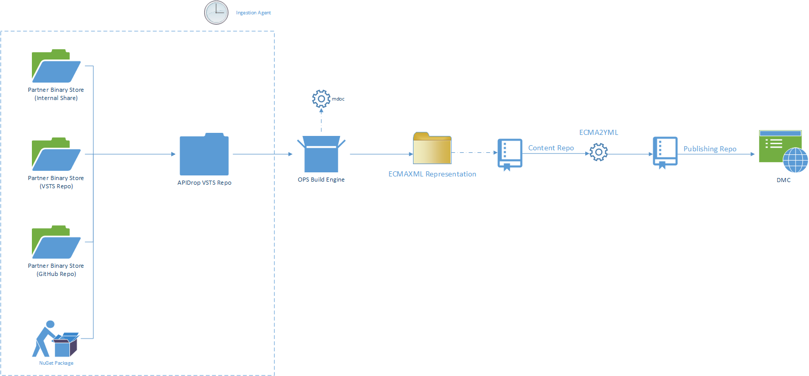

# .NET Managed Reference

When we talk about onboarding managed reference, we refer to onboarding products that ship [ECMA335](https://www.ecma-international.org/publications/standards/Ecma-335.htm)-compatible assemblies to the end-user. This is otherwise known as .NET-based content. 

All managed reference is intended to be included in the [.NET API Browser](https://docs.microsoft.com/dotnet/api).


## Learn more about ECMAXML and tooling for managed reference

The recording of an introductory meeting is available here:
https://microsoft.sharepoint.com/teams/CE_CSI/_layouts/15/guestaccess.aspx?guestaccesstoken=jk2wGJ%2b6R6qeRCZgCM7M%2bcvSYysSrCMhexJrrH0PRvw%3d&docid=2_1a2bcfa2331404b30874b913c75b2971f&rev=1 
 
The deck is available here: 
https://microsoft.sharepoint.com/teams/CE_CSI/_layouts/15/guestaccess.aspx?guestaccesstoken=i4npVfGoP8hREp9tXDfxS5tzM2PimOjI2W0R3M9GUxM%3d&docid=2_1aedaefb398544c5eb767eabfc0fb6a55&rev=1


## Partner Requirements
The following outline requirements for partners to follow in order to onboard their managed reference to docs.microsoft.com. Without fulfilling _every single one of the below_ onboarding is not possible.

* **Provide a reliable place for product binaries.** We no longer rely on source code to generate documentation - instead, we rely on binaries (DLL/EXE). Refer to the FAQ later in this article to learn about the reason behind this decision.
* **Determine the versioning story.** The product team needs to determine how many versions they want to document, and for each version follow the first point in this list - they will need to provide a reliable place for all product binaries.
* **Determine reliance on /// comments.** If the team uses /// (documentation) comments, they need to make sure that they provide the output XML files along each binary that is being documented. Visual Studio provides a [convenient option to generate the aforementioned XML file](https://msdn.microsoft.com/en-us/library/x4sa0ak0(v=vs.100).aspx).

## Workflow

The workflow from picking up the binaries to generating the documentation published on docs.microsoft is explained below:



### Partner Binary Store
This is the location of all binaries that the partner provides. When we onboard a specific set of libraries, we bind a single location to a specific moniker. On the service side, we create a key-value pair of the format:

```
{
    location : "\\someshare\somefolder\v1.0",
    locationType : "InternalShare",
    targetSet : "ecosystem_name",
    moniker : "someproduct-1.0"
}
```

Effectively, we bind the location to an internal container in the API Drop repo where the DLLs will be copied in a sub-container, named exactly as the specified moniker, which represents the product and its version.

#### Supported Binary Locations

* NuGet
* Internal Share
* VSTS Repository
* GitHub Repository
* HTTP Direct Link

#### Unsupported Binary Locations

* Storage accounts (Azure, S3, etc.)
* FTP shares

### API Drop VSTS repo

This is the repositories where ultimately all managed binaries are aggregated in their respective containers. The repository is also provisioned with appropriate webhooks, that are triggered to re-generate documentation when changes happen.

### Ingestion Agent

The ingestion agent runs on a schedule and pulls binaries that are registered and runs them against a hash for binaries already in the API Drop repo. If there is a delta, it will make sure to check-in new binaries, that will later be translated in ECMAXML documents.

For an example of ECMAXML, you can [see here the complete set of .NET API ECMAXML files](https://github.com/dotnet/docs/tree/master/xml).

The ingestion agent will also check-in any of the existing `.xml` files that represent documentation comments, for later transformation in the ECMAXML format.

The ingestion agent works similarly with [NuGet packages](https://nuget.org) - we download them, check against registered binaries in API Drop and check in the binaries along with XML doc files, if available.

### OPS Build Engine

The Open Publishing Build agent can pick up the binaries and pipe them through the `mdoc` tool, that will in turn produce the desired ECMAXML reflected from individual (or grouped) assemblies.

### Content Repo

Once the ECMAXML is generated, it is merged with the existing XML in the content repositories. Content that is already there is not lost, but rather augmented with the new content.

### ECMA2YML

A special tool designed by APEX Shanghai will then convert the ECMAXML files in the content repository into YAML that can be published on docs.microsoft.com.

## Steps to Onboard

0. [Content Team] Email your [APEX onboarding PM](https://microsoft.sharepoint.com/teams/Visual_Studio_China/_layouts/15/WopiFrame.aspx?sourcedoc={2438313c-56db-4aa3-be47-eac50e7bba32}&action=edit&wd=target%28Overview%2Eone%7CAC65D90B%2D5DA7%2D458E%2D9AA6%2DD2C98F06E207%2FTeam%7C94DC06FE%2DC59B%2D4D69%2D8BD6%2DD12060CF2F55%2F%29) and [Den Delimarsky](mailto:dendeli@microsoft.com) your onboarding request.
1. [Content Team] Provide the location for binaries and XML doc files, if applicable (the location can be a share, NuGet.org OR an existing repo).
2. [Content Team] Create and provision with OPS [a new repo](https://opensource.microsoft.com) in the _MicrosoftDocs_ organization on GitHub for your content (You would have the XML files, generated from our CI, in the repo).
3. [Content Team] Provide **admin** access to [Den Delimarsky](mailto:dendeli@microsoft.com), [VSC Service account](https://github.com/VSC-Service-Account) as well as [these teams](https://opsdocs.azurewebsites.net/en-us/opsdocs/partnerdocs/repo-creation-config?branch=master#a-namerepo-permsa4-setting-up-permissions-to-the-git-repo).
4. [Content Team] Contact [Den Delimarsky](mailto:dendeli@microsoft.com) and cc your APEX onboarding PM to create a new CI step for your binaries, that will output the XML files.
5. [APEX Engineering] The Moniker Management Group (MMG)  will set up a moniker (or multiple monikers) for your content and will make sure that it is integrated with the API Browser repo.
6. [Content Team] Verify your content in the following URL: https://docs.microsoft.com/en-us/dotnet/api/?view=netcore-1.1

## FAQ

### Why can't I use source code for managed reference?
We recently moved away from relying on source code for managed reference for the following reasons:

1. **Versioning** - It's much easier to maintain versions for different implementations when we have clear separation of releases.
2. **Tooling** - We rely on [mdoc](https://github.com/mono/api-doc-tools) as the centerpiece of our managed documentation generation pipeline. It can produce documentation for different versions and framework sets, and therefore only support input in the form of ECMA335 binaries.
3. **Reliability** - Source frequently changes, and sometimes we see changes that results in content going missing when accidental check-ins are made in the SDK/framework repo. To avoid that, the reliance on binaries helps us create a failsafe - once it's shipped, it's more likely to be the "true" version that needs to be documented.
4. **Scalability** - We can easily scale the pipeline to several releases of the same SDK/framework without impacting content that is already published.

### I updated the DLLs - will the CI job pick them up automatically?

Yes, once the DLLs are updated in a source location for which we have provisioned a CI step, the content will reflect those changes.

### I have a new version that I need to document, for something I already have onboarded. What do I do?

The steps should be almost the same for version updates as for the first time onboarding (see above). We will create a new moniker for your product and onboard it following the standard steps.

It's important to mention that you won't need to create a new repo for a new version of the product - they will live within the same GitHub location.

### I want a separate URL for my product, such as `/myproduct/api`

We do not support custom URLs for managed reference. All .NET-based APIs are within the `/dotnet/api` base path, with no exceptions.

### I don't want users to modify the reference content. Can I stop them?

Yes, this is an [OPS setting](https://opsdocs.azurewebsites.net/en-us/opsdocs/partnerdocs/publish-configuration?branch=master).

### Can users modify everything in the ECMAXML file?

Technically, yes, but we are designing a validation process that ensures that users can only modify components of the XML that are not generated from code. For example, you wouldn't want a user to modify the type signature, since it is not reflective of the code. 

### Is there a tool that makes editing ECMAXML files easier?

Yes, the [Xamarin DocWriter](https://github.com/xamarin/DocWriter).

### Can I integrate Markdown into ECMAXML files?

There are designated sections, such as _Remarks_, that support 

```
<format type="text\markdown">![CDATA[

## Your Markdown Content here.    
]</format>
```

### I have some unmanaged assemblies in the mix. Can those be documented as well?

No, the current managed experience focuses exclusively on managed binaries. If you have unmanaged binaries, please make sure to remove them from the location that you will provide to the docs team.

You might be able to accomodate the unmanaged APIs in their designated areas on the docs site. Please contact one of our onboarding PMs for details.

### Can I see the content in stage before going live?
Yes, but we will need to onboard a new reference docset in the repo. I probably should be clearer in the steps involved, but there will be a need to (1) add the moniker to the config and (2) specify the folder with the XML as a reference container, that will be rendered on the review site.

