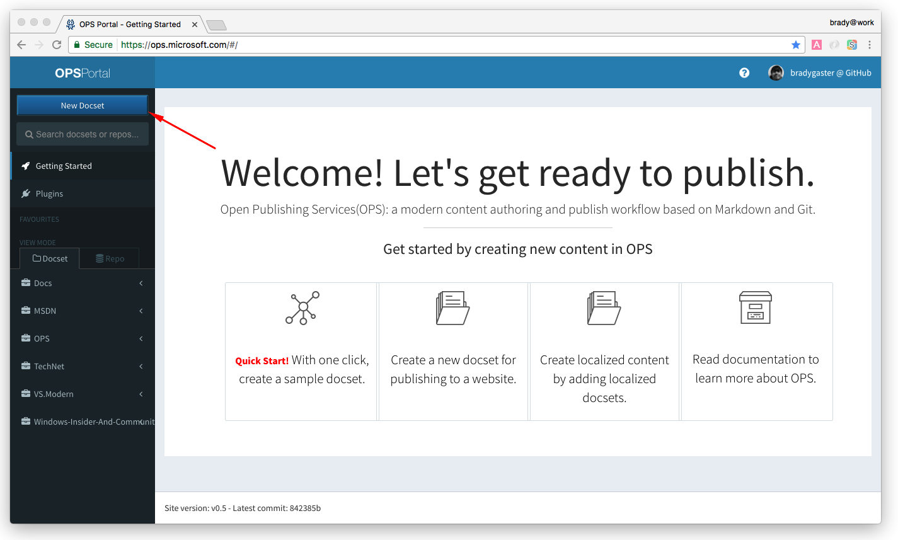
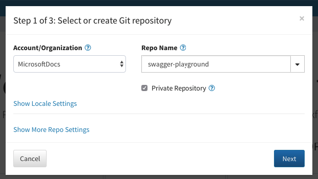
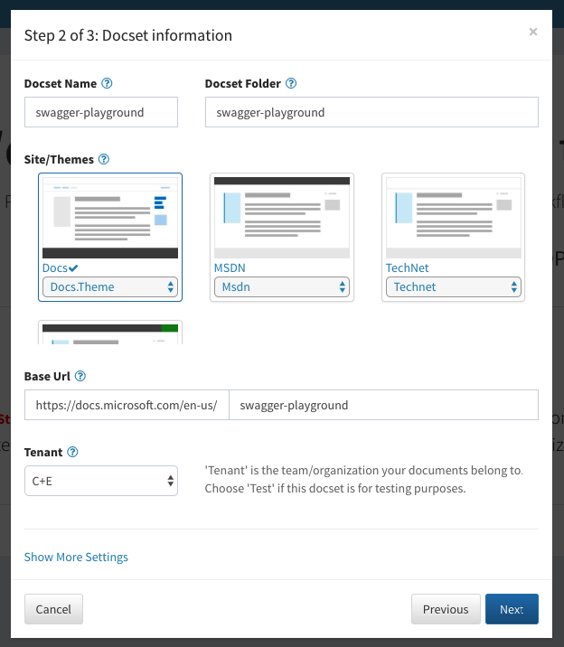
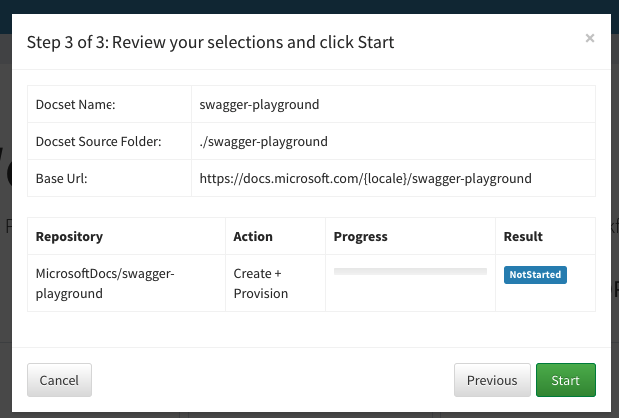
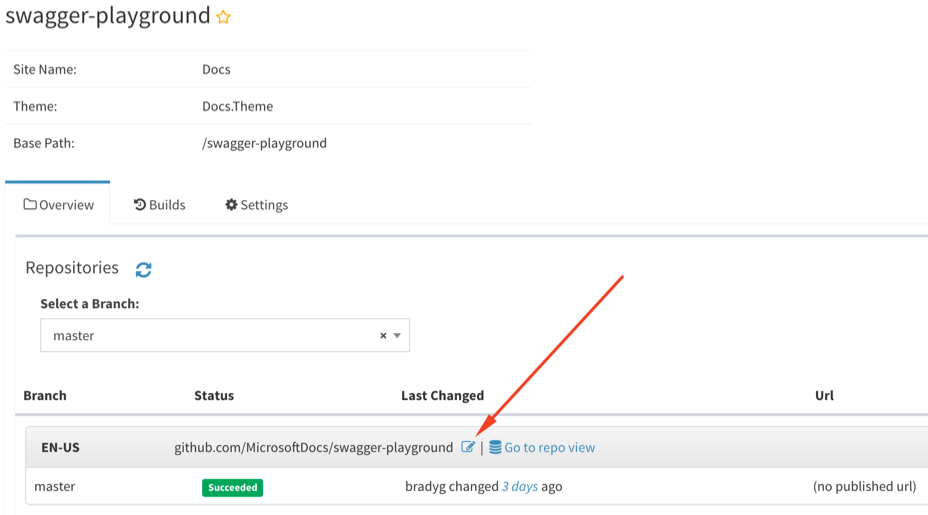
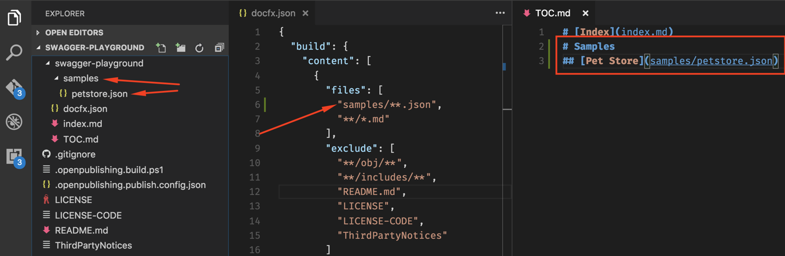
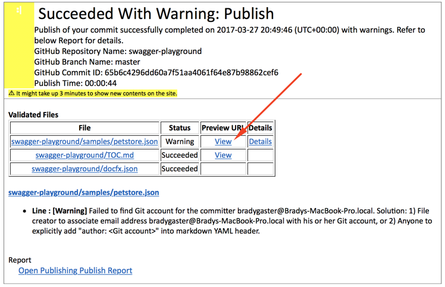

# Self-service REST API reference

This guide walks you through the process of creating your own REST API reference site so your Swagger can be tested in the [docs.microsoft.com](http://docs.microsoft.com) chrome. There are some features available in the [docs.microsoft.com REST API reference](http://docs.microsoft.com/rest/api) site that are unavailable in the base DocFX-generated reference, but this guide gives you a great self-service process that will enable you to preview your REST API reference without the need for making your Swagger public.

> [!IMPORTANT]
> This is an interim, **self-service** solution while we improve the tooling for REST reference documentation. "Self-service" in this case means the APEX team provides you with the infrastructure, workflow, and documentation to set up your own private REST API preview. APEX is not resourced for support, and is unable to answer questions beyond information found in the documentation, and cannot provide custom troubleshooting support for this process. If you run into issues, please review the [FAQ](#frequently-asked-questions) and provide feedback for any issues that you find and fix so that we can update this documentation.

There are two options to choose from for staging your own REST API reference preview:

1. [Create a branch of the Swagger Playground](#create-a-branch-of-the-swagger-playground). With this option, you send a pull request to add your REST API to the [OPS Swagger Playground](https://review.docs.microsoft.com/swagger-playground/) docset in a branch of the [Swagger Playground GitHub repository](https://github.com/MicrosoftDocs/swagger-playground/) (which is **private**) where you can test your Swagger's output in the docs.ms.com theme.
1. [Create your own Open Publishing Docset](#create-your-own-open-publishing-docset) using a GitHub or Visual Studio Online Git account, and publish files to it.

The remainder of this document walks you through both options in detail.

> [!TIP]
> Check out the [Additional resources](#additional-resources) and [Frequently asked questions](#frequently-asked-questions) sections of this article if you run into trouble.

## Create a branch of the Swagger Playground

APEX has a private, Microsoft corporate-account-only [Swagger playground docset](https://review.docs.microsoft.com/en-us/swagger-playground/) backed by a [private GitHub repository](https://github.com/MicrosoftDocs/swagger-playground) that you can use to test your Swagger files. This section of the tutorial illustrates how you can create a branch in the Swagger playground repository so you can review and test your own Swagger-generated REST API reference without worrying about putting your pre-release Swagger files in a public repository, or having it accidentally published to customers. 

1. Use the [Microsoft open source tool](https://repos.opensource.microsoft.com/MicrosoftDocs/teams/swagger-testers) to request access to the [swagger-testers](https://github.com/orgs/MicrosoftDocs/teams/swagger-testers) team. The [swagger-testers](https://github.com/orgs/MicrosoftDocs/teams/swagger-testers) GitHub team is specifically for use by the Swagger playground. 

    > [!NOTE]
    > This team has write access to the Swagger playground, so **please** read the [contribution guidelines](https://github.com/MicrosoftDocs/swagger-playground/blob/master/CONTRIBUTING.md), and create branches for testing your own Swagger files in isolation. 

1. Use the `git clone {repo-URL}` command to clone the [swagger-playground](https://github.com/MicrosoftDocs/swagger-playground) repository locally. You can find the repository URL (`{repo-URL}` in the *clone* command) in the GitHub UI:

    

1. Create a new branch in your local repository using the `git checkout -b {branchname}` command.

1. Follow the steps in the [Add your own Swagger file to the repository](#add-your-own-swagger-file-to-the-repository) section of this article.

## Create your own Open Publishing Docset

In this scenario you'll use the [OPS Portal](https://ops.microsoft.com/#/login) and [GitHub](http://github.com) to host your Swagger JSON file and supporting conceptual content. 

1. Login to the OPS portal and click the **New Docset** button in the left navigation bar. This tutorial presumes you're logging in using GitHub credentials, but VSO support also exists. 

    

1. Select the GitHub organization to use as the content repository for the documentation site. In this case a **private** GitHub repository is going to be used (mainly pointed out to demonstrate that private. Then, click the **Next** button.

    

1. Name your docset and specify the folder in your GitHub repository where your content should be stored. It is not uncommon for these two values to be identical, or for the `docset folder` to be set to something like `docs` if your repository contains other content or code. Then, click the **Next** button.

    > Note: When you do this you'll need to use something *other than* `swagger-playground` as this docset name is already in use. 

    

1. Once the **Start** button is clicked, the repository will be created, the docset created, and the repository will be configured with the files that drive the OPS publishing process and a baseline `docfx.json` file. 

    

1. Once the docset has been created the initial publishing will take place. When it finishes click the `repo view` button in the OPS portal to browse to the GitHub repository containing the docset configuration and content. 

    

1. Copy the Git URL. Use the Git URL to clone the repository locally.

    

### Add your own Swagger file to the repository

1. Using an IDE or text editor like [Visual Studio Code](http://code.visualstudio.com), open the folder containing your locally cloned repository, then perform the following steps:

    1. Create a new folder to contain your Swagger JSON file (OPS currently lacks support for Swagger YAML, so JSON is a hard requirement).

    1. Drop the Swagger JSON file into the folder. 

    1. Add a link to the JSON file in the site's `TOC.md` file. 

    1. If adding a new directory to be served up, add that directory to the `docfx.json` file. 

    The screen shot below demonstrates this step for adding the Swagger team's *pet store* sample Swagger file to the docset. 

    

1. Once these changes have been made, `git commit` and `git push` the updates back to the repository. 

1. After the OPS build completes, you should receive an email containing links to preview your staged reference content. 

    

1. The Swagger file will be displayed in the staging area (which is accessible only when logged in with Microsoft corp credentials). 

    

## Summary

This document described two approaches for testing your not-yet-released Swagger description files. In both cases, you can rest assured your Swagger documents are not going to be published live for non-internal presentation. Likewise, it is important to note that the approaches illustrated in this document currently are not a **direct replica** of the functionality in the production REST API reference. APEX is working on replicating the entire scope in a preview-only docset.

## Additional resources

* [How to onboard a REST reference project](howto-onboard-rest-reference-project.md)
* [Swagger spec cheat sheet](cheatsheet-swagger-specs.md)
* [Considerations for migrating to Swagger-generated documentation](swagger-migration-considerations-for-content.md)

## Frequently asked questions

* **Q: I got the build notification email after I pushed my changes, but there are no preview URL links.**
  * A: If there are any build errors, you won't receive a staging link. Resolve the errors detailed in the build notification and push again.
* **Q: I updated `TOC.md` and `DocFx.json`, and the build report is clean, but I still don’t get a preview link.**
  * This issue has been reported, but appears to be transient. If the notification email doesn't contain preview URLs, you can manually navigate to your content by using the following pattern: `https://review.docs.microsoft.com/en-us/swagger-playground/{folder}/{JSON-file-without-the-JSON-extension}?branch={branch-name}`
* **Q: When I click the preview URL link, why does it append a branch query string to the URL?**
  * OPS has multi-branch support, and appends the last branch you viewed to the URL. You can change it by using the **Branch** drop-down menu in the right-hand TOC if it's appending a branch name other than your own.